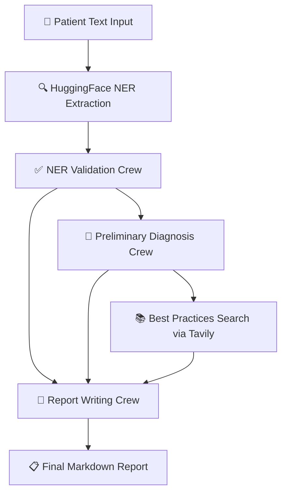
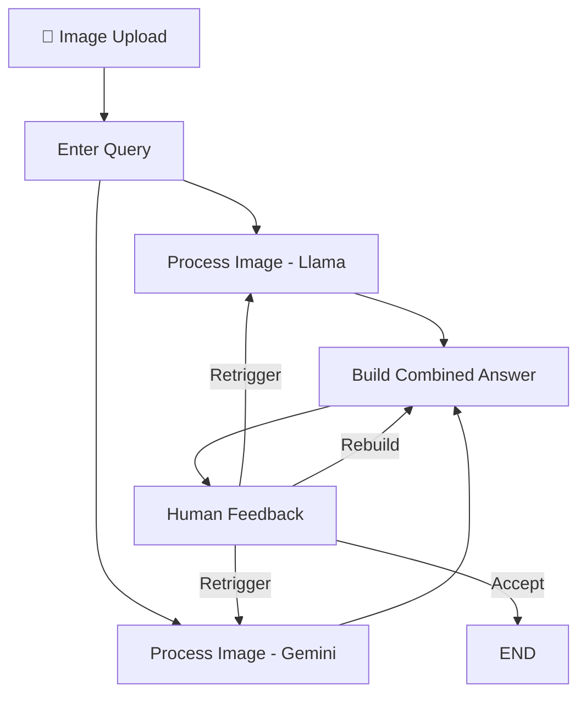
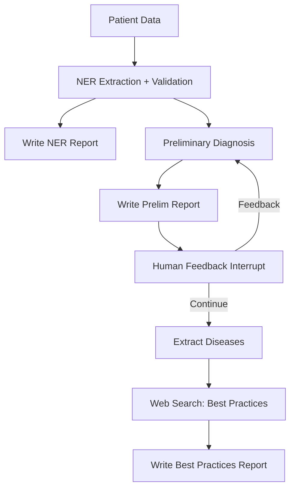
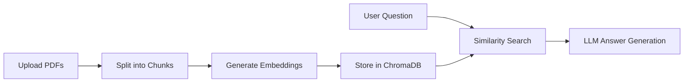

# CuraSense Backend Documentation

> **Version**: 1.0 | **Last Updated**: February 2026

---

## 📐 Architecture Overview

CuraSense uses a **dual-backend architecture** with two specialized FastAPI services:

```
┌─────────────────────────────────────────────────────────────────────────────┐
│                            FRONTEND (Next.js)                               │
│                         Vercel / Port 3000                                  │
└───────────────────────────────┬─────────────────────────────────────────────┘
                                │
              ┌─────────────────┴─────────────────┐
              ▼                                   ▼
┌─────────────────────────┐         ┌─────────────────────────┐
│      ML API             │         │     Vision API          │
│   (curasense-ml)        │         │    (ml-fastapi)         │
│   Port 8000             │         │    Port 8001            │
├─────────────────────────┤         ├─────────────────────────┤
│ • Text/PDF Diagnosis    │         │ • X-Ray Analysis        │
│ • CrewAI Pipeline       │         │ • Medical Image AI      │
│ • AI Chat Assistant     │         │ • RAG Document Search   │
│ • Medicine Comparison   │         │ • LangGraph Workflows   │
└─────────────────────────┘         └─────────────────────────┘
              │                                   │
              └─────────────────┬─────────────────┘
                                ▼
              ┌─────────────────────────────────────┐
              │         External AI Services        │
              ├─────────────────────────────────────┤
              │ • Google Gemini (Vision + Text)     │
              │ • Groq (Llama 3.3/4)                │
              │ • Tavily (Medical Research)         │
              │ • HuggingFace (NER Models)          │
              └─────────────────────────────────────┘
```

---

## 🔬 Service 1: ML API (`curasense-ml`)

**Purpose**: Primary diagnosis engine for text and PDF-based medical reports.

### Technology Stack

| Component        | Technology                  |
| ---------------- | --------------------------- |
| Framework        | FastAPI                     |
| AI Orchestration | CrewAI Flow                 |
| LLM              | Groq (Llama), Google Gemini |
| NER              | HuggingFace Transformers    |
| Medical Research | Tavily Search API           |

### Directory Structure

```
curasense-ml/
├── app.py                 # Main FastAPI application
├── flow.py                # CrewAI diagnosis pipeline
├── src/
│   ├── pdf_parser.py      # PDF text extraction
│   ├── hugging_face_ner.py # Medical NER extraction
│   └── crew/              # CrewAI agent definitions
├── frontend/              # Built-in test dashboard
└── requirements.txt
```

---

### API Endpoints

#### 1. Text Diagnosis

```http
POST /diagnose/text/
Content-Type: application/json

{
  "text": "42-year-old male with type 2 diabetes, presenting with polyuria..."
}
```

**Response**:

```json
{
  "status": "success",
  "report": "## Comprehensive Diagnosis Report\n\n### Patient Summary..."
}
```

#### 2. PDF Diagnosis

```http
POST /diagnose/pdf/
Content-Type: multipart/form-data

file: [medical_report.pdf]
```

Extracts text from PDF using PyPDF2/pdfplumber, then runs the full diagnosis pipeline.

#### 3. AI Chat Assistant

```http
POST /api/chat
Content-Type: application/json

{
  "message": "What does HbA1c of 10.5% indicate?",
  "report_context": "...(optional diagnosis report)...",
  "conversation_history": []
}
```

**Features**:

- Context-aware responses using the diagnosis report
- Powered by Groq's GPT-OSS-120B model
- Maintains conversation history for follow-up questions

#### 4. Medicine Comparison

```http
POST /api/compare
Content-Type: application/json

{
  "medicines": ["Metformin", "Glipizide"]
}
```

---

### CrewAI Diagnosis Pipeline (`flow.py`)

The diagnosis engine uses CrewAI's **Flow** architecture with a 6-stage pipeline:



#### Stage 1: HuggingFace NER Extraction

- Uses pre-trained medical NER model
- Extracts: diseases, symptoms, medications, lab values, vital signs
- Output: Tagged tokens with entity labels

#### Stage 2: NER Validation Crew

- CrewAI agents validate and refine extracted entities
- Cross-checks against UMLS/SNOMED ontologies
- Removes duplicates and misclassifications

#### Stage 3: Preliminary Diagnosis Crew

- Generates 3 most likely diagnoses based on symptoms
- Each diagnosis includes:
  - Disease name
  - Description
  - Clinical reasoning
  - Recommendations

#### Stage 4: Best Practices Search

- Uses Tavily API for medical research
- Searches for treatment guidelines per diagnosis
- Filters results by relevance score (>0.5)

#### Stage 5: Report Writing Crew

- Compiles all data into structured Markdown report
- Sections: Patient Summary, NER Report, Diagnoses, Best Practices

---

### Key Functions

#### PDF Text Extraction (`src/pdf_parser.py`)

```python
def process_pdf_file(file_content: bytes) -> dict:
    """
    Extract text from uploaded PDF file.

    Uses dual-method approach:
    1. Primary: pdfplumber (better for complex layouts)
    2. Fallback: PyPDF2 (faster, simpler PDFs)

    Returns:
        {"status": "success", "text": "...", "error": None}
    """
```

#### NER Processing (`src/hugging_face_ner.py`)

```python
def process_ner_output(text: str) -> tuple:
    """
    Run HuggingFace NER model on medical text.

    Returns:
        tagged_tokens: List of (token, entity_label) pairs
        unique_tags: Set of all entity types found
    """
```

---

## 🩻 Service 2: Vision API (`ml-fastapi`)

**Purpose**: Medical image analysis (X-rays, scans) and document understanding.

### Technology Stack

| Component        | Technology                      |
| ---------------- | ------------------------------- |
| Framework        | FastAPI                         |
| AI Orchestration | LangGraph                       |
| Vision Models    | Gemini 2.5 Flash, Llama 4 Scout |
| Vector DB        | ChromaDB                        |
| Embeddings       | Google Gemini Embeddings        |

### Directory Structure

```
ml-fastapi/
├── main.py                    # Main FastAPI application
├── config/
│   ├── vision_graph.py        # X-ray analysis LangGraph
│   ├── main_graph.py          # Diagnosis LangGraph
│   ├── rag.py                 # RAG search pipeline
│   ├── medical_summarizer_graph.py
│   ├── vectordb.py            # ChromaDB operations
│   └── hugging_face_ner.py
├── cron/                      # Background cleanup jobs
├── static/                    # Frontend assets
└── requirements.txt
```

---

### API Endpoints

#### 1. X-Ray Image Input

```http
POST /input-image/
Content-Type: multipart/form-data

thread_id: "session-123"
image: [chest_xray.jpg]
```

Starts the vision analysis graph. Image is converted to base64 and processed.

#### 2. Query About Image

```http
POST /input-query/
Content-Type: application/json

{
  "thread_id": "session-123",
  "query": "What abnormalities do you see in this chest X-ray?"
}
```

#### 3. Get Vision Answer

```http
POST /vision-answer/
Content-Type: application/json

{
  "thread_id": "session-123"
}
```

**Response**: Streaming text with analysis results.

#### 4. Provide Feedback (Iterative Refinement)

```http
POST /vision-feedback/
Content-Type: application/json

{
  "thread_id": "session-123",
  "feedback": "Focus more on the lower right lung region"
}
```

#### 5. RAG Document Search

```http
POST /addFilesAndCreateVectorDB
Content-Type: multipart/form-data

thread_id: "session-123"
files: [document1.pdf, document2.pdf]
```

Creates a vector database from uploaded medical documents.

```http
POST /ragSearch
Content-Type: application/json

{
  "thread_id": "session-123",
  "question": "What are the contraindications for this medication?"
}
```

#### 6. Medical Report Extraction

```http
POST /extractMedicalDetails
Content-Type: multipart/form-data

thread_id: "session-123"
files: [lab_report.pdf]
```

Extracts structured medical information from uploaded files.

---

### Vision Graph (`config/vision_graph.py`)

The X-ray analysis uses LangGraph for multi-model orchestration:



#### Dual-Model Processing

| Model                 | Provider | Purpose                 |
| --------------------- | -------- | ----------------------- |
| **Gemini 2.5 Flash**  | Google   | Primary vision analysis |
| **Llama 4 Scout 17B** | Groq     | Secondary validation    |

Both models analyze the same image independently. Their outputs are combined into a consensus answer.

#### Key State Variables

```python
class OverAllState(TypedDict):
    query: str           # User's question about the image
    base64_image: str    # Image encoded as base64
    llama_response: str  # Llama model's analysis
    gemini_response: str # Gemini model's analysis
    answer: str          # Combined final answer
    feedback: str        # Optional human feedback
```

---

### Main Diagnosis Graph (`config/main_graph.py`)

A comprehensive LangGraph for structured medical diagnosis:



#### Human-in-the-Loop

The graph supports **interrupt points** where:

1. Clinicians can review preliminary diagnoses
2. Provide feedback to refine results
3. Resume the graph with updated context

---

### RAG Pipeline (`config/rag.py`)

Retrieval-Augmented Generation for document Q&A:



#### Vector Database Operations (`config/vectordb.py`)

```python
async def create_vector_db(files, api_key, thread_id):
    """
    Create ChromaDB collection from uploaded files.

    - Uses Gemini embeddings for vectorization
    - Stores with thread_id prefix for isolation
    - Automatic cleanup via cron jobs
    """
```

---

## 🔐 Environment Variables

### ML API (`curasense-ml`)

| Variable          | Required | Description                       |
| ----------------- | -------- | --------------------------------- |
| `GROQ_API_KEY`    | ✅       | Groq API for LLM inference        |
| `TAVILY_API_KEY`  | ✅       | Tavily for medical research       |
| `HOST`            | ✅       | Bind address (default: `0.0.0.0`) |
| `PORT`            | ✅       | Server port (default: `8000`)     |
| `ALLOWED_ORIGINS` | ❌       | CORS origins (comma-separated)    |

### Vision API (`ml-fastapi`)

| Variable                    | Required | Description                       |
| --------------------------- | -------- | --------------------------------- |
| `GOOGLE_API_KEY`            | ✅       | Google Gemini API key             |
| `GROQ_API_KEY`              | ✅       | Groq API for Llama models         |
| `TAVILY_API_KEY`            | ✅       | Tavily for research               |
| `HOST`                      | ✅       | Bind address (default: `0.0.0.0`) |
| `PORT`                      | ✅       | Server port (default: `8001`)     |
| `GOOGLE_CREDENTIALS_BASE64` | ❌       | Base64 service account (optional) |

---

## 🚀 Running the Services

### Local Development

```bash
# Terminal 1: ML API
cd curasense-ml
pip install -r requirements.txt
uvicorn app:app --host 0.0.0.0 --port 8000 --reload

# Terminal 2: Vision API
cd ml-fastapi
pip install -r requirements.txt
uvicorn main:app --host 0.0.0.0 --port 8001 --reload
```

### Docker

```bash
# Build images
docker build -t curasense-ml ./curasense-ml
docker build -t curasense-vision ./ml-fastapi

# Run containers
docker run -p 8000:8000 --env-file ./curasense-ml/.env curasense-ml
docker run -p 8001:8001 --env-file ./ml-fastapi/.env curasense-vision
```

---

## 📊 Data Flow Examples

### Text Diagnosis Flow

```
User Input → POST /diagnose/text/
    ↓
PDF Parser (if PDF) or Direct Text
    ↓
CrewAI Pipeline:
    1. HuggingFace NER
    2. NER Validation
    3. Preliminary Diagnosis (3 candidates)
    4. Tavily Best Practices Search
    5. Report Compilation
    ↓
Markdown Report Response
```

### X-Ray Analysis Flow

```
Image Upload → POST /input-image/
    ↓
Base64 Encoding + Thread Creation
    ↓
User Query → POST /input-query/
    ↓
Parallel Processing:
    ├── Gemini 2.5 Flash Analysis
    └── Llama 4 Scout Analysis
    ↓
Answer Synthesis → POST /vision-answer/
    ↓
Optional: Feedback Loop → POST /vision-feedback/
```

---

## 🔧 Troubleshooting

### Common Issues

| Error                           | Cause                | Solution             |
| ------------------------------- | -------------------- | -------------------- |
| `GROQ_API_KEY not found`        | Missing env variable | Add to `.env` file   |
| `Quota exceeded`                | API rate limit       | Wait or upgrade plan |
| `No text extracted from PDF`    | Scanned/image PDF    | Use OCR-enabled PDF  |
| `ChromaDB collection not found` | Thread expired       | Re-upload documents  |

### Health Checks

```bash
# ML API
curl http://localhost:8000/

# Vision API
curl http://localhost:8001/ping
```

---

## 📈 Scaling Considerations

| Aspect    | Current        | Production Recommendation |
| --------- | -------------- | ------------------------- |
| Workers   | 1 (Uvicorn)    | 2-4 Gunicorn workers      |
| Memory    | 2-4 GB         | 4-8 GB per service        |
| Vector DB | Local ChromaDB | Managed Qdrant/Pinecone   |
| Caching   | None           | Redis for session state   |

---

## 🔗 Related Documentation

- [ENV_DOCUMENTATION.md](ENV_DOCUMENTATION.md) - Complete environment variable reference
- [SYSTEM_CONTEXT.md](SYSTEM_CONTEXT.md) - High-level system architecture
- [compose.yaml](compose.yaml) - Docker Compose configuration

---

**Maintainers**: CuraSense Team  
**License**: MIT
