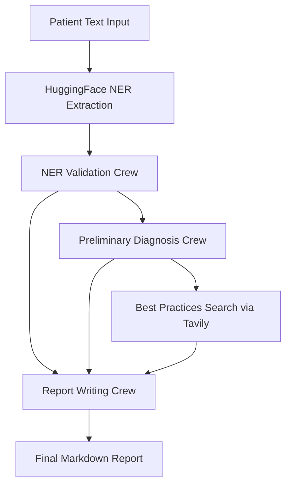
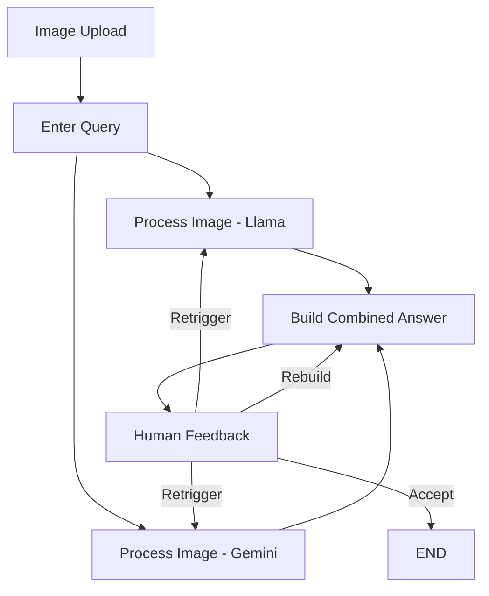
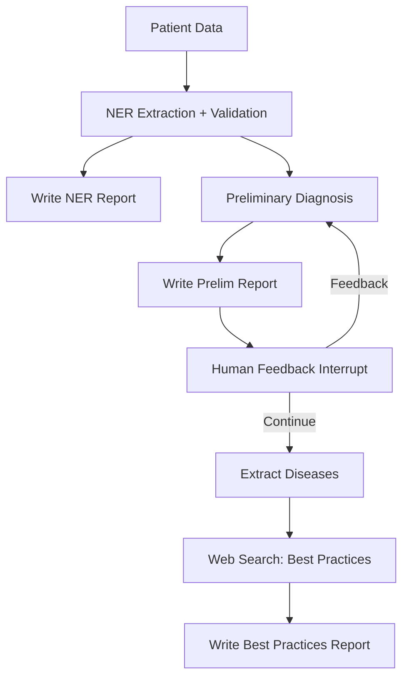
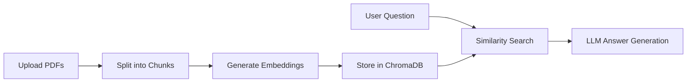

# CuraSense Backend Documentation

> **Version**: 2.0 | **Last Updated**: March 2026

---

## Architecture Overview

CuraSense uses a **tri-backend architecture** with three specialized FastAPI services:

```
┌─────────────────────────────────────────────────────────────────────────────┐
│                            FRONTEND (Next.js)                               │
│                            Port 3000                                        │
└───────────────────┬─────────────────┬─────────────────┬─────────────────────┘
                    │                 │                 │
                    ▼                 ▼                 ▼
┌───────────────────────┐ ┌───────────────────────┐ ┌───────────────────────┐
│      ML API           │ │     Vision API        │ │   Medicine API        │
│   (curasense-ml)      │ │    (ml-fastapi)       │ │  (medicine_model)     │
│   Port 8000           │ │    Port 8001          │ │   Port 8002           │
├───────────────────────┤ ├───────────────────────┤ ├───────────────────────┤
│ - Text/PDF Diagnosis  │ │ - X-Ray Analysis      │ │ - Medicine Lookup     │
│ - CrewAI Pipeline     │ │ - Medical Image AI    │ │ - Drug Interactions   │
│ - AI Chat Assistant   │ │ - RAG Document Search │ │ - Medicine Comparison │
│ - Medicine Comparison │ │ - LangGraph Workflows │ │ - Symptom Advisor     │
│                       │ │                       │ │ - Image/Label Scanner │
│                       │ │                       │ │ - Vision + RAG Chain  │
└───────────────────────┘ └───────────────────────┘ └───────────────────────┘
          │                         │                         │
          └─────────────────────────┼─────────────────────────┘
                                    ▼
                  ┌─────────────────────────────────────┐
                  │         External AI Services        │
                  ├─────────────────────────────────────┤
                  │ - Google Gemini (Vision + Text)     │
                  │ - Groq (Llama 3.3/4)               │
                  │ - Tavily (Medical Research)         │
                  │ - HuggingFace (NER Models)          │
                  │ - ChromaDB (Vector Embeddings)      │
                  └─────────────────────────────────────┘
```

### Frontend API Proxy Mapping

All backend calls are proxied through Next.js API routes (no direct browser-to-backend calls):

| Frontend Route | Backend Service | Backend URL |
|---|---|---|
| `/api/diagnose/text` | curasense-ml | `BACKEND_API_URL` (default `localhost:8000`) |
| `/api/diagnose/pdf` | curasense-ml | `BACKEND_API_URL` (default `localhost:8000`) |
| `/api/chat` | curasense-ml | `BACKEND_API_URL` (default `localhost:8000`) |
| `/api/compare` | curasense-ml | `BACKEND_API_URL` (default `localhost:8000`) |
| `/api/vision/upload` | ml-fastapi | `BACKEND_VISION_URL` (default `localhost:8001`) |
| `/api/vision/query` | ml-fastapi | `BACKEND_VISION_URL` (default `localhost:8001`) |
| `/api/vision/answer` | ml-fastapi | `BACKEND_VISION_URL` (default `localhost:8001`) |
| `/api/medicine/[name]` | medicine_model | `MEDICINE_API_URL` (default `127.0.0.1:8002`) |
| `/api/medicine/recommend` | medicine_model | `MEDICINE_API_URL` (default `127.0.0.1:8002`) |
| `/api/medicine/interaction` | medicine_model | `MEDICINE_API_URL` (default `127.0.0.1:8002`) |
| `/api/medicine/compare` | medicine_model | `MEDICINE_API_URL` (default `127.0.0.1:8002`) |
| `/api/medicine/analyze-image` | medicine_model | `MEDICINE_API_URL` (default `127.0.0.1:8002`) |

---

## Service 1: ML API (`curasense-ml`)

**Purpose**: Primary diagnosis engine for text and PDF-based medical reports.
**Port**: 8000
**Conda Environment**: `curasense_env`
**Entry Point**: `uvicorn app:app --reload --host 127.0.0.1 --port 8000`
**Working Directory**: `D:\final_curasense\curasense-ml`

### Technology Stack

| Component        | Technology                  |
| ---------------- | --------------------------- |
| Framework        | FastAPI                     |
| AI Orchestration | CrewAI Flow                 |
| LLM              | Groq (Llama), Google Gemini |
| NER              | HuggingFace Transformers    |
| Medical Research | Tavily Search API           |

### Directory Structure

```
curasense-ml/
├── app.py                 # Main FastAPI application
├── flow.py                # CrewAI diagnosis pipeline
├── src/
│   ├── pdf_parser.py      # PDF text extraction
│   ├── hugging_face_ner.py # Medical NER extraction
│   └── crew/              # CrewAI agent definitions
├── frontend/              # Built-in test dashboard
└── requirements.txt
```

---

### API Endpoints

#### 1. Text Diagnosis

```http
POST /diagnose/text/
Content-Type: application/json

{
  "text": "42-year-old male with type 2 diabetes, presenting with polyuria..."
}
```

**Response**:

```json
{
  "status": "success",
  "report": "## Comprehensive Diagnosis Report\n\n### Patient Summary..."
}
```

#### 2. PDF Diagnosis

```http
POST /diagnose/pdf/
Content-Type: multipart/form-data

file: [medical_report.pdf]
```

Extracts text from PDF using PyPDF2/pdfplumber, then runs the full diagnosis pipeline.

#### 3. AI Chat Assistant

```http
POST /api/chat
Content-Type: application/json

{
  "message": "What does HbA1c of 10.5% indicate?",
  "report_context": "...(optional diagnosis report)...",
  "conversation_history": []
}
```

**Features**:

- Context-aware responses using the diagnosis report
- Powered by Groq's GPT-OSS-120B model
- Maintains conversation history for follow-up questions

#### 4. Medicine Comparison

```http
POST /api/compare
Content-Type: application/json

{
  "medicines": ["Metformin", "Glipizide"]
}
```

---

### CrewAI Diagnosis Pipeline (`flow.py`)

The diagnosis engine uses CrewAI's **Flow** architecture with a 6-stage pipeline:



#### Stage 1: HuggingFace NER Extraction

- Uses pre-trained medical NER model
- Extracts: diseases, symptoms, medications, lab values, vital signs
- Output: Tagged tokens with entity labels

#### Stage 2: NER Validation Crew

- CrewAI agents validate and refine extracted entities
- Cross-checks against UMLS/SNOMED ontologies
- Removes duplicates and misclassifications

#### Stage 3: Preliminary Diagnosis Crew

- Generates 3 most likely diagnoses based on symptoms
- Each diagnosis includes:
  - Disease name
  - Description
  - Clinical reasoning
  - Recommendations

#### Stage 4: Best Practices Search

- Uses Tavily API for medical research
- Searches for treatment guidelines per diagnosis
- Filters results by relevance score (>0.5)

#### Stage 5: Report Writing Crew

- Compiles all data into structured Markdown report
- Sections: Patient Summary, NER Report, Diagnoses, Best Practices

---

### Key Functions

#### PDF Text Extraction (`src/pdf_parser.py`)

```python
def process_pdf_file(file_content: bytes) -> dict:
    """
    Extract text from uploaded PDF file.

    Uses dual-method approach:
    1. Primary: pdfplumber (better for complex layouts)
    2. Fallback: PyPDF2 (faster, simpler PDFs)

    Returns:
        {"status": "success", "text": "...", "error": None}
    """
```

#### NER Processing (`src/hugging_face_ner.py`)

```python
def process_ner_output(text: str) -> tuple:
    """
    Run HuggingFace NER model on medical text.

    Returns:
        tagged_tokens: List of (token, entity_label) pairs
        unique_tags: Set of all entity types found
    """
```

---

## Service 2: Vision API (`ml-fastapi`)

**Purpose**: Medical image analysis (X-rays, scans) and document understanding.
**Port**: 8001
**Conda Environment**: `curasense_vision_env`
**Entry Point**: `uvicorn main:app --reload --host 127.0.0.1 --port 8001`
**Working Directory**: `D:\final_curasense\ml-fastapi`

### Technology Stack

| Component        | Technology                      |
| ---------------- | ------------------------------- |
| Framework        | FastAPI                         |
| AI Orchestration | LangGraph                       |
| Vision Models    | Gemini 2.5 Flash, Llama 4 Scout |
| Vector DB        | ChromaDB                        |
| Embeddings       | Google Gemini Embeddings        |

### Directory Structure

```
ml-fastapi/
├── main.py                    # Main FastAPI application
├── config/
│   ├── vision_graph.py        # X-ray analysis LangGraph
│   ├── main_graph.py          # Diagnosis LangGraph
│   ├── rag.py                 # RAG search pipeline
│   ├── medical_summarizer_graph.py
│   ├── vectordb.py            # ChromaDB operations
│   └── hugging_face_ner.py
├── cron/                      # Background cleanup jobs
├── static/                    # Frontend assets
└── requirements.txt
```

---

### API Endpoints

#### 1. X-Ray Image Input

```http
POST /input-image/
Content-Type: multipart/form-data

thread_id: "session-123"
image: [chest_xray.jpg]
```

Starts the vision analysis graph. Image is converted to base64 and processed.

#### 2. Query About Image

```http
POST /input-query/
Content-Type: application/json

{
  "thread_id": "session-123",
  "query": "What abnormalities do you see in this chest X-ray?"
}
```

#### 3. Get Vision Answer

```http
POST /vision-answer/
Content-Type: application/json

{
  "thread_id": "session-123"
}
```

**Response**: Streaming text with analysis results.

#### 4. Provide Feedback (Iterative Refinement)

```http
POST /vision-feedback/
Content-Type: application/json

{
  "thread_id": "session-123",
  "feedback": "Focus more on the lower right lung region"
}
```

#### 5. RAG Document Search

```http
POST /addFilesAndCreateVectorDB
Content-Type: multipart/form-data

thread_id: "session-123"
files: [document1.pdf, document2.pdf]
```

Creates a vector database from uploaded medical documents.

```http
POST /ragSearch
Content-Type: application/json

{
  "thread_id": "session-123",
  "question": "What are the contraindications for this medication?"
}
```

#### 6. Medical Report Extraction

```http
POST /extractMedicalDetails
Content-Type: multipart/form-data

thread_id: "session-123"
files: [lab_report.pdf]
```

Extracts structured medical information from uploaded files.

---

### Vision Graph (`config/vision_graph.py`)

The X-ray analysis uses LangGraph for multi-model orchestration:



#### Dual-Model Processing

| Model                 | Provider | Purpose                 |
| --------------------- | -------- | ----------------------- |
| **Gemini 2.5 Flash**  | Google   | Primary vision analysis |
| **Llama 4 Scout 17B** | Groq     | Secondary validation    |

Both models analyze the same image independently. Their outputs are combined into a consensus answer.

#### Key State Variables

```python
class OverAllState(TypedDict):
    query: str           # User's question about the image
    base64_image: str    # Image encoded as base64
    llama_response: str  # Llama model's analysis
    gemini_response: str # Gemini model's analysis
    answer: str          # Combined final answer
    feedback: str        # Optional human feedback
```

---

### Main Diagnosis Graph (`config/main_graph.py`)

A comprehensive LangGraph for structured medical diagnosis:



#### Human-in-the-Loop

The graph supports **interrupt points** where:

1. Clinicians can review preliminary diagnoses
2. Provide feedback to refine results
3. Resume the graph with updated context

---

### RAG Pipeline (`config/rag.py`)

Retrieval-Augmented Generation for document Q&A:



#### Vector Database Operations (`config/vectordb.py`)

```python
async def create_vector_db(files, api_key, thread_id):
    """
    Create ChromaDB collection from uploaded files.

    - Uses Gemini embeddings for vectorization
    - Stores with thread_id prefix for isolation
    - Automatic cleanup via cron jobs
    """
```

---

## Service 3: Medicine API (`medicine_model`)

**Purpose**: Comprehensive medicine information hub — lookup, interactions, comparisons, symptom-based recommendations, and medicine image/label analysis.
**Port**: 8002
**Conda Environment**: `curasense_medicine_env`
**Entry Point**: `uvicorn app.main:app --reload --host 127.0.0.1 --port 8002`
**Working Directory**: `E:\medicine_model_curasense`

> **Note**: First startup takes 60-120 seconds due to loading the sentence-transformers model (`all-MiniLM-L6-v2`) and ChromaDB collections.

### Technology Stack

| Component          | Technology                      |
| ------------------ | ------------------------------- |
| Framework          | FastAPI                         |
| Primary LLM        | Google Gemini 2.5 Flash         |
| Fallback LLM       | Groq (Llama)                    |
| Web Search         | Tavily Search API               |
| Vector DB          | ChromaDB                        |
| Embeddings         | sentence-transformers (MiniLM)  |
| Vision             | Gemini Vision (image analysis)  |

### Directory Structure

```
medicine_model_curasense/       # E:\medicine_model_curasense
├── app/
│   ├── main.py                 # FastAPI entry point (app.main:app)
│   ├── api/
│   │   └── routes.py           # All endpoint definitions
│   ├── services/
│   │   ├── medicine_insight_service.py   # Core medicine lookup
│   │   ├── medicine_compare_service.py   # Side-by-side comparison
│   │   ├── medicine_interaction_service.py # Drug interaction checking
│   │   ├── medicine_recommendation_service.py # Symptom-based advice
│   │   ├── vision_service.py             # Gemini Vision extraction
│   │   └── vision_rag_service.py         # Vision + RAG chain
│   ├── core/
│   │   └── config.py           # Settings and API key management
│   └── db/
│       └── chroma_client.py    # ChromaDB initialization
├── data/                       # Pre-loaded medicine knowledge base
├── .env                        # API keys (GOOGLE_API_KEY, GROQ_API_KEY, TAVILY_API_KEY)
└── requirements.txt            # 12 dependencies
```

---

### API Endpoints

#### 1. Medicine Lookup

```http
GET /medicine/{name}
```

Returns comprehensive information about a specific medicine.

**Response**:

```json
{
  "name": "Paracetamol",
  "generic_name": "Acetaminophen",
  "drug_class": "Analgesic/Antipyretic",
  "description": "...",
  "uses": ["Pain relief", "Fever reduction"],
  "dosage": { "adults": "500-1000mg every 4-6 hours", "children": "..." },
  "side_effects": { "common": [...], "serious": [...] },
  "warnings": [...],
  "interactions": [...]
}
```

#### 2. Symptom-Based Recommendations

```http
POST /recommend
Content-Type: application/json

{
  "symptoms": "persistent headache with mild fever and body ache"
}
```

Returns a list of recommended medicines with reasoning.

#### 3. Drug Interaction Check

```http
POST /interaction
Content-Type: application/json

{
  "medicine1": "Aspirin",
  "medicine2": "Warfarin"
}
```

**Response** includes interaction severity (Low/Moderate/High), mechanism, clinical effects, and recommendations.

#### 4. Medicine Comparison

```http
POST /compare
Content-Type: application/json

{
  "medicine1": "Ibuprofen",
  "medicine2": "Naproxen"
}
```

Returns a side-by-side comparison across efficacy, side effects, cost, and use cases.

#### 5. Image Comparison

```http
POST /compare-images
Content-Type: multipart/form-data

image1: [medicine1_photo.jpg]
image2: [medicine2_photo.jpg]
```

Extracts medicine names from images via Gemini Vision, then runs a standard comparison.

#### 6. Medicine Image/Label Analysis (Scanner)

```http
POST /analyze-image
Content-Type: multipart/form-data

image: [medicine_label.jpg]
```

This is the endpoint powering the **Medicine Scanner** feature. It uses `VisionRAGService` which chains:

1. **VisionService.extract_medicine_info()** - Gemini Vision reads the medicine name/details from the image
2. **MedicineInsightService.get_full_insight(name)** - Enriches with comprehensive drug information

**Response**:

```json
{
  "extracted_text": "Amoxicillin 500mg Capsules",
  "medicine_name": "Amoxicillin",
  "analysis": {
    "name": "Amoxicillin",
    "generic_name": "Amoxicillin",
    "drug_class": "Penicillin Antibiotic",
    "uses": [...],
    "dosage": {...},
    "side_effects": {...},
    "warnings": [...]
  }
}
```

#### 7. Health Check

```http
GET /health
```

Returns `{"status": "ok"}`.

---

### Service Architecture

```
Medicine Scanner Flow:
┌──────────────┐     ┌──────────────────┐     ┌──────────────────────┐
│ Image Upload │ ──> │ VisionService    │ ──> │ MedicineInsight      │
│ (POST)       │     │ (Gemini Vision)  │     │ Service (Enrichment) │
└──────────────┘     │ Extract name +   │     │ Full drug info via   │
                     │ text from image  │     │ Gemini + Tavily +    │
                     └──────────────────┘     │ ChromaDB             │
                                              └──────────────────────┘

Standard Lookup/Recommend/Interact/Compare Flow:
┌──────────────┐     ┌──────────────────────┐     ┌──────────────┐
│ User Query   │ ──> │ Gemini 2.5 Flash     │ ──> │ Structured   │
│ (text input) │     │ (primary) or Groq    │     │ JSON Response│
│              │     │ (fallback) + Tavily  │     │              │
│              │     │ search + ChromaDB    │     │              │
└──────────────┘     └──────────────────────┘     └──────────────┘
```

---

## Environment Variables

### ML API (`curasense-ml`)

| Variable          | Required | Description                       |
| ----------------- | -------- | --------------------------------- |
| `GROQ_API_KEY`    | Yes      | Groq API for LLM inference        |
| `TAVILY_API_KEY`  | Yes      | Tavily for medical research       |
| `HOST`            | No       | Bind address (default: `0.0.0.0`) |
| `PORT`            | No       | Server port (default: `8000`)     |
| `ALLOWED_ORIGINS` | No       | CORS origins (comma-separated)    |

### Vision API (`ml-fastapi`)

| Variable                    | Required | Description                       |
| --------------------------- | -------- | --------------------------------- |
| `GOOGLE_API_KEY`            | Yes      | Google Gemini API key             |
| `GROQ_API_KEY`              | Yes      | Groq API for Llama models         |
| `TAVILY_API_KEY`            | Yes      | Tavily for research               |
| `HOST`                      | No       | Bind address (default: `0.0.0.0`) |
| `PORT`                      | No       | Server port (default: `8001`)     |
| `GOOGLE_CREDENTIALS_BASE64` | No       | Base64 service account (optional) |

### Medicine API (`medicine_model`)

| Variable          | Required | Description                        |
| ----------------- | -------- | ---------------------------------- |
| `GOOGLE_API_KEY`  | Yes      | Google Gemini API key (Vision + Text) |
| `GROQ_API_KEY`    | Yes      | Groq API for fallback LLM          |
| `TAVILY_API_KEY`  | Yes      | Tavily for medicine research       |

---

## Running the Services

### Local Development

Each backend runs in its own conda environment. Use separate terminal windows:

```bash
# Terminal 1: ML API (port 8000)
conda activate curasense_env
cd D:\final_curasense\curasense-ml
uvicorn app:app --reload --host 127.0.0.1 --port 8000

# Terminal 2: Vision API (port 8001)
conda activate curasense_vision_env
cd D:\final_curasense\ml-fastapi
uvicorn main:app --reload --host 127.0.0.1 --port 8001

# Terminal 3: Medicine API (port 8002)
conda activate curasense_medicine_env
cd E:\medicine_model_curasense
uvicorn app.main:app --reload --host 127.0.0.1 --port 8002
```

### Batch Launch

Use `start_servers.bat` in the project root to launch all 4 services (3 backends + frontend) in separate terminal windows:

```bash
D:\final_curasense\start_servers.bat
```

### Port Assignments

| Service | Port | Conda Env | Entry Point |
|---|---|---|---|
| curasense-ml | 8000 | `curasense_env` | `app:app` |
| ml-fastapi | 8001 | `curasense_vision_env` | `main:app` |
| medicine_model | 8002 | `curasense_medicine_env` | `app.main:app` |
| Frontend | 3000 | Node.js | `npm run dev` |

---

## Data Flow Examples

### Text Diagnosis Flow

```
User Input --> POST /diagnose/text/
    |
PDF Parser (if PDF) or Direct Text
    |
CrewAI Pipeline:
    1. HuggingFace NER
    2. NER Validation
    3. Preliminary Diagnosis (3 candidates)
    4. Tavily Best Practices Search
    5. Report Compilation
    |
Markdown Report Response
```

### X-Ray Analysis Flow

```
Image Upload --> POST /input-image/
    |
Base64 Encoding + Thread Creation
    |
User Query --> POST /input-query/
    |
Parallel Processing:
    +-- Gemini 2.5 Flash Analysis
    +-- Llama 4 Scout Analysis
    |
Answer Synthesis --> POST /vision-answer/
    |
Optional: Feedback Loop --> POST /vision-feedback/
```

### Medicine Lookup Flow

```
User searches "Ibuprofen" --> GET /medicine/Ibuprofen
    |
MedicineInsightService:
    1. Check ChromaDB cache
    2. Query Gemini 2.5 Flash for comprehensive info
    3. Tavily web search for latest data
    4. Merge and structure response
    |
JSON Response with full medicine details
```

### Medicine Scanner Flow

```
User uploads medicine photo --> POST /analyze-image
    |
VisionRAGService chain:
    1. VisionService.extract_medicine_info()
       - Sends image to Gemini Vision
       - Extracts medicine name + visible text
    2. MedicineInsightService.get_full_insight(name)
       - Uses extracted name to fetch comprehensive info
       - Gemini + Tavily + ChromaDB enrichment
    |
JSON Response with extracted_text + full analysis
```

---

## Troubleshooting

### Common Issues

| Error | Cause | Solution |
|---|---|---|
| `GROQ_API_KEY not found` | Missing env variable | Add to `.env` file |
| `Quota exceeded` | API rate limit | Wait or upgrade plan |
| `No text extracted from PDF` | Scanned/image PDF | Use OCR-enabled PDF |
| `ChromaDB collection not found` | Thread expired | Re-upload documents |
| Port 8000 already in use | Ghost/zombie socket | `netstat -ano \| findstr :8000`, then `taskkill /PID <pid> /F`, or use port 8003 |
| Medicine API slow first start | Loading sentence-transformers model | Normal — wait 60-120 seconds |
| `app.main:app` not found | Wrong working directory | Must run from `E:\medicine_model_curasense` |

### Health Checks

```bash
# ML API
curl http://127.0.0.1:8000/

# Vision API
curl http://127.0.0.1:8001/ping

# Medicine API
curl http://127.0.0.1:8002/health
```

---

## Scaling Considerations

| Aspect    | Current        | Production Recommendation |
| --------- | -------------- | ------------------------- |
| Workers   | 1 (Uvicorn)    | 2-4 Gunicorn workers      |
| Memory    | 2-4 GB         | 4-8 GB per service        |
| Vector DB | Local ChromaDB | Managed Qdrant/Pinecone   |
| Caching   | None           | Redis for session state   |

---

## Related Documentation

- [FRONTEND_DOCUMENTATION.md](FRONTEND_DOCUMENTATION.md) - Frontend architecture and pages
- [DATABASE_DOCUMENTATION.md](DATABASE_DOCUMENTATION.md) - Database schema and auth flow
- [README.md](README.md) - Quick start guide and project overview

---

**Maintainers**: CuraSense Team
**License**: MIT
