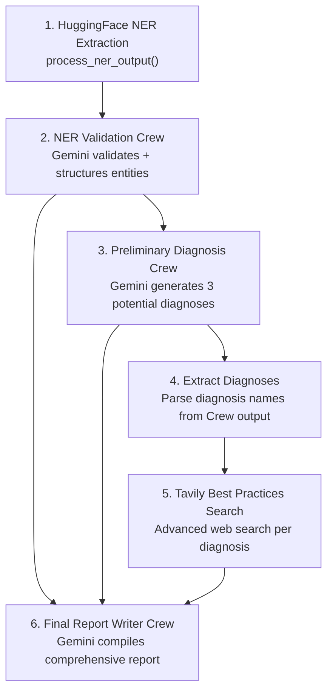
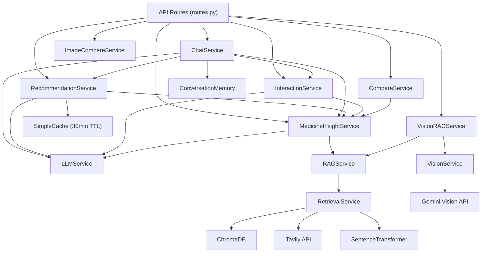

# CuraSense Backend — Technical Report

> Comprehensive documentation of all backend services: architecture, endpoints, AI pipelines, external APIs, data stores, and deployment.

---

## 1. Architecture Overview

CuraSense uses a **polyglot microservice architecture** — four independent services, each purpose-built for a specific domain:

```
┌───────────────────────────────────────────────────────────────────┐
│  FRONTEND (Next.js :3000)                                          │
│  Proxies all requests via /api/* routes                            │
│                                                                    │
│  ┌──────────────────┐  ┌──────────────────┐  ┌──────────────────┐ │
│  │ /api/diagnose/*   │  │ /api/xray/*      │  │ /api/medicine/*  │ │
│  └────────┬─────────┘  └────────┬─────────┘  └────────┬─────────┘ │
└───────────┼──────────────────────┼──────────────────────┼──────────┘
            │                      │                      │
            ▼                      ▼                      ▼
┌──────────────────┐  ┌──────────────────┐  ┌──────────────────────┐
│  curasense-ml    │  │  ml-fastapi      │  │  medicine_model      │
│  :8000           │  │  :8001           │  │  :8002               │
│  CrewAI Pipeline │  │  LangGraph +     │  │  RAG + LLM +         │
│  HuggingFace NER │  │  Gemini Vision   │  │  ChromaDB + Tavily   │
│  Groq Chat       │  │  RAG + ChromaDB  │  │  NHS Scraper         │
└──────────────────┘  └──────────────────┘  └──────────────────────┘
                                                       │
┌──────────────────────────────────────────────────────-┘──────────┐
│  curasense-database (Prisma ORM → NeonDB PostgreSQL)             │
│  Auth, Reports, Sessions, Audit Logs                              │
└──────────────────────────────────────────────────────────────────┘
```

| Service | Port | Framework | Language | Purpose |
|---|---|---|---|---|
| **curasense-ml** | 8000 | FastAPI | Python | Text/PDF diagnosis via CrewAI pipeline + AI chat |
| **ml-fastapi** | 8001 | FastAPI | Python | X-ray/vision analysis via LangGraph + RAG |
| **medicine_model** | 8002 | FastAPI | Python | Medicine lookup, comparison, interaction, recommendation |
| **curasense-database** | — | Prisma ORM | TypeScript | Schema management, migrations, seed scripts |

---

## 2. Service 1 — curasense-ml (Diagnosis Engine)

### 2.1 Technology Stack

| Component | Technology | Version/Model |
|---|---|---|
| **Framework** | FastAPI + Uvicorn | — |
| **AI Orchestration** | CrewAI (Flow + Crews) | Latest |
| **NER Model** | HuggingFace Transformers | `Clinical-AI-Apollo/Medical-NER` |
| **LLM (Agents)** | Google Gemini | `gemini-2.5-flash` |
| **LLM (Chat)** | Groq | `openai/gpt-oss-120b` |
| **Web Research** | Tavily | Advanced search |
| **PDF Extraction** | pdfplumber (primary) + PyPDF2 (fallback) | — |
| **Concurrency** | ThreadPoolExecutor (3 workers) | — |

### 2.2 API Endpoints

| Method | Endpoint | Request | Response | Description |
|---|---|---|---|---|
| `GET` | `/health` | — | `{"status": "ok"}` | Docker/ECS healthcheck |
| `POST` | `/diagnose/text/` | `{"text": "..."}` | `DiagnosisResponse` | Full 6-stage diagnosis pipeline on text |
| `POST` | `/diagnose/pdf/` | `file: UploadFile` | `DiagnosisResponse` | PDF → text extraction → diagnosis pipeline |
| `POST` | `/api/chat` | `ChatMessage` | `{"response": "...", "model": "..."}` | Groq-powered medical AI chatbot |
| `POST` | `/input/` | `{"text": "..."}` | `{"response": "..."}` | Basic text echo endpoint |
| `POST` | `/agent/prelim/` | `{"text": "..."}` | `{"response": "..."}` | Preliminary agent communication |
| `POST` | `/agent/bestdiag/` | `{"text": "..."}` | `{"response": "..."}` | Best diagnosis agent communication |
| `POST` | `/api/compare` | `{"medicines": [...]}` | `{"comparison": [...]}` | Basic medicine comparison |
| `GET` | `/` | — | HTML | Dashboard page |
| `GET` | `/simple` | — | HTML | Simple frontend page |

### 2.3 The CdssPipeline — 6-Stage Diagnosis Flow

The core of this service is a **CrewAI Flow** — a directed acyclic graph of AI processing steps:



**Stage 1 — HuggingFace NER Extraction**
- Model: `Clinical-AI-Apollo/Medical-NER` (transformer-based token classifier)
- Input: Raw clinical text (max 512 tokens)
- Process: Tokenize → predict labels per token → filter `O` labels → group B-/I- tags into entities
- Output: Structured dict of entity categories (e.g., `SIGN_SYMPTOM`, `MEDICATION`, `DISEASE_DISORDER`)

**Stage 2 — NER Validation Crew**
- Agent: `ner_validation_agent` powered by Gemini 2.5 Flash
- Task: Validate and restructure NER output into a clean clinical summary
- Output: `NERValidationOutput` (Pydantic model with age, sex, history, signs/symptoms, vital signs, lab values)

**Stage 3 — Preliminary Diagnosis Crew**
- Agent: `preliminary_diagnosis_agent` powered by Gemini 2.5 Flash
- Task: Generate 3 preliminary diagnoses based on validated NER data
- Output: `PreliminaryDiagnosisListOutput` (list of diagnoses with reasoning and recommendations)

**Stage 4 — Extract Diagnoses**
- Pure Python extraction — parses diagnosis names from Crew output for Tavily search

**Stage 5 — Tavily Best Practices Search**
- For each diagnosis, searches `"Best practices for {diagnosis}"` with `search_depth="advanced"`
- Filters results by score > 0.5
- Returns cited best practices with titles, URLs, and summaries

**Stage 6 — Final Report Writer Crew**
- Uses `and_(ner_validation, prelim_diagnosis, best_practices)` — waits for all three to complete
- Agent: `report_writer_agent` powered by Gemini 2.5 Flash
- Compiles all data into a comprehensive clinical markdown report
- Returns in-memory (fixed race condition vs. file-based output)

### 2.4 Chat Endpoint — Groq AI

```python
model = "openai/gpt-oss-120b"  # Groq-hosted
temperature = 0.5
max_tokens = 500
```

- Accepts optional `report_context` (up to 8000 chars) for context-aware Q&A about diagnosis reports
- Maintains `conversation_history` (last 10 messages)
- System prompt enforces: short responses, simple language, always recommend consulting doctor
- Fallback: if Groq unavailable, returns informative error message

### 2.5 PDF Parser — Dual-Engine

```
pdfplumber (primary) → success? → return text
         ↓ failure
PyPDF2 (fallback) → success? → return text
         ↓ failure
Return error
```

Validation: rejects PDFs with < 10 characters extracted (likely scanned images).

---

## 3. Service 2 — ml-fastapi (Vision & RAG Engine)

### 3.1 Technology Stack

| Component | Technology | Version/Model |
|---|---|---|
| **Framework** | FastAPI + Uvicorn | — |
| **AI Orchestration** | LangGraph (stateful graphs) | Latest |
| **LLM** | Google Gemini + Groq | `gemini-2.5-flash`, `llama-3.3-70b` |
| **Embeddings** | LangChain + Google Generative AI | — |
| **Vector Store** | ChromaDB | Persistent storage |
| **Web Research** | Tavily | Advanced search |
| **PDF Processing** | LangChain PyPDFLoader | — |
| **Scheduling** | APScheduler | Background jobs |
| **Auth** | Google Cloud Service Account (base64 creds) | — |

### 3.2 API Endpoints

| Method | Endpoint | Request | Response Type | Description |
|---|---|---|---|---|
| `GET` | `/ping` | — | `"PONG"` | Healthcheck |
| `POST` | `/validate_and_set_api` | `APIInput` | JSON | Validate and set API keys at runtime |
| `POST` | `/set_api` | `APIInput` | — | Set API keys without validation |
| `POST` | `/graphstart/` | `GraphInput` | **SSE Stream** | Start main diagnosis graph |
| `POST` | `/prelimInterruptTrigger` | `PrelimInterrupt` | **SSE Stream** | Human-in-the-loop feedback for diagnosis |
| `POST` | `/nerReport` | `Thread` | **SSE Stream** | Retrieve NER report from graph state |
| `POST` | `/prelimReport` | `Thread` | **SSE Stream** | Retrieve preliminary report from graph state |
| `POST` | `/bestpracReport` | `Thread` | **SSE Stream** | Retrieve best practices report from graph state |
| `POST` | `/addFilesAndCreateVectorDB` | Files + thread_id | JSON | Upload PDFs → create ChromaDB vector collection |
| `POST` | `/ragSearch` | `RagChat` | **SSE Stream** | RAG-based question answering over uploaded documents |
| `POST` | `/ragAnswer` | `Thread` | **SSE Stream** | Retrieve RAG answer from graph state |
| `POST` | `/extractMedicalDetails` | Files + thread_id | **SSE Stream** | Extract medical details from uploaded PDFs |
| `POST` | `/medicalInsightReport` | `Thread` | **SSE Stream** | Retrieve medical insight report from graph state |
| `POST` | `/input-image/` | Image + thread_id | JSON | Upload X-ray/medical image for vision analysis |
| `POST` | `/input-query/` | `VisionInput` | JSON | Send query about uploaded image |
| `POST` | `/vision-answer/` | `Thread` | **SSE Stream** | Retrieve vision analysis answer |
| `POST` | `/vision-feedback/` | `VisionFeedback` | JSON | Human feedback on vision analysis |

### 3.3 Four LangGraph State Machines

| Graph | Purpose | Key Nodes | Human Interaction |
|---|---|---|---|
| **`graph`** (main) | Full clinical diagnosis pipeline | NER → Prelim → Best Practices → Report | ✅ `prelim human feedback node` — user can review preliminary diagnosis and provide corrections |
| **`rag_graph`** | Document-based Q&A | Query generation → Vector search → Answer synthesis | ❌ |
| **`medical_insights_graph`** | Medical PDF summarization | File processing → Insight extraction → Report generation | ❌ |
| **`vision_graph`** | X-ray / medical image analysis | Image input → Analysis → Query → Answer | ✅ `enter query` + `human feedback` — user asks questions and provides feedback on analysis |

### 3.4 Streaming Architecture (SSE)

All long-running operations use **Server-Sent Events (SSE)**:

```python
async def event_stream():
    for event in graph.stream(inputs, thread, stream_mode="updates"):
        node_name = next(iter(event.keys()))
        yield f"data: {node_name}\n\n"

return StreamingResponse(event_stream(), media_type="text/event-stream")
```

- Each SSE event contains the **node name** being processed
- Frontend receives real-time progress updates during multi-step AI pipelines
- Thread-based state management enables pausing/resuming workflows

### 3.5 Vector Database (ChromaDB)

- PDFs uploaded via `/addFilesAndCreateVectorDB` → vectorized with Google Generative AI embeddings
- Collections named `{thread_id}_vectorDB`
- `appendVectorName()` tracks active collections
- RAG queries: question → embedding → vector similarity search → LLM answer synthesis

---

## 4. Service 3 — medicine_model_curasense (Medicine Intelligence)

### 4.1 Technology Stack

| Component | Technology | Version/Model |
|---|---|---|
| **Framework** | FastAPI + Uvicorn | — |
| **Configuration** | Pydantic Settings (`.env` auto-load) | — |
| **LLM (Primary)** | Google Gemini | `gemini-2.5-flash` |
| **LLM (Fallback)** | Groq | `llama-3.3-70b-versatile` |
| **Vector Store** | ChromaDB (PersistentClient) | `./chroma_db` |
| **Embeddings** | SentenceTransformer | `all-MiniLM-L6-v2` |
| **Web Research** | Tavily | Domain-filtered |
| **Vision** | Google Generative AI | `gemini-2.5-flash` |
| **Data Source** | NHS Medicines A-Z Scraper | SQLite → ChromaDB |
| **Caching** | In-memory SimpleCache (TTL: 30min) | — |

### 4.2 API Endpoints

| Method | Endpoint | Request | Response | Description |
|---|---|---|---|---|
| `GET` | `/health` | — | `{"status": "ok"}` | Healthcheck |
| `POST` | `/chat` | `{"session_id": "...", "message": "..."}` | Routed response | Intent-based chat router |
| `POST` | `/recommend` | `{"illness_text": "...", "user_context": {...}}` | Recommendations + scores | AI-powered medicine recommendation |
| `POST` | `/interaction` | `{"medicine_1": "...", "medicine_2": "..."}` | Drug interaction analysis | Check drug-drug interactions |
| `POST` | `/compare` | `{"medicine_1": "...", "medicine_2": "..."}` | Detailed comparison | Compare two medicines with enrichment |
| `POST` | `/compare-images` | 2 image files | Image comparison | Compare medicine images |
| `POST` | `/analyze-image` | 1 image file | Medicine identification | Extract brand/generic/strength from photo |
| `GET` | `/medicine/{name}` | Path param | Full medicine profile | Retrieve + enrich medicine data |

### 4.3 Service Architecture (12 Services)



### 4.4 RAG Pipeline — How Medicine Data is Retrieved

```
User queries "Aspirin"
    │
    ├─ 1. Tavily Search: query="Aspirin" → advanced search → up to 5 results
    │     └─ Domain filter: only drugs.com, 1mg.com, netmeds.com,
    │        pharmeasy.in, nih.gov, fda.gov
    │
    ├─ 2. Chunk Documents: each result → 500-char chunks with source metadata
    │
    ├─ 3. Embed & Store in ChromaDB:
    │     └─ SentenceTransformer("all-MiniLM-L6-v2") → encode chunks
    │     └─ chroma_db/medicine_collection → add(documents, embeddings, ids)
    │
    ├─ 4. Semantic Search: encode "Aspirin" → query ChromaDB → top 5 matches
    │
    └─ 5. LLM Extraction: Gemini parses chunks → structured Medicine object
          └─ JSON schema: name, dosage, price, composition, uses,
             side_effects, warnings, contraindications, manufacturer
```

### 4.5 Dual-LLM Strategy with Automatic Fallback

```python
class LLMService:
    def generate(self, prompt, json_mode=False):
        # Try Gemini first (up to MAX_RETRIES attempts)
        for attempt in range(settings.MAX_RETRIES):
            try:
                return self._call_gemini(prompt)      # gemini-2.5-flash
            except:
                continue

        # Fallback to Groq
        try:
            return self._call_groq(prompt)            # llama-3.3-70b-versatile
        except:
            return ""  # or {} in json_mode
```

**Why?** Gemini has rate limits and occasional availability issues. Groq provides a reliable fallback with minimal latency difference.

### 4.6 Recommendation Engine — Scoring Algorithm

```python
def _rank_medicines(self, medicines, symptoms, user_context):
    for med in medicines:
        score = 0
        # Positive: +2 per symptom matched in uses
        for symptom in symptoms:
            if symptom in med.uses: score += 2

        # Negative: -0.5 per warning, -0.3 per side effect
        score -= len(med.warnings) * 0.5
        score -= len(med.side_effects) * 0.3

        # Context-aware penalties:
        if age < 12 and "children under 12" in warnings: score -= 5
        if pregnant and "pregnancy" in warnings: score -= 6
        if any condition in contraindications: score -= 7
        if any allergy in composition: score -= 10  # HIGHEST penalty
```

### 4.7 Chat Service — Intent-Based Routing

```
User message → LLM classifies intent → routed to appropriate service
    │
    ├─ "recommendation" → RecommendationService.recommend()
    ├─ "medicine_info" → MedicineInsightService.get_full_insight()
    ├─ "comparison" → CompareService.compare_by_name()
    ├─ "interaction" → InteractionService.check_interaction()
    └─ "general" → LLMService.generate() with safety prompt
```

Maintains **conversation memory** per session (session_id → message history + extracted user context).

### 4.8 Vision Pipeline — Medicine Image Recognition

```
Medicine photo uploaded
    │
    ├─ 1. VisionService: Gemini multimodal → extract Brand, Generic, Strength
    │     (e.g., Brand: Dolo 650, Generic: Paracetamol, Strength: 650mg)
    │
    └─ 2. VisionRAGService: pass extracted name → RAGService → full medicine info
```

### 4.9 NHS Medicine Scraper (Data Source)

File: `scrape_nhs_medicines.py` (519 lines) — a comprehensive web scraper that populates the medicine knowledge base:

- **Source**: `https://www.nhs.uk/medicines/` (A-Z index)
- **Database**: SQLite → `data/nhs_medicines.db`
- **Schema**: `medicines` table (name, slug, brand_names, description) + `medicine_sections` table (about, side_effects, dosage, interactions, pregnancy info)
- **Features**: Resumable scraping (skips already-scraped entries), polite 1-second delays, retry logic (3 attempts), markdown-formatted content extraction
- **Section normalization**: Maps section titles to snake_case keys (`"Side effects of ..."` → `side_effects`)

---

## 5. Service 4 — curasense-database (Data Layer)

### 5.1 Technology Stack

| Component | Technology |
|---|---|
| **ORM** | Prisma 7 |
| **Database** | NeonDB (Serverless PostgreSQL) |
| **Adapter** | `@prisma/adapter-pg` |
| **Language** | TypeScript |
| **Runtime** | Node.js |

### 5.2 Database Schema (10 Models)

| Model | Fields | Purpose |
|---|---|---|
| **User** | id, email, passwordHash, firstName, lastName, role, failedLoginCount, lockedUntil, avatarUrl, emailVerified | User accounts with lockout support |
| **Report** | id, userId, type (enum), title, content, summary, status, confidence, processingTime, findings, archivedAt | Medical reports (diagnosis, X-ray, medicine, text) |
| **Session** | id, userId, token, ipAddress, userAgent, expiresAt | Active login sessions |
| **AuditLog** | id, userId, action, ipAddress, userAgent, details (JSON) | Security audit trail |
| **RefreshToken** | id, userId, token, expiresAt, revokedAt | JWT refresh token management |
| **PasswordResetToken** | id, userId, email, token, expiresAt, usedAt | Password reset flow |
| **Notification** | id, userId, title, message, type, read | User notifications |
| **UserPreference** | id, userId, theme, language, notifications settings | User preferences |
| **ApiKey** | id, userId, key, name, permissions, expiresAt | API key management |
| **SharedReport** | id, reportId, accessCode, expiresAt, viewCount | Shareable report links |

### 5.3 Key Enums

| Enum | Values |
|---|---|
| **UserRole** | USER, ADMIN, DOCTOR |
| **ReportType** | PRESCRIPTION, XRAY, TEXT, MEDICINE |
| **ReportStatus** | PENDING, PROCESSING, COMPLETED, FAILED, ARCHIVED |
| **NotificationType** | GENERAL, ALERT, REPORT, SYSTEM |

### 5.4 Database Indexes (34 total)

Strategically placed indexes on:
- All foreign keys (`userId`, `reportId`)
- Query patterns (`userId + createdAt DESC`)
- Content lookup (`email UNIQUE`, `token UNIQUE`)
- Compound indexes for common queries

---

## 6. External APIs & Services

| API | Service | Purpose | Key/Auth |
|---|---|---|---|
| **Google Gemini** | All 3 ML backends | LLM inference (text + vision + agents) | `GOOGLE_API_KEY` / `GEMINI_API_KEY` |
| **Groq** | curasense-ml + medicine_model | Fast LLM inference (chat fallback) | `GROQ_API_KEY` |
| **Tavily** | curasense-ml + ml-fastapi + medicine_model | Medical web search and research | `TAVILY_API_KEY` |
| **HuggingFace** | curasense-ml + ml-fastapi | NER model downloads, model access | `HF_TOKEN` |
| **NeonDB** | curasense-database (via Prisma) | Serverless PostgreSQL | `DATABASE_URL` |
| **Google Cloud** | ml-fastapi | Service account credentials for auth | `GOOGLE_CREDENTIALS_BASE64` |
| **NHS UK** | medicine_model (scraper) | Medicine data source | Public (no key needed) |
| **drugs.com, 1mg.com, nih.gov, fda.gov** | medicine_model (via Tavily) | Medicine information retrieval | Via Tavily API |

### 6.1 LLM Models Used

| Model | Provider | Service | Purpose |
|---|---|---|---|
| `gemini-2.5-flash` | Google (Gemini) | All backends | Primary LLM for agents, extraction, analysis |
| `openai/gpt-oss-120b` | Groq | curasense-ml | Chat assistant |
| `llama-3.3-70b-versatile` | Groq | medicine_model | LLM fallback |
| `Clinical-AI-Apollo/Medical-NER` | HuggingFace | curasense-ml | Named Entity Recognition |
| `all-MiniLM-L6-v2` | SentenceTransformers | medicine_model | Document embeddings |

---

## 7. Deployment Architecture

### 7.1 Docker Compose Orchestration

```yaml
services:
  frontend:      # Next.js :3000 — depends on all 3 backends
  ml-api:        # curasense-ml :8000
  vision-api:    # ml-fastapi :8001
  medicine-api:  # medicine_model :8002
```

| Config | Value | Purpose |
|---|---|---|
| **depends_on** | `condition: service_healthy` | Frontend waits for all backends to pass healthcheck |
| **healthcheck interval** | 30 seconds | Regular liveness probes |
| **start_period** | 20-40 seconds | Grace period for model loading |
| **retries** | 5 | Automatic restart on failure |
| **restart** | `unless-stopped` | Auto-recover from crashes |

### 7.2 Docker Image — curasense-ml

```dockerfile
FROM python:3.12-slim
# Install deps → copy code → expose 8000
CMD ["uvicorn", "app:app", "--host", "0.0.0.0", "--port", "8000"]
```

### 7.3 Service Discovery

Services communicate via Docker DNS names:
- `http://ml-api:8000` → curasense-ml
- `http://vision-api:8001` → ml-fastapi
- `http://medicine-api:8002` → medicine_model

Frontend references these via `BACKEND_API_URL`, `BACKEND_VISION_URL`, `MEDICINE_API_URL` environment variables.

### 7.4 Environment Variables Summary

| Variable | Service(s) | Purpose |
|---|---|---|
| `GOOGLE_API_KEY` | curasense-ml, ml-fastapi | Gemini API access |
| `GEMINI_API_KEY` | medicine_model | Gemini API access (separate key option) |
| `GROQ_API_KEY` | All 3 backends | Groq LLM access |
| `TAVILY_API_KEY` | All 3 backends | Web search API |
| `HF_TOKEN` | ml-fastapi, medicine_model | HuggingFace model access |
| `GOOGLE_CREDENTIALS_BASE64` | ml-fastapi | Google Cloud Service Account |
| `DATABASE_URL` | Frontend (Prisma) | PostgreSQL connection string |
| `JWT_SECRET` | Frontend | Token signing key |
| `CRON_SECRET` | Frontend | Cron job authentication |

---

## 8. Dependency Summary

### curasense-ml (18 packages)

| Package | Purpose |
|---|---|
| `crewai`, `crewai-tools` | AI agent orchestration framework |
| `langchain`, `langchain-google-genai`, `langchain_community` | LLM + tool integrations |
| `transformers`, `torch`, `accelerate` | HuggingFace NER model inference |
| `groq` | Groq LLM client |
| `tavily-python` | Web search API |
| `PyPDF2`, `pdfplumber` | PDF text extraction |
| `fastapi`, `uvicorn`, `python-multipart` | Web framework |
| `pyyaml` | Agent/task config loading |
| `huggingface_hub` | Model downloads |
| `python-dotenv` | Environment management |

### ml-fastapi (22 packages)

| Package | Purpose |
|---|---|
| `langgraph` | Stateful graph-based AI workflows |
| `langchain-*` (6 packages) | LLM chains, tools, text splitters |
| `chromadb` | Vector database |
| `google-genai`, `google-generativeai`, `google-auth` | Gemini API + auth |
| `groq` | Groq LLM fallback |
| `tavily-python` | Web search |
| `pillow` | Image processing |
| `APScheduler` | Background job scheduling |
| `pypdf` | PDF processing for RAG |
| `fastapi`, `uvicorn`, `pydantic`, `python-multipart` | Web framework |
| `huggingface_hub` | Model access |

### medicine_model_curasense (12 packages)

| Package | Purpose |
|---|---|
| `google-generativeai` | Gemini LLM + Vision |
| `groq` | LLM fallback |
| `chromadb` | Vector store |
| `sentence-transformers` | Document embeddings (`all-MiniLM-L6-v2`) |
| `tavily-python` | Web research |
| `beautifulsoup4`, `requests` | NHS scraper |
| `fastapi`, `uvicorn`, `pydantic`, `pydantic-settings` | Web framework + config |
| `python-multipart` | File uploads |

---

## 9. Data Flow — End-to-End Examples

### 9.1 Text Diagnosis Flow

```
User types symptoms → Frontend POST /api/diagnose/text
    → Next.js proxy → curasense-ml POST /diagnose/text/
    → CdssPipeline.kickoff():
        1. HuggingFace NER → entity extraction
        2. Gemini validates entities → NERValidationOutput
        3. Gemini generates 3 diagnoses → PreliminaryDiagnosisListOutput
        4. Extract diagnosis names
        5. Tavily searches best practices per diagnosis
        6. Gemini writes final clinical report
    ← Report markdown returned
    → Frontend: Zustand store + POST /api/reports → PostgreSQL
    → UI renders report with markdown
```

### 9.2 Medicine Lookup Flow

```
User searches "Aspirin" → Frontend GET /api/medicine/aspirin
    → Next.js proxy → medicine_model GET /medicine/aspirin
    → MedicineInsightService.get_medicine("aspirin")
        → RAGService → RetrievalService:
            1. Tavily search → domain-filtered results
            2. Chunk documents → 500-char segments
            3. SentenceTransformer encode → ChromaDB store
            4. Semantic search → top 5 matches
        → LLMService (Gemini) → parse into Medicine schema
    → MedicineInsightService.enrich_medicine(med)
        → Gemini: pros/cons
        → Gemini: similar medicines
        → Gemini: price estimate
    ← Full enriched medicine profile returned
```

### 9.3 X-Ray Analysis Flow

```
User uploads X-ray → Frontend POST /api/xray/upload (with thread_id)
    → Next.js proxy → ml-fastapi POST /input-image/
    → Image → base64 → vision_graph.invoke({"base64_image": ...})
    ← {"graph started, image input success!"}

User asks question → Frontend POST /api/xray/query
    → Next.js proxy → ml-fastapi POST /input-query/
    → vision_graph.update_state({"query": "..."})
    → vision_graph.invoke(None, thread)   # Resume graph
    ← {"Graph was resumed"}

Frontend retrieves answer → POST /api/xray/answer
    → Next.js proxy → ml-fastapi POST /vision-answer/
    → vision_graph.get_state(thread) → values["answer"]
    ← StreamingResponse with analysis
```

---

## 10. Error Handling & Resilience

| Pattern | Where | How |
|---|---|---|
| **Lazy imports** | curasense-ml | `get_pipeline()` delays heavy CrewAI/model loading until first request |
| **ThreadPoolExecutor** | curasense-ml | Blocking CrewAI `kickoff()` runs in thread pool to avoid asyncio conflict |
| **Dual PDF engines** | curasense-ml | pdfplumber fails → PyPDF2 fallback → error |
| **LLM fallback** | medicine_model | Gemini fails (up to 2 retries) → Groq fallback → empty string |
| **JSON cleanup** | medicine_model | LLM returns ```json wrapped → strip markdown → `json.loads()` → `{}` fallback |
| **ChromaDB fallback** | medicine_model | PersistentClient fails → EphemeralClient (in-memory) |
| **Domain filtering** | medicine_model | Only trusted medical domains allowed through Tavily results |
| **Global exception handler** | medicine_model | Catches all unhandled exceptions → 500 with logged traceback |
| **Graceful shutdown** | ml-fastapi | APScheduler stopped cleanly on `@app.on_event("shutdown")` |
| **Content validation** | curasense-ml | PDFs with < 10 chars rejected as "too short for analysis" |
| **Race condition fix** | curasense-ml | CrewAI report output returns in-memory instead of writing to file |

---

## 11. Security Considerations

| Concern | Current State | Production Best Practice |
|---|---|---|
| **API keys in .env files** | Present in repository | Use secret manager (AWS Secrets, Vault) |
| **CORS wildcards** | `allow_origins=["*"]` | Restrict to specific frontend origin |
| **No API authentication** | ML endpoints are open | Add JWT or API key verification |
| **Dynamic API key setting** | `/set_api` allows overriding keys | Remove in production |
| **No rate limiting** | Unlimited requests to ML APIs | Add token bucket per IP |
| **No input sanitization** | Raw text passed to LLMs | Add input length limits, content filtering |
| **Temp file handling** | ml-fastapi writes/deletes temp PDFs | Use in-memory processing |
| **Service account creds** | Base64 in env var | Use IAM roles in cloud deployment |

---

*CuraSense Backend — Technical Report v1.0 · March 2026*
