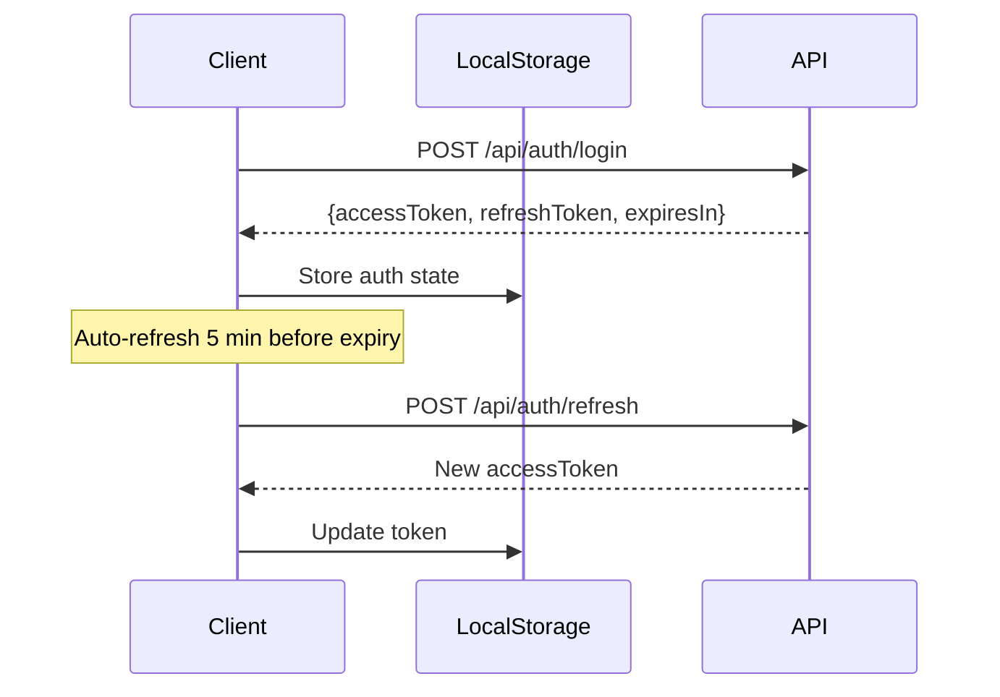

# CuraSense Frontend Documentation

> **Framework**: Next.js 16 + React 19
> **Styling**: Tailwind CSS 4
> **State**: Zustand + React Context
> **Version**: 2.0 | **Last Updated**: March 2026

---

## Architecture Overview

CuraSense uses a modern **Next.js App Router** architecture with server-side rendering and API routes that proxy to three backend services:

```
┌─────────────────────────────────────────────────────────────────────────────┐
│                           BROWSER (Client)                                  │
├─────────────────────────────────────────────────────────────────────────────┤
│  ┌──────────────┐  ┌──────────────┐  ┌──────────────┐  ┌──────────────┐     │
│  │   Pages      │  │  Components  │  │  State       │  │  API Client  │     │
│  │  (App Dir)   │  │  (UI/Layout) │  │  (Zustand)   │  │  (lib/api)   │     │
│  └──────────────┘  └──────────────┘  └──────────────┘  └──────────────┘     │
└───────────────────────────────────┬─────────────────────────────────────────┘
                                    │
                                    ▼
┌─────────────────────────────────────────────────────────────────────────────┐
│                         NEXT.JS SERVER                                      │
├─────────────────────────────────────────────────────────────────────────────┤
│  ┌──────────────┐  ┌──────────────┐  ┌──────────────┐  ┌──────────────┐     │
│  │  API Routes  │  │  Middleware  │  │  Prisma      │  │  Auth        │     │
│  │  (/api/*)    │  │  (JWT Check) │  │  (Database)  │  │  (Sessions)  │     │
│  └──────────────┘  └──────────────┘  └──────────────┘  └──────────────┘     │
└───────────┬─────────────────┬─────────────────┬─────────────────┬───────────┘
            │                 │                 │                 │
            ▼                 ▼                 ▼                 ▼
┌─────────────────┐ ┌─────────────────┐ ┌─────────────────┐ ┌─────────────┐
│     NeonDB      │ │     ML API      │ │   Vision API    │ │ Medicine API│
│   (PostgreSQL)  │ │   (Port 8000)   │ │  (Port 8001)    │ │ (Port 8002) │
└─────────────────┘ └─────────────────┘ └─────────────────┘ └─────────────┘
```

---

## Directory Structure

```
curasense-frontend/
├── src/
│   ├── app/                    # Next.js App Router pages
│   │   ├── api/                # API route handlers (proxy to backends)
│   │   │   ├── auth/           # Authentication endpoints
│   │   │   ├── diagnose/       # Diagnosis proxy (text/, pdf/)
│   │   │   ├── chat/           # Chat proxy
│   │   │   ├── compare/        # Medicine comparison proxy (curasense-ml)
│   │   │   ├── vision/         # Vision proxy (upload/, query/, answer/)
│   │   │   ├── medicine/       # Medicine Hub proxy ([name]/, recommend/,
│   │   │   │                   #   interaction/, compare/, analyze-image/)
│   │   │   ├── reports/        # Report CRUD
│   │   │   └── user/           # User profile
│   │   ├── diagnosis/          # AI Diagnosis page
│   │   ├── medicine/           # Medicine Hub (multi-page)
│   │   │   ├── page.tsx        # Hub dashboard landing
│   │   │   ├── lookup/         # Medicine lookup page
│   │   │   ├── advisor/        # Symptom advisor page
│   │   │   ├── interactions/   # Drug interaction checker page
│   │   │   ├── compare/        # Side-by-side comparison page
│   │   │   └── scanner/        # Medicine image scanner page
│   │   ├── reports/            # Report history
│   │   ├── analytics/          # Analytics dashboard
│   │   ├── login/              # Authentication
│   │   ├── register/
│   │   ├── profile/
│   │   ├── settings/
│   │   ├── layout.tsx          # Root layout with providers
│   │   └── page.tsx            # Landing page
│   ├── components/
│   │   ├── ui/                 # Reusable UI components
│   │   │   ├── aceternity.tsx  # Premium animated components (1014 lines)
│   │   │   └── premium-components.tsx  # Glass/glow/parallax components
│   │   ├── medicine/           # Medicine-specific components
│   │   │   ├── MedicineCard.tsx       # Medicine info display (372 lines)
│   │   │   ├── InteractionResult.tsx  # Risk level visualization (247 lines)
│   │   │   ├── ComparisonView.tsx     # Side-by-side view (328 lines)
│   │   │   └── RecommendationView.tsx # Staggered cards (110 lines)
│   │   ├── layout/             # Sidebar, Header, Nav
│   │   ├── motion/             # Animation components
│   │   ├── accessibility/      # A11y components
│   │   ├── analytics/          # Charts and stats
│   │   └── backgrounds/        # Visual effects
│   ├── lib/
│   │   ├── auth-context.tsx    # Auth provider (useAuth hook)
│   │   ├── store.ts            # Zustand store
│   │   ├── api.ts              # API client functions (all backends)
│   │   ├── medicine-types.ts   # Medicine TypeScript types + flatten utils
│   │   ├── medicine-cabinet.ts # localStorage cabinet + recent + activity
│   │   ├── prisma.ts           # Database client
│   │   └── db/                 # Database utilities
│   ├── styles/
│   │   └── tokens/
│   │       └── animations.ts   # Spring presets, variants, micro-interactions
│   └── middleware.ts           # Route protection (JWT check)
├── prisma/
│   ├── schema.prisma           # Database schema
│   └── seed.ts                 # Seed data
└── public/                     # Static assets
```

---

## Technology Stack

### Core Dependencies

| Package       | Version | Purpose                         |
| ------------- | ------- | ------------------------------- |
| `next`        | 16.0.6  | React framework with App Router |
| `react`       | 19.2.0  | UI library                      |
| `typescript`  | 5.x     | Type safety                     |
| `tailwindcss` | 4.x     | Utility-first CSS               |

### State Management

| Package         | Purpose                          |
| --------------- | -------------------------------- |
| `zustand`       | Global state (reports, chat, UI) |
| `react-context` | Auth state (user, tokens)        |

### UI Components

| Package         | Purpose                                        |
| --------------- | ---------------------------------------------- |
| `@radix-ui/*`   | Accessible primitives (Dialog, Dropdown, etc.) |
| `lucide-react`  | Icon library                                   |
| `framer-motion` | Animations                                     |
| `recharts`      | Data visualization                             |
| `sonner`        | Toast notifications                            |

### Database and Auth

| Package          | Purpose           |
| ---------------- | ----------------- |
| `@prisma/client` | Database ORM      |
| `bcryptjs`       | Password hashing  |
| `jsonwebtoken`   | JWT tokens        |
| `pg`             | PostgreSQL driver  |

---

## Pages Overview

### Public Pages

| Route              | Description                         |
| ------------------ | ----------------------------------- |
| `/`                | Landing page with features and hero |
| `/login`           | User authentication                 |
| `/register`        | New user registration               |
| `/forgot-password` | Password reset request              |
| `/reset-password`  | Password reset form                 |

### Protected Pages

| Route                      | Description                                |
| -------------------------- | ------------------------------------------ |
| `/diagnosis`               | AI diagnosis (text/PDF/X-ray)              |
| `/medicine`                | Medicine Hub dashboard (landing)           |
| `/medicine/lookup`         | Medicine lookup (search by name)           |
| `/medicine/advisor`        | Symptom-based medicine advisor             |
| `/medicine/interactions`   | Drug interaction checker                   |
| `/medicine/compare`        | Side-by-side medicine comparison           |
| `/medicine/scanner`        | Medicine image/label scanner               |
| `/reports`                 | Report history                             |
| `/analytics`               | Usage analytics dashboard                  |
| `/profile`                 | User profile management                    |
| `/settings`                | App settings                               |
| `/history`                 | Activity history                           |
| `/help`                    | Help and documentation                     |

---

## Medicine Hub Architecture

The Medicine Hub is a **multi-page experience** redesigned from a single tabbed interface. Each feature has its own dedicated page with a shared hub dashboard as the entry point.

### Hub Dashboard (`/medicine/page.tsx`)

The hub landing page includes:

- **Multi-layered background**: AuroraBackground + GridPattern + FloatingOrbs + GlowOrbs
- **Scroll-linked hero** with parallax opacity/scale/y fade
- **Animated search bar** with ambient glow on focus — navigates to `/medicine/lookup?q=...`
- **Smart Search Autocomplete** — debounced dropdown with suggestions from common medicines, recent searches, and cabinet items
- **Feature bento grid** — 5 SpotlightCardV2 cards with parallax tilt, gradient icons, stats badges
- **Medicine Category Quick-Access** — 8 condition cards (Pain Relief, Diabetes, Blood Pressure, Antibiotics, Allergies, Heart Health, Stomach/Digestion, Mental Health). Click category title for advisor, click example medicine for lookup
- **Medicine Cabinet** — glass-morphism section showing saved medicines with remove/clear/navigate actions
- **Emergency Medicine Card** — expandable numbered list of cabinet medicines with "Copy to Clipboard"
- **Batch Interaction Matrix** — "Check All" button (3+ cabinet items), checks every pair via API, shows color-coded safety grid
- **Recent Activity Feed** — last 5 activities with type icons, timestamps, navigation links
- **Health Tip of the Day** — daily rotating tip with animated lightbulb

### Sub-Pages

Each sub-page follows a consistent pattern:
- Reads URL query params via `window.location.search` in `useEffect` (avoids Suspense boundary requirements)
- Uses the shared design system (glassmorphism, framer-motion)
- Tracks activities via `medicine-cabinet.ts` utilities
- Saves analysis results via `saveReport()` with type `"medicine"` and `accessToken` from `useAuth()`
- Includes "Add to Cabinet" actions on results
- Interaction and Compare pages include "Select from Cabinet" buttons

| Page | URL Params | Description |
|---|---|---|
| Lookup | `?q=medicine_name` | Auto-searches on mount if `q` present |
| Advisor | `?symptoms=symptom_text` | Auto-searches on mount if `symptoms` present |
| Interactions | none | Manual input or select from cabinet |
| Compare | none | Manual input or select from cabinet |
| Scanner | none | Drag-drop image upload, Gemini Vision analysis |

### Medicine Cabinet (`lib/medicine-cabinet.ts`)

localStorage-based persistent storage utilities:

```typescript
// Cabinet (max 20 items)
getCabinet(): CabinetItem[]
addToCabinet(item: { name, genericName?, addedFrom }): void
removeFromCabinet(name: string): void
clearCabinet(): void
isInCabinet(name: string): boolean

// Recent Searches (max 8 items)
getRecentSearches(): RecentSearch[]
addRecentSearch(query: string, type: SearchType): void

// Activity Tracking (max 20 items, deduplication by type+query)
getActivities(): Activity[]
addActivity(activity: { type, query, result? }): void
```

### Medicine Types (`lib/medicine-types.ts`)

TypeScript types for all medicine API responses:

- `MedicineInfo` — full medicine details (name, generic_name, drug_class, uses, dosage, side_effects, warnings, interactions)
- `InteractionResult` — drug interaction response (severity, mechanism, effects, recommendations)
- `ComparisonResult` — comparison data structure
- `RecommendationResult` — symptom-based advice response
- `ImageAnalysisResponse` — scanner response (extracted_text, medicine_name, analysis)
- `flattenMedicine()` / `flattenInteraction()` — utility functions to normalize nested API responses

---

## Authentication System

### Auth Context (`lib/auth-context.tsx`)

Provides authentication state and methods to the entire app:

```typescript
interface AuthContextType {
  user: User | null;
  isAuthenticated: boolean;
  isGuest: boolean;
  isLoading: boolean;
  accessToken: string | null;

  // Methods
  login: (email: string, password: string) => Promise<Result>;
  register: (data: RegisterData) => Promise<Result>;
  logout: () => Promise<void>;
  forgotPassword: (email: string) => Promise<Result>;
  resetPassword: (token: string, password: string) => Promise<Result>;
  refreshToken: () => Promise<boolean>;
  updateProfile: (data: Partial<User>) => Promise<Result>;
  continueAsGuest: () => void;
}
```

### Token Management



### Guest Mode

Users can explore the app without registration:

```typescript
const { continueAsGuest, isGuest, exitGuestMode } = useAuth();

// Enable guest mode
continueAsGuest();

// Check if guest
if (isGuest) {
  // Show limited features
}
```

---

## State Management

### Zustand Store (`lib/store.ts`)

Global state with persistence:

```typescript
interface AppState {
  // Sidebar
  isSidebarExpanded: boolean;
  toggleSidebar: () => void;

  // Chat
  isChatOpen: boolean;
  chatHistory: ChatMessage[];
  addChatMessage: (message) => void;
  clearChatHistory: () => void;

  // Reports
  reports: Report[];
  currentReport: Report | null;
  addReport: (report) => void;
  removeReport: (id: string) => void;

  // Analytics
  getAnalytics: () => AnalyticsData;

  // Theme
  theme: "light" | "dark" | "system";
  setTheme: (theme) => void;
}
```

### localStorage State (Medicine Hub)

In addition to the Zustand store, the Medicine Hub uses direct localStorage for:

| Key | Purpose | Max Items |
|---|---|---|
| `medicine-cabinet` | Saved medicines the user is taking | 20 |
| `medicine-recent-searches` | Recent search queries | 8 |
| `medicine-activities` | Recent activity feed | 20 |

### Persisted State (Zustand)

The following state is saved to localStorage via Zustand:

- `isSidebarExpanded`
- `theme`
- `reports`

---

## API Layer

### Client-Side API (`lib/api.ts`)

Functions for calling all three backend services through Next.js proxy routes:

```typescript
// Diagnosis (proxied to curasense-ml)
export async function diagnosePDF(file: File): Promise<DiagnosisResponse>;
export async function diagnoseText(text: string): Promise<DiagnosisResponse>;

// X-Ray Analysis (proxied to ml-fastapi)
export async function uploadXrayImage(threadId: string, file: File);
export async function queryXrayImage(threadId: string, query: string);
export async function getXrayAnswer(threadId: string): Promise<string>;

// Chat (proxied to curasense-ml)
export async function sendChatMessage(
  message: string,
  reportContext?: string,
): Promise<ChatResponse>;

// Medicine Hub (proxied to medicine_model)
export async function getMedicine(name: string): Promise<MedicineInfo>;
export async function recommendMedicines(symptoms: string): Promise<RecommendationResult>;
export async function checkInteraction(med1: string, med2: string): Promise<InteractionResult>;
export async function compareMedicines(med1: string, med2: string): Promise<ComparisonResult>;
export async function analyzeMedicineImage(file: File): Promise<ImageAnalysisResponse>;
```

### API Routes (`app/api/`)

| Route | Method | Backend | Description |
|---|---|---|---|
| `/api/auth/login` | POST | — | User login |
| `/api/auth/register` | POST | — | User registration |
| `/api/auth/logout` | POST | — | Session logout |
| `/api/auth/refresh` | POST | — | Refresh access token |
| `/api/auth/verify` | GET | — | Verify token validity |
| `/api/diagnose/pdf` | POST | curasense-ml | Proxy: PDF diagnosis |
| `/api/diagnose/text` | POST | curasense-ml | Proxy: text diagnosis |
| `/api/chat` | POST | curasense-ml | Proxy: AI chat |
| `/api/compare` | POST | curasense-ml | Proxy: medicine comparison (legacy) |
| `/api/vision/upload` | POST | ml-fastapi | Proxy: X-ray image upload |
| `/api/vision/query` | POST | ml-fastapi | Proxy: image query |
| `/api/vision/answer` | POST | ml-fastapi | Proxy: get vision answer |
| `/api/medicine/[name]` | GET | medicine_model | Proxy: medicine lookup |
| `/api/medicine/recommend` | POST | medicine_model | Proxy: symptom recommendations |
| `/api/medicine/interaction` | POST | medicine_model | Proxy: drug interactions |
| `/api/medicine/compare` | POST | medicine_model | Proxy: medicine comparison |
| `/api/medicine/analyze-image` | POST | medicine_model | Proxy: scanner image analysis |
| `/api/reports` | GET/POST | — | Report CRUD |
| `/api/reports/[id]` | GET/DELETE | — | Single report ops |
| `/api/user/profile` | GET/PATCH | — | User profile |

---

## Component Library

### UI Components (`components/ui/`)

| Component     | Description                                 |
| ------------- | ------------------------------------------- |
| `Button`      | Primary, secondary, ghost, outline variants |
| `Card`        | Content container with header/footer        |
| `Input`       | Form input with validation states           |
| `Textarea`    | Multi-line text input                       |
| `Select`      | Dropdown selection                          |
| `Switch`      | Toggle switch                               |
| `Tabs`        | Tab navigation                              |
| `Badge`       | Status indicators                           |
| `AlertDialog` | Confirmation modals                         |
| `ScrollArea`  | Custom scrollbars                           |
| `Loading`     | Skeleton loaders and spinners               |

### Premium Components (`components/ui/aceternity.tsx`)

| Component | Description |
|---|---|
| `SpotlightCard` | Card with mouse-tracking spotlight effect |
| `GlowingBorder` | Animated glowing border wrapper |
| `TiltCard` | 3D tilt on hover |
| `GradientText` | Animated gradient text |
| `AnimatedContainer` | Scroll-triggered animation wrapper |
| `StaggerContainer` | Children animate in sequence |
| `FloatingOrb` | Floating ambient background orb |
| `GridPattern` | Subtle dot grid background |
| `PulsingDot` | AI status indicator |
| `OrganicBlob` | Morphing blob shape |
| `HeartbeatDivider` | Medical-themed section separator |
| `MedicalCrossContainer` | Cross-shaped container |
| `CapsuleContainer` | Pill-shaped container |
| `ShimmerButton` / `PressButton` / `MagneticButton` | Button variants |
| `FocusInput` | Input with focus glow |
| `BorderBeam` | Rotating border light |
| `EmptyState` | Empty state illustration |

### Premium Components (`components/ui/premium-components.tsx`)

| Component | Description |
|---|---|
| `GlassCard` | Glassmorphism card with backdrop-blur |
| `AnimatedCounter` | Number count-up animation on scroll |
| `MorphingBlob` | Shape-shifting background element |
| `ParallaxContainer` | Mouse-tracking 3D tilt container |
| `AuroraBackground` | Animated gradient background |
| `GlowOrb` | Glowing ambient light orb |
| `SpotlightCardV2` | Enhanced spotlight card with inner glow |
| `AnimatedDivider` | Animated horizontal rule |
| `FeatureIcon` | Icon with gradient background |
| `GradientTextV2` | Enhanced gradient text |
| `StaggerContainerV2` / `StaggerItemV2` | Enhanced stagger animations |
| `PulsingIndicator` | Pulsing status dot |
| `Shimmer` | Loading shimmer effect |
| `RippleButton` / `MagneticButton` | Interactive button variants |

### Medicine Components (`components/medicine/`)

| Component | Lines | Description |
|---|---|---|
| `MedicineCard` | 372 | Glassmorphism card displaying full medicine info — sections for uses, dosage, side effects, warnings, interactions. Expandable sections with framer-motion. |
| `InteractionResult` | 247 | Drug interaction visualization — color-coded risk levels (Low=green, Moderate=amber, High=red), mechanism details, clinical effects, recommendations. |
| `ComparisonView` | 328 | Side-by-side medicine comparison — split layout showing both medicines across multiple categories with visual diff highlights. |
| `RecommendationView` | 110 | Staggered medicine recommendation cards — animated entrance, click to navigate to lookup. |

### Layout Components (`components/layout/`)

| Component   | Description                      |
| ----------- | -------------------------------- |
| `Sidebar`   | Desktop navigation (collapsible) |
| `Header`    | Top bar with user menu           |
| `MobileNav` | Bottom navigation for mobile     |

### Motion Components (`components/motion/`)

| Component        | Description               |
| ---------------- | ------------------------- |
| `ScrollProgress` | Reading progress bar      |
| `ScrollToTop`    | Floating scroll button    |
| `FadeIn`         | Fade-in animation wrapper |

---

## Design System

### CSS Custom Properties (`globals.css` — 2029 lines)

All colors are defined as HSL values via CSS custom properties:

```css
/* Brand colors */
--brand-primary: 168 80% 45%;      /* Teal */
--brand-secondary: 262 80% 55%;    /* Purple */

/* Feature colors */
--color-medicine: 152 68% 45%;     /* Green */
--color-diagnosis: 210 80% 50%;    /* Blue */
--color-vision: 280 70% 55%;       /* Violet */

/* Semantic colors */
--color-success: 152 68% 45%;      /* Green */
--color-warning: 38 92% 50%;       /* Amber */
--color-error: 0 72% 51%;          /* Red */
--color-info: 210 80% 50%;         /* Blue */
```

Usage: `hsl(var(--brand-primary))`, `hsl(var(--color-medicine))`, etc.

### Animation Tokens (`styles/tokens/animations.ts` — 307 lines)

```typescript
// Spring presets
springPresets: { snappy, smooth, bouncy, heavy, gentle }

// Animation variants (for framer-motion)
animationVariants: { fadeIn, fadeUp, scaleIn, blurIn, ... }

// Element-specific springs
elementSprings: { button, card, modal, tooltip, ... }

// Stagger config
staggerConfig: { fast, normal, slow }

// Micro-interactions
microInteractions: { hover, tap, focus, ... }

// Page transitions
pageTransitions: { fade, slide, scale, ... }
```

### Tailwind Color Classes — Static Maps

Dynamic color classes use static class maps (not template literal interpolation) to ensure Tailwind's JIT compiler includes them:

```typescript
// Example from medicine hub
const FEATURE_COLORS: Record<string, { bg: string; text: string; shadow: string }> = {
  lookup: { bg: "bg-emerald-500/20", text: "text-emerald-400", shadow: "shadow-emerald-500/25" },
  advisor: { bg: "bg-blue-500/20", text: "text-blue-400", shadow: "shadow-blue-500/25" },
  // ...
};
```

---

## Chat Assistant

The floating chat assistant (`components/chat-assistant.tsx`) provides:

- **AI-powered responses** using Groq LLM
- **Context-aware** — knows about current report
- **Keyboard shortcuts** — `Ctrl+K` to open
- **Conversation history** — maintained in Zustand
- **Markdown rendering** — for formatted responses

### Keyboard Shortcuts

| Shortcut   | Action          |
| ---------- | --------------- |
| `Ctrl + K` | Open/close chat |
| `Escape`   | Close chat      |
| `Enter`    | Send message    |

---

## Theming

### Theme Provider

Uses `next-themes` for dark/light mode:

```tsx
// In providers.tsx
<ThemeProvider attribute="class" defaultTheme="system">
  {children}
</ThemeProvider>
```

### Toggle Theme

```typescript
const { theme, setTheme } = useAppStore();
setTheme(theme === "dark" ? "light" : "dark");
```

---

## Middleware

Route protection via `middleware.ts`:

```typescript
const protectedRoutes = [
  "/diagnosis",
  "/medicine",
  "/reports",
  "/analytics",
  "/profile",
  "/settings",
];

const publicRoutes = ["/login", "/register", "/forgot-password"];

export function middleware(request: NextRequest) {
  const token = request.cookies.get("refreshToken");
  const isProtected = protectedRoutes.some((route) =>
    pathname.startsWith(route),
  );

  if (isProtected && !token) {
    return NextResponse.redirect("/login");
  }

  if (publicRoutes.includes(pathname) && token) {
    return NextResponse.redirect("/");
  }
}
```

---

## Environment Variables

### Required Variables

| Variable             | Example               | Description       |
| -------------------- | --------------------- | ----------------- |
| `DATABASE_URL`       | `postgresql://...`    | NeonDB connection |
| `JWT_SECRET`         | `your-secret-key`     | JWT signing key   |
| `JWT_REFRESH_SECRET` | `your-refresh-secret` | Refresh token key |

### Backend URL Variables (Server-Side Only)

| Variable             | Default                    | Description            |
| -------------------- | -------------------------- | ---------------------- |
| `BACKEND_API_URL`    | `http://localhost:8000`    | ML API (curasense-ml)  |
| `BACKEND_VISION_URL` | `http://localhost:8001`    | Vision API (ml-fastapi)|
| `MEDICINE_API_URL`   | `http://127.0.0.1:8002`   | Medicine API           |

### Client-Side Variables

| Variable                     | Default                 | Description              |
| ---------------------------- | ----------------------- | ------------------------ |
| `NEXT_PUBLIC_ML_API`         | `http://localhost:8001` | Vision API (direct call) |
| `NEXT_PUBLIC_ML_API_URL`     | `http://localhost:8000` | ML API URL               |
| `NEXT_PUBLIC_VISION_API_URL` | `http://localhost:8001` | Vision API URL           |

---

## Responsive Design

### Breakpoints

| Breakpoint | Size   | Description   |
| ---------- | ------ | ------------- |
| `sm`       | 640px  | Small devices |
| `md`       | 768px  | Tablets       |
| `lg`       | 1024px | Desktop       |
| `xl`       | 1280px | Large desktop |
| `2xl`      | 1536px | Extra large   |

### Mobile Navigation

- Desktop: Sidebar (collapsible)
- Mobile: Bottom navigation bar

```tsx
{/* Desktop only */}
<Sidebar className="hidden lg:flex" />

{/* Mobile only */}
<MobileNav className="lg:hidden" />
```

---

## Accessibility

### Features

| Feature              | Implementation                     |
| -------------------- | ---------------------------------- |
| **Skip Navigation**  | `<SkipNavigation />` component     |
| **Keyboard Nav**     | All interactive elements focusable |
| **Screen Readers**   | ARIA labels on components          |
| **Focus Indicators** | Visible focus rings                |
| **Color Contrast**   | WCAG AA compliant                  |

### Components

```tsx
import {
  SkipNavigation,
  SkipNavTarget,
  FocusTrap,
  KeyboardNavigation,
} from "@/components/accessibility";
```

---

## Running the Application

### Development

```bash
cd curasense-frontend
npm install
npm run dev
```

Opens at `http://localhost:3000`

### Production Build

```bash
npm run build
npm start
```

### Database Setup

```bash
npx prisma generate
npx prisma db push
npm run db:seed    # Optional: seed with sample data
```

---

## Analytics Dashboard

The analytics page (`/analytics`) displays:

- **Total Reports** — Count by status and type
- **Processing Time** — Average time per analysis
- **Confidence Scores** — AI accuracy metrics
- **Daily Usage** — 30-day usage chart
- **Findings Frequency** — Common diagnoses

### Data Source

Analytics are computed from the Zustand store:

```typescript
const { getAnalytics } = useAppStore();
const analytics = getAnalytics();

// Returns:
{
  totalReportsAnalyzed: number;
  reportsByType: Record<string, number>;
  averageProcessingTime: number;
  accuracyMetrics: {
    averageConfidence: number;
    highConfidenceCount: number;
  }
  dailyUsage: Array<{ date: string; count: number }>;
}
```

---

## Scripts

| Script              | Description              |
| ------------------- | ------------------------ |
| `npm run dev`       | Start development server |
| `npm run build`     | Production build         |
| `npm run start`     | Start production server  |
| `npm run lint`      | Run ESLint               |
| `npm run db:seed`   | Seed database            |
| `npm run db:studio` | Open Prisma Studio       |

---

## Key Files Reference

| File | Purpose |
|---|---|
| `src/app/layout.tsx` | Root layout with providers |
| `src/app/page.tsx` | Landing page |
| `src/app/medicine/page.tsx` | Medicine Hub dashboard (~1300 lines) |
| `src/lib/auth-context.tsx` | Authentication provider |
| `src/lib/store.ts` | Zustand state management |
| `src/lib/api.ts` | API client functions (all 3 backends) |
| `src/lib/medicine-types.ts` | Medicine TypeScript types + flatten utils |
| `src/lib/medicine-cabinet.ts` | localStorage cabinet/recent/activity |
| `src/middleware.ts` | Route protection |
| `src/app/globals.css` | Design system (~2029 lines) |
| `src/styles/tokens/animations.ts` | Animation presets and variants |
| `src/components/ui/aceternity.tsx` | Premium animated UI components |
| `src/components/ui/premium-components.tsx` | Glass/glow/parallax components |

---

## Related Documentation

- [BACKEND_DOCUMENTATION.md](BACKEND_DOCUMENTATION.md) - Backend API reference (all 3 services)
- [DATABASE_DOCUMENTATION.md](DATABASE_DOCUMENTATION.md) - Database schema and auth flow
- [README.md](README.md) - Quick start guide and project overview

---

**Maintainers**: CuraSense Team
**License**: MIT
