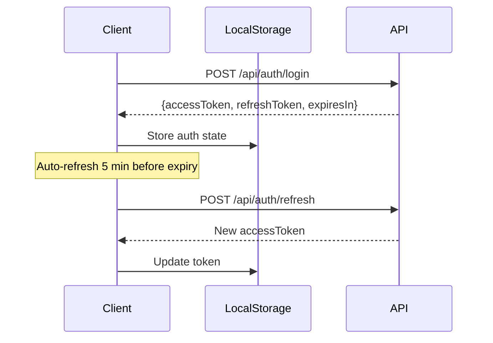

# CuraSense Frontend Documentation

> **Framework**: Next.js 16 + React 19  
> **Styling**: Tailwind CSS 4  
> **State**: Zustand + React Context  
> **Version**: 1.0 | **Last Updated**: February 2026

---

## 📐 Architecture Overview

CuraSense uses a modern **Next.js App Router** architecture with server-side rendering and API routes:

```
┌─────────────────────────────────────────────────────────────────────────────┐
│                           BROWSER (Client)                                  │
├─────────────────────────────────────────────────────────────────────────────┤
│  ┌──────────────┐  ┌──────────────┐  ┌──────────────┐  ┌──────────────┐     │
│  │   Pages      │  │  Components  │  │  State       │  │  API Client  │     │
│  │  (App Dir)   │  │  (UI/Layout) │  │  (Zustand)   │  │  (lib/api)   │     │
│  └──────────────┘  └──────────────┘  └──────────────┘  └──────────────┘     │
└───────────────────────────────────┬─────────────────────────────────────────┘
                                    │
                                    ▼
┌─────────────────────────────────────────────────────────────────────────────┐
│                         NEXT.JS SERVER                                      │
├─────────────────────────────────────────────────────────────────────────────┤
│  ┌──────────────┐  ┌──────────────┐  ┌──────────────┐  ┌──────────────┐     │
│  │  API Routes  │  │  Middleware  │  │  Prisma      │  │  Auth        │     │
│  │  (/api/*)    │  │  (JWT Check) │  │  (Database)  │  │  (Sessions)  │     │
│  └──────────────┘  └──────────────┘  └──────────────┘  └──────────────┘     │
└───────────────────────────────────┬─────────────────────────────────────────┘
                                    │
              ┌─────────────────────┼─────────────────────┐
              ▼                     ▼                     ▼
┌─────────────────────┐  ┌─────────────────────┐  ┌─────────────────────┐
│     NeonDB          │  │     ML API          │  │    Vision API       │
│   (PostgreSQL)      │  │   (Port 8000)       │  │   (Port 8001)       │
└─────────────────────┘  └─────────────────────┘  └─────────────────────┘
```

---

## 🗂️ Directory Structure

```
curasense-frontend/
├── src/
│   ├── app/                    # Next.js App Router pages
│   │   ├── api/                # API route handlers
│   │   │   ├── auth/           # Authentication endpoints
│   │   │   ├── diagnose/       # Diagnosis proxy endpoints
│   │   │   ├── reports/        # Report CRUD
│   │   │   └── user/           # User profile
│   │   ├── diagnosis/          # Diagnosis page
│   │   ├── medicine/           # Medicine comparison
│   │   ├── reports/            # Report history
│   │   ├── analytics/          # Analytics dashboard
│   │   ├── login/              # Authentication
│   │   ├── register/
│   │   ├── profile/
│   │   ├── settings/
│   │   ├── layout.tsx          # Root layout
│   │   └── page.tsx            # Home page
│   ├── components/
│   │   ├── ui/                 # Reusable UI components
│   │   ├── layout/             # Sidebar, Header, Nav
│   │   ├── motion/             # Animation components
│   │   ├── accessibility/      # A11y components
│   │   ├── analytics/          # Charts and stats
│   │   └── backgrounds/        # Visual effects
│   ├── lib/
│   │   ├── auth-context.tsx    # Auth provider
│   │   ├── store.ts            # Zustand store
│   │   ├── api.ts              # API client functions
│   │   ├── prisma.ts           # Database client
│   │   └── db/                 # Database utilities
│   ├── styles/
│   │   └── tokens/             # Design tokens
│   └── middleware.ts           # Route protection
├── prisma/
│   ├── schema.prisma           # Database schema
│   └── seed.ts                 # Seed data
└── public/                     # Static assets
```

---

## 📦 Technology Stack

### Core Dependencies

| Package       | Version | Purpose                         |
| ------------- | ------- | ------------------------------- |
| `next`        | 16.0.6  | React framework with App Router |
| `react`       | 19.2.0  | UI library                      |
| `typescript`  | 5.x     | Type safety                     |
| `tailwindcss` | 4.x     | Utility-first CSS               |

### State Management

| Package         | Purpose                          |
| --------------- | -------------------------------- |
| `zustand`       | Global state (reports, chat, UI) |
| `react-context` | Auth state (user, tokens)        |

### UI Components

| Package         | Purpose                                        |
| --------------- | ---------------------------------------------- |
| `@radix-ui/*`   | Accessible primitives (Dialog, Dropdown, etc.) |
| `lucide-react`  | Icon library                                   |
| `framer-motion` | Animations                                     |
| `recharts`      | Data visualization                             |
| `sonner`        | Toast notifications                            |

### Database & Auth

| Package          | Purpose           |
| ---------------- | ----------------- |
| `@prisma/client` | Database ORM      |
| `bcryptjs`       | Password hashing  |
| `jsonwebtoken`   | JWT tokens        |
| `pg`             | PostgreSQL driver |

---

## 📄 Pages Overview

### Public Pages

| Route              | Description                         |
| ------------------ | ----------------------------------- |
| `/`                | Landing page with features and hero |
| `/login`           | User authentication                 |
| `/register`        | New user registration               |
| `/forgot-password` | Password reset request              |
| `/reset-password`  | Password reset form                 |

### Protected Pages

| Route        | Description                   |
| ------------ | ----------------------------- |
| `/diagnosis` | AI diagnosis (text/PDF/X-ray) |
| `/medicine`  | Medicine comparison tool      |
| `/reports`   | Report history                |
| `/analytics` | Usage analytics dashboard     |
| `/profile`   | User profile management       |
| `/settings`  | App settings                  |
| `/history`   | Activity history              |
| `/help`      | Help & documentation          |

---

## 🔐 Authentication System

### Auth Context (`lib/auth-context.tsx`)

Provides authentication state and methods to the entire app:

```typescript
interface AuthContextType {
  user: User | null;
  isAuthenticated: boolean;
  isGuest: boolean;
  isLoading: boolean;
  accessToken: string | null;

  // Methods
  login: (email: string, password: string) => Promise<Result>;
  register: (data: RegisterData) => Promise<Result>;
  logout: () => Promise<void>;
  forgotPassword: (email: string) => Promise<Result>;
  resetPassword: (token: string, password: string) => Promise<Result>;
  refreshToken: () => Promise<boolean>;
  updateProfile: (data: Partial<User>) => Promise<Result>;
  continueAsGuest: () => void;
}
```

### Token Management



### Guest Mode

Users can explore the app without registration:

```typescript
const { continueAsGuest, isGuest, exitGuestMode } = useAuth();

// Enable guest mode
continueAsGuest();

// Check if guest
if (isGuest) {
  // Show limited features
}
```

---

## 🗄️ State Management

### Zustand Store (`lib/store.ts`)

Global state with persistence:

```typescript
interface AppState {
  // Sidebar
  isSidebarExpanded: boolean;
  toggleSidebar: () => void;

  // Chat
  isChatOpen: boolean;
  chatHistory: ChatMessage[];
  addChatMessage: (message) => void;
  clearChatHistory: () => void;

  // Reports
  reports: Report[];
  currentReport: Report | null;
  addReport: (report) => void;
  removeReport: (id: string) => void;

  // Analytics
  getAnalytics: () => AnalyticsData;

  // Theme
  theme: "light" | "dark" | "system";
  setTheme: (theme) => void;
}
```

### Usage Example

```typescript
import { useAppStore } from "@/lib/store";

function MyComponent() {
  const { reports, addReport, theme } = useAppStore();

  const handleNewReport = (data) => {
    addReport({
      type: "prescription",
      title: "Blood Test",
      content: data,
      status: "completed",
    });
  };
}
```

### Persisted State

The following state is saved to localStorage:

- `isSidebarExpanded`
- `theme`
- `reports`

---

## 🌐 API Layer

### Client-Side API (`lib/api.ts`)

Functions for calling backend services:

```typescript
// PDF Diagnosis - proxied through Next.js
export async function diagnosePDF(file: File): Promise<DiagnosisResponse>;

// Text Diagnosis - proxied through Next.js
export async function diagnoseText(text: string): Promise<DiagnosisResponse>;

// X-Ray Analysis - direct to Vision API
export async function uploadXrayImage(threadId: string, file: File);
export async function queryXrayImage(threadId: string, query: string);
export async function getXrayAnswer(threadId: string): Promise<string>;

// Chat - proxied through Next.js
export async function sendChatMessage(
  message: string,
  reportContext?: string,
): Promise<ChatResponse>;

// Medicine Comparison
export async function compareMedicines(
  medicines: string[],
): Promise<ComparisonResult>;
```

### API Routes (`app/api/`)

| Route                | Method     | Description                        |
| -------------------- | ---------- | ---------------------------------- |
| `/api/auth/login`    | POST       | User login                         |
| `/api/auth/register` | POST       | User registration                  |
| `/api/auth/logout`   | POST       | Session logout                     |
| `/api/auth/refresh`  | POST       | Refresh access token               |
| `/api/auth/verify`   | GET        | Verify token validity              |
| `/api/diagnose/pdf`  | POST       | Proxy to ML API for PDF diagnosis  |
| `/api/diagnose/text` | POST       | Proxy to ML API for text diagnosis |
| `/api/chat`          | POST       | Proxy to ML API for chat           |
| `/api/compare`       | POST       | Medicine comparison                |
| `/api/reports`       | GET/POST   | Report CRUD                        |
| `/api/reports/[id]`  | GET/DELETE | Single report ops                  |
| `/api/user/profile`  | GET/PATCH  | User profile                       |

---

## 🎨 Component Library

### UI Components (`components/ui/`)

| Component     | Description                                 |
| ------------- | ------------------------------------------- |
| `Button`      | Primary, secondary, ghost, outline variants |
| `Card`        | Content container with header/footer        |
| `Input`       | Form input with validation states           |
| `Textarea`    | Multi-line text input                       |
| `Select`      | Dropdown selection                          |
| `Switch`      | Toggle switch                               |
| `Tabs`        | Tab navigation                              |
| `Badge`       | Status indicators                           |
| `AlertDialog` | Confirmation modals                         |
| `ScrollArea`  | Custom scrollbars                           |
| `Loading`     | Skeleton loaders and spinners               |

### Layout Components (`components/layout/`)

| Component   | Description                      |
| ----------- | -------------------------------- |
| `Sidebar`   | Desktop navigation (collapsible) |
| `Header`    | Top bar with user menu           |
| `MobileNav` | Bottom navigation for mobile     |

### Motion Components (`components/motion/`)

| Component        | Description               |
| ---------------- | ------------------------- |
| `ScrollProgress` | Reading progress bar      |
| `ScrollToTop`    | Floating scroll button    |
| `FadeIn`         | Fade-in animation wrapper |

### Premium Components (`components/ui/premium-components.tsx`)

Advanced UI elements:

- `GlowingCard` - Cards with glow effects
- `AnimatedCounter` - Number animations
- `PulseButton` - Attention-grabbing buttons
- `GradientText` - Animated gradient text

---

## 💬 Chat Assistant

The floating chat assistant (`components/chat-assistant.tsx`) provides:

- **AI-powered responses** using Groq LLM
- **Context-aware** - knows about current report
- **Keyboard shortcuts** - `Ctrl+K` to open
- **Conversation history** - maintained in Zustand
- **Markdown rendering** - for formatted responses

### Usage

```tsx
import { ChatAssistant } from "@/components/chat-assistant";

// Included in root layout - always available
<ChatAssistant />;
```

### Keyboard Shortcuts

| Shortcut   | Action          |
| ---------- | --------------- |
| `Ctrl + K` | Open/close chat |
| `Escape`   | Close chat      |
| `Enter`    | Send message    |

---

## 🎭 Theming

### Theme Provider

Uses `next-themes` for dark/light mode:

```tsx
// In providers.tsx
<ThemeProvider attribute="class" defaultTheme="system">
  {children}
</ThemeProvider>
```

### CSS Variables

```css
:root {
  --background: 0 0% 100%;
  --foreground: 222.2 84% 4.9%;
  --card: 0 0% 100%;
  --primary: 221.2 83.2% 53.3%;
  /* ... */
}

.dark {
  --background: 222.2 84% 4.9%;
  --foreground: 210 40% 98%;
  /* ... */
}
```

### Toggle Theme

```typescript
const { theme, setTheme } = useAppStore();

// Toggle
setTheme(theme === "dark" ? "light" : "dark");
```

---

## 🛡️ Middleware

Route protection via `middleware.ts`:

```typescript
const protectedRoutes = [
  "/diagnosis",
  "/reports",
  "/analytics",
  "/profile",
  "/settings",
];

const publicRoutes = ["/login", "/register", "/forgot-password"];

export function middleware(request: NextRequest) {
  const token = request.cookies.get("refreshToken");
  const isProtected = protectedRoutes.some((route) =>
    pathname.startsWith(route),
  );

  if (isProtected && !token) {
    return NextResponse.redirect("/login");
  }

  if (publicRoutes.includes(pathname) && token) {
    return NextResponse.redirect("/");
  }
}
```

---

## 🔑 Environment Variables

### Required Variables

| Variable             | Example               | Description       |
| -------------------- | --------------------- | ----------------- |
| `DATABASE_URL`       | `postgresql://...`    | NeonDB connection |
| `JWT_SECRET`         | `your-secret-key`     | JWT signing key   |
| `JWT_REFRESH_SECRET` | `your-refresh-secret` | Refresh token key |

### Optional Variables

| Variable                     | Default                 | Description    |
| ---------------------------- | ----------------------- | -------------- |
| `NEXT_PUBLIC_ML_API`         | `http://localhost:8001` | Vision API URL |
| `NEXT_PUBLIC_ML_API_URL`     | `http://localhost:8000` | ML API URL     |
| `NEXT_PUBLIC_VISION_API_URL` | `http://localhost:8001` | Vision API URL |

---

## 📱 Responsive Design

### Breakpoints

| Breakpoint | Size   | Description   |
| ---------- | ------ | ------------- |
| `sm`       | 640px  | Small devices |
| `md`       | 768px  | Tablets       |
| `lg`       | 1024px | Desktop       |
| `xl`       | 1280px | Large desktop |
| `2xl`      | 1536px | Extra large   |

### Mobile Navigation

- Desktop: Sidebar (collapsible)
- Mobile: Bottom navigation bar

```tsx
{
  /* Desktop only */
}
<Sidebar className="hidden lg:flex" />;

{
  /* Mobile only */
}
<MobileNav className="lg:hidden" />;
```

---

## ♿ Accessibility

### Features

| Feature              | Implementation                     |
| -------------------- | ---------------------------------- |
| **Skip Navigation**  | `<SkipNavigation />` component     |
| **Keyboard Nav**     | All interactive elements focusable |
| **Screen Readers**   | ARIA labels on components          |
| **Focus Indicators** | Visible focus rings                |
| **Color Contrast**   | WCAG AA compliant                  |

### Components

```tsx
import {
  SkipNavigation,
  SkipNavTarget,
  FocusTrap,
  KeyboardNavigation,
} from "@/components/accessibility";
```

---

## 🚀 Running the Application

### Development

```bash
cd curasense-frontend
npm install
npm run dev
```

Opens at `http://localhost:3000`

### Production Build

```bash
npm run build
npm start
```

### Docker

```bash
docker build -t curasense-frontend .
docker run -p 3000:3000 --env-file .env curasense-frontend
```

---

## 📊 Analytics Dashboard

The analytics page (`/analytics`) displays:

- **Total Reports** - Count by status and type
- **Processing Time** - Average time per analysis
- **Confidence Scores** - AI accuracy metrics
- **Daily Usage** - 30-day usage chart
- **Findings Frequency** - Common diagnoses

### Data Source

Analytics are computed from the Zustand store:

```typescript
const { getAnalytics } = useAppStore();
const analytics = getAnalytics();

// Returns:
{
  totalReportsAnalyzed: number;
  reportsByType: Record<string, number>;
  averageProcessingTime: number;
  accuracyMetrics: {
    averageConfidence: number;
    highConfidenceCount: number;
  }
  dailyUsage: Array<{ date: string; count: number }>;
}
```

---

## 🔧 Scripts

| Script              | Description              |
| ------------------- | ------------------------ |
| `npm run dev`       | Start development server |
| `npm run build`     | Production build         |
| `npm run start`     | Start production server  |
| `npm run lint`      | Run ESLint               |
| `npm run db:seed`   | Seed database            |
| `npm run db:studio` | Open Prisma Studio       |

---

## 📁 Key Files Reference

| File                       | Purpose                    |
| -------------------------- | -------------------------- |
| `src/app/layout.tsx`       | Root layout with providers |
| `src/app/page.tsx`         | Home page (~48KB)          |
| `src/lib/auth-context.tsx` | Authentication provider    |
| `src/lib/store.ts`         | Zustand state management   |
| `src/lib/api.ts`           | API client functions       |
| `src/middleware.ts`        | Route protection           |
| `src/app/globals.css`      | Global styles (~53KB)      |

---

## 🔗 Related Documentation

- [BACKEND_DOCUMENTATION.md](BACKEND_DOCUMENTATION.md) - Backend API reference
- [DATABASE_DOCUMENTATION.md](DATABASE_DOCUMENTATION.md) - Database schema
- [ENV_DOCUMENTATION.md](ENV_DOCUMENTATION.md) - Environment variables

---

**Maintainers**: CuraSense Team  
**License**: MIT
