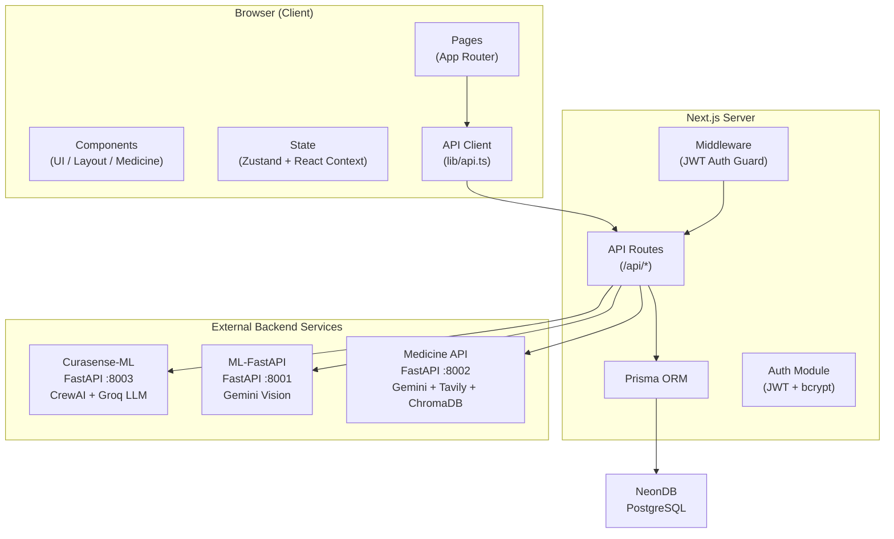
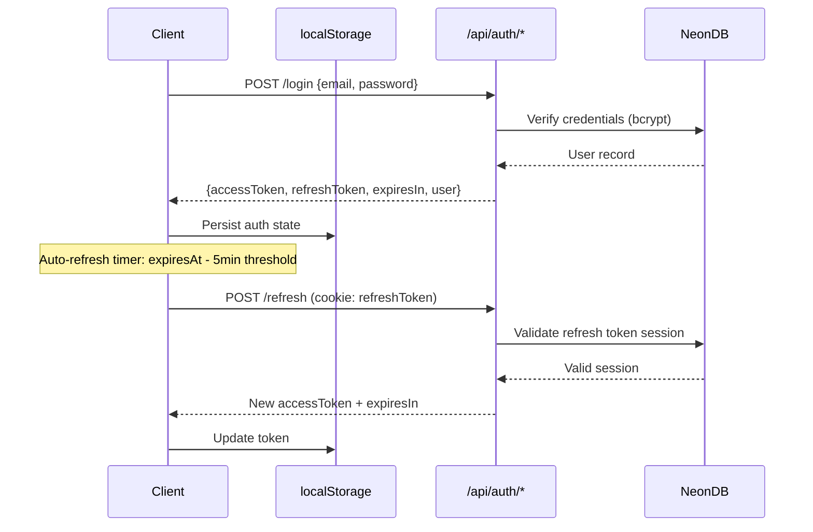

# CuraSense Frontend — Technical Report

> **Application**: CuraSense AI-Powered Healthcare Assistant  
> **Framework**: Next.js 16 · React 19 · TypeScript 5  
> **Report Date**: March 2026

---

## 1. Executive Summary

CuraSense is a full-stack healthcare AI platform whose frontend is built on **Next.js 16** with the **App Router** architecture. The application provides AI-powered medical diagnosis (text, PDF, and X-ray), a comprehensive medicine intelligence hub, a conversational AI assistant, and analytics dashboards — all behind a JWT-authenticated, role-based access system.

The frontend acts as both the user-facing interface and a server-side proxy layer. All external backend calls are routed through **28 Next.js API routes**, avoiding CORS issues and keeping backend URLs strictly server-side. The UI is powered by **Tailwind CSS 4**, **Framer Motion 12**, **Radix UI** primitives, and a custom premium component library with glassmorphism, spotlight effects, and parallax animations.

---

## 2. Architecture Overview

### Key Architectural Decisions

| Decision | Rationale |
|---|---|
| **Server-side proxy pattern** | Client never knows backend URLs; no `NEXT_PUBLIC_*` env vars for backends |
| **Zustand + localStorage** | Instant UI for reports and settings; DB persistence is fire-and-forget |
| **Prisma with `@prisma/adapter-pg`** | Uses native `pg` Pool for NeonDB compatibility with connection pooling |
| **Lazy Prisma initialization** | Proxy-based getter prevents build-time `DATABASE_URL` requirement |
| **Standalone Docker output** | `next.config.ts` sets `output: "standalone"` for containerized deployment |

---

## 3. Technology Stack

### 3.1 Core Framework & Language

| Technology | Version | Purpose |
|---|---|---|
| [Next.js](https://nextjs.org/) | **16.0.6** | React meta-framework — App Router, Server Components, API Routes |
| [React](https://react.dev/) | **19.2.0** | Component model, hooks (`useSyncExternalStore`, `use` hook) |
| [TypeScript](https://www.typescriptlang.org/) | **5.x** | Static typing, interface definitions for all API contracts |

### 3.2 Styling & UI

| Package | Version | Purpose |
|---|---|---|
| [Tailwind CSS](https://tailwindcss.com/) | **4.x** | Utility-first CSS, JIT compilation |
| [tailwind-merge](https://github.com/dcastil/tailwind-merge) | 3.4.0 | Intelligent className merging without conflicts |
| [class-variance-authority](https://cva.style/) | 0.7.1 | Variant-driven component styling (Button, Badge, Card) |
| [tw-animate-css](https://github.com/magicuidesign/tw-animate-css) | 1.4.0 | CSS keyframe animation utilities |

### 3.3 Component Libraries

| Package | Usage |
|---|---|
| **@radix-ui/react-*** (12 packages) | Accessible headless primitives: Dialog, AlertDialog, DropdownMenu, Select, Tabs, Switch, Tooltip, Avatar, Label, Separator, Slot, ScrollArea |
| [lucide-react](https://lucide.dev/) | **0.555.0** — 1000+ SVG icons (MessageCircle, Send, Bot, Sparkles, etc.) |
| [framer-motion](https://www.framer.com/motion/) | **12.23.24** — Animation engine (springs, variants, AnimatePresence, layout animations) |
| [recharts](https://recharts.org/) | **3.6.0** — Data visualization charts for analytics dashboard |
| [sonner](https://sonner.emilkowal.dev/) | **2.0.7** — Toast notification system |

### 3.4 State Management

| Package | Version | Purpose |
|---|---|---|
| [zustand](https://zustand.docs.pmnd.rs/) | **5.0.9** | Global state: reports, chat history, sidebar, theme. Uses `persist` middleware with localStorage |
| React Context | built-in | Authentication state (`AuthProvider` / `useAuth`) |

### 3.5 Database & Auth

| Package | Version | Purpose |
|---|---|---|
| [@prisma/client](https://www.prisma.io/) | **7.2.0** | Type-safe ORM for PostgreSQL |
| [@prisma/adapter-pg](https://www.prisma.io/docs/orm/overview/databases/neon) | 7.2.0 | NeonDB-compatible PostgreSQL driver adapter |
| [pg](https://node-postgres.com/) | **8.17.0** | Native PostgreSQL connection pool |
| [bcryptjs](https://www.npmjs.com/package/bcryptjs) | **3.0.3** | WASM-based password hashing |
| [jsonwebtoken](https://www.npmjs.com/package/jsonwebtoken) | **9.0.3** | JWT access/refresh token generation and verification |

### 3.6 Utilities

| Package | Version | Purpose |
|---|---|---|
| [marked](https://marked.js.org/) | **17.0.1** | Markdown → HTML rendering (reports, chat, exports) |
| [react-dropzone](https://react-dropzone.js.org/) | **14.3.8** | Drag-and-drop file upload (PDF, images) |
| [lenis](https://lenis.darkroom.engineering/) | **1.3.15** | Smooth scroll engine for premium page transitions |
| [next-themes](https://github.com/pacocoursey/next-themes) | **0.4.6** | Dark/light/system theme switching with SSR support |
| [clsx](https://github.com/lukeed/clsx) | 2.1.1 | Conditional className builder |

---

## 4. Application Pages & Features

### 4.1 Public Pages

| Route | Feature | Implementation |
|---|---|---|
| `/` | **Landing page** — Hero section, feature showcase, animated components | `app/page.tsx` (54,824 bytes) |
| `/login` | Email + password authentication | `app/login/page.tsx` |
| `/register` | New user registration (firstName, lastName, email, password, phone, DOB) | `app/register/page.tsx` |
| `/forgot-password` | Password reset request | `app/forgot-password/page.tsx` |
| `/reset-password` | Token-based password reset form | `app/reset-password/page.tsx` |

### 4.2 Protected Pages

| Route | Feature | Description |
|---|---|---|
| `/diagnosis` | **AI Diagnosis** | Text input, PDF upload, and X-ray image analysis. Multi-modal analysis powered by CrewAI agents |
| `/medicine` | **Medicine Hub Dashboard** | Entry point with search, category cards, cabinet, batch interaction matrix, activity feed |
| `/medicine/lookup` | Medicine Lookup | Search by name → detailed medicine card (composition, uses, dosage, side effects, warnings) |
| `/medicine/advisor` | Symptom Advisor | Enter symptoms → AI-recommended medicines with staggered animation |
| `/medicine/interactions` | Drug Interaction Checker | Enter two medicines → color-coded risk level (Low/Moderate/High) with recommendations |
| `/medicine/compare` | Medicine Comparison | Side-by-side comparison across categories (dosage, price, composition, uses, side effects) |
| `/medicine/scanner` | Medicine Image Scanner | Upload image of medicine packaging → Gemini Vision extracts brand, generic name, strength |
| `/reports` | Report History | CRUD operations on saved analysis reports with export options |
| `/analytics` | Analytics Dashboard | Charts for report counts, processing time, confidence scores, daily usage, findings frequency |
| `/profile` | User Profile | View and edit user information |
| `/settings` | App Settings | Privacy, display, notification, and dashboard preferences |
| `/history` | Activity History | Chronological log of all user activities |
| `/help` | Help & Documentation | Application guide and FAQ |

### 4.3 Error Handling Pages

| Route | Component | Description |
|---|---|---|
| `error.tsx` | Global Error Boundary | Catches unhandled errors with recovery options (4,767 bytes) |
| `not-found.tsx` | 404 Page | Custom not-found page with navigation (4,813 bytes) |

---

## 5. API Layer — Complete Endpoint Reference

### 5.1 Client → Next.js API Routes (28 routes)

All client-side API calls go through Next.js API routes (`src/app/api/`), which act as a server-side proxy to external backends. This architecture:
- Eliminates CORS issues
- Keeps backend URLs server-side only (no `NEXT_PUBLIC_*` exposure)
- Enables server-side request enrichment and error handling

#### Authentication Endpoints (7 routes)

| Endpoint | Method | Backend | Description |
|---|---|---|---|
| `/api/auth/login` | POST | Internal (Prisma) | Email/password login → returns `{accessToken, refreshToken, expiresIn, user}` |
| `/api/auth/register` | POST | Internal (Prisma) | Creates user with bcrypt-hashed password |
| `/api/auth/logout` | POST | Internal | Invalidates session, clears refresh token cookie |
| `/api/auth/refresh` | POST | Internal (Prisma) | Exchanges refresh token cookie for new access token |
| `/api/auth/verify` | GET | Internal (Prisma) | Validates Bearer token, returns user profile |
| `/api/auth/forgot-password` | POST | Internal (Prisma) | Generates password reset token |
| `/api/auth/reset-password` | POST | Internal (Prisma) | Resets password using token |

#### Diagnosis Endpoints (2 routes → curasense-ml :8003)

| Endpoint | Method | Backend URL | Description |
|---|---|---|---|
| `/api/diagnose/pdf` | POST | `BACKEND_API_URL/api/v1/diagnose` | Uploads PDF → CrewAI pipeline → clinical markdown report |
| `/api/diagnose/text` | POST | `BACKEND_API_URL/api/v1/diagnose-text` | Sends symptom text → CrewAI diagnosis |

> **Note**: 500-second timeout configured for long-running CrewAI pipelines. Report extraction handles Python `str(dict)` repr format via `extractMarkdownFromReport()`.

#### Vision / X-Ray Endpoints (3 routes → ml-fastapi :8001)

| Endpoint | Method | Backend URL | Description |
|---|---|---|---|
| `/api/vision/upload` | POST | `BACKEND_VISION_URL/upload_image` | Multipart upload of X-ray image with thread ID |
| `/api/vision/query` | POST | `BACKEND_VISION_URL/query_image` | Sends analysis query for uploaded X-ray |
| `/api/vision/answer` | POST | `BACKEND_VISION_URL/answer` | Streams X-ray analysis response (ReadableStream) |

#### Medicine Intelligence Endpoints (5 routes → medicine_model :8002)

| Endpoint | Method | Backend URL | Request Body | Description |
|---|---|---|---|---|
| `/api/medicine/[name]` | GET | `MEDICINE_API_URL/medicine/{name}` | — | Lookup medicine by name |
| `/api/medicine/recommend` | POST | `MEDICINE_API_URL/recommend` | `{illness_text}` | Symptom-based medicine recommendations |
| `/api/medicine/interaction` | POST | `MEDICINE_API_URL/interaction` | `{medicine_1, medicine_2}` | Drug interaction check |
| `/api/medicine/compare` | POST | `MEDICINE_API_URL/compare` | `{medicine_1, medicine_2}` | Side-by-side medicine comparison |
| `/api/medicine/analyze-image` | POST | `MEDICINE_API_URL/analyze-image` | `FormData(image)` | Medicine image analysis via Gemini Vision |

#### Chat Endpoint (1 route → curasense-ml :8003)

| Endpoint | Method | Backend URL | Request Body |
|---|---|---|---|
| `/api/chat` | POST | `BACKEND_API_URL/api/v1/chat` | `{message, report_context, conversation_history[]}` |

#### Legacy Comparison Endpoint (1 route → curasense-ml :8003)

| Endpoint | Method | Description |
|---|---|---|
| `/api/compare` | POST | Legacy medicine comparison through ML backend |

#### Report CRUD Endpoints (2 routes)

| Endpoint | Method | Description |
|---|---|---|
| `/api/reports` | GET | List all reports for authenticated user (ordered by `createdAt DESC`) |
| `/api/reports` | POST | Create new report with `{title, type, description, summary, content, findings[], confidenceScore, processingTimeMs}` |
| `/api/reports/[id]` | GET | Fetch single report by ID |
| `/api/reports/[id]` | DELETE | Soft-delete report |

#### User Endpoints (4 routes)

| Endpoint | Method | Description |
|---|---|---|
| `/api/user/profile` | GET | Fetch authenticated user's profile |
| `/api/user/profile` | PATCH | Update profile fields (firstName, lastName, displayName, phone, avatarUrl) |
| `/api/user/preferences` | GET/PATCH | User preferences (privacy, display, notifications, dashboard layout) |
| `/api/user/activity` | GET | Fetch user activity history |
| `/api/user/stats` | GET | Fetch aggregated user statistics |

#### System Endpoints (3 routes)

| Endpoint | Method | Description |
|---|---|---|
| `/api/health` | GET | Health check — returns `{ status: "ok" }` |
| `/api/analytics` | GET | Server-side analytics aggregation |
| `/api/cron/cleanup` | POST | Cleanup expired sessions and reset tokens |

### 5.2 External APIs & Services

| Service | Technology | Port | AI Models Used | Purpose |
|---|---|---|---|---|
| **curasense-ml** | Python FastAPI | 8003 | Groq LLM (Llama 3), CrewAI Agents | Text/PDF diagnosis, AI chat |
| **ml-fastapi** | Python FastAPI | 8001 | Google Gemini Vision Pro | X-ray image analysis with conversational queries |
| **medicine_model** | Python FastAPI | 8002 | Google Gemini, Tavily Web Search, ChromaDB (vector store) | Medicine lookup, recommendations, interactions, comparisons, image scanner |
| **NeonDB** | PostgreSQL (cloud) | — | — | Persistent data storage (users, reports, sessions, audit logs) |

---

## 6. Authentication & Authorization

### 6.1 Auth Provider (`lib/auth-context.tsx` — 504 lines)

The authentication system is implemented as a React Context provider wrapping the entire application.

**Token lifecycle:**

**Key features:**

| Feature | Implementation |
|---|---|
| **Auto token refresh** | `useEffect` timer schedules refresh 5 minutes before expiry |
| **Session restoration** | On mount, reads localStorage → verifies with `/api/auth/verify` → refreshes if expired |
| **Guest mode** | `continueAsGuest()` sets limited-access mode persisted in localStorage |
| **Authenticated fetch** | `useAuthenticatedFetch()` hook auto-attaches Bearer token and retries on 401 |
| **User roles** | `PATIENT`, `DOCTOR`, `ADMIN` — defined in Prisma schema |

### 6.2 Route Protection Middleware (`middleware.ts` — 91 lines)

The Next.js middleware runs on every request and enforces authentication:

- **Public page routes**: `/login`, `/register`, `/forgot-password`, `/reset-password`, `/help`
- **Public API routes**: `/api/auth/login`, `/api/auth/register`, `/api/auth/forgot-password`, `/api/auth/reset-password`, `/api/auth/refresh`, `/api/health`
- **Static assets skipped**: `/_next`, favicon, robots.txt, sitemap.xml, manifest.json

**Auth check order**: Refresh token cookie → Access token cookie → `Authorization: Bearer` header

| Request Type | Unauthorized Behavior |
|---|---|
| API route (`/api/*`) | Returns `401 JSON { error: "Unauthorized" }` |
| Page route | Redirects to `/login?callbackUrl={pathname}` |

---

## 7. State Management

### 7.1 Zustand Store (`lib/store.ts` — 216 lines)

Global app state managed with Zustand's `persist` middleware:

| State Slice | Fields | Persisted? |
|---|---|---|
| **Sidebar** | `isSidebarExpanded`, `toggleSidebar()`, `setSidebarExpanded()` | ✅ |
| **Chat** | `isChatOpen`, `chatHistory[]`, `addChatMessage()`, `clearChatHistory()` | ❌ |
| **Reports** | `reports[]`, `currentReport`, `addReport()`, `removeReport()`, `clearReports()` | ✅ |
| **Analytics** | `getAnalytics()` (computed from reports — totals, averages, distributions, daily usage) | N/A |
| **Theme** | `theme` ("light" / "dark" / "system"), `setTheme()` | ✅ |

**localStorage key**: `curasense-storage`

### 7.2 Medicine Cabinet (`lib/medicine-cabinet.ts` — 147 lines)

Direct localStorage storage for medicine-specific features:

| Key | Max Items | Data Shape | Functions |
|---|---|---|---|
| `curasense_medicine_cabinet` | 20 | `{name, addedAt}[]` | `getCabinet()`, `addToCabinet()`, `removeFromCabinet()`, `isInCabinet()`, `clearCabinet()` |
| `curasense_recent_searches` | 8 | `string[]` | `getRecentSearches()`, `addRecentSearch()` |
| `curasense_medicine_activity` | 20 | `{type, query, timestamp}[]` | `getActivities()`, `addActivity()` |

All functions are **SSR-safe** with `typeof window === "undefined"` guards.

### 7.3 Dual Persistence (`lib/save-report.ts` — 114 lines)

Reports are saved through a dual-persistence bridge:

1. **Zustand** (instant) — Added to store immediately for instant UI update
2. **Database** (async) — Fire-and-forget POST to `/api/reports` if user is authenticated

---

## 8. Component Library

### 8.1 UI Primitives (`components/ui/` — 17 files)

| Component | File | Description |
|---|---|---|
| `Button` | `button.tsx` (4,877 bytes) | CVA-styled with variants: default, destructive, outline, secondary, ghost, link. Supports `asChild` via Radix Slot |
| `Card` | `card.tsx` (2,293 bytes) | Container with Header, Title, Description, Content, Footer sub-components |
| `Input` | `input.tsx` (1,140 bytes) | Styled text input with focus states |
| `Textarea` | `textarea.tsx` (1,019 bytes) | Multi-line text input |
| `Select` | `select.tsx` (5,958 bytes) | Radix-based dropdown with Trigger, Content, Item, Group, Separator |
| `Tabs` | `tabs.tsx` (2,446 bytes) | Radix-based tab navigation |
| `AlertDialog` | `alert-dialog.tsx` (4,630 bytes) | Radix-based confirmation modal |
| `Badge` | `badge.tsx` (1,679 bytes) | Status indicators with CVA variants |
| `ScrollArea` | `scroll-area.tsx` (1,732 bytes) | Radix-based custom scrollbar container |
| `Switch` | `switch.tsx` (1,208 bytes) | Toggle switch |
| `Separator` | `separator.tsx` (727 bytes) | Horizontal/vertical divider |
| `Label` | `label.tsx` (635 bytes) | Form label with Radix accessibility |
| `Loading` | `loading.tsx` (7,938 bytes) | Skeleton loaders, spinners, and shimmer states |
| `Logo` | `logo.tsx` (2,610 bytes) | CuraSense brand logo component |
| `Empty States` | `empty-states.tsx` (11,816 bytes) | Illustrated empty state components |

### 8.2 Premium Animated Components (`aceternity.tsx` — 30,387 bytes)

Custom high-fidelity animation components:

| Component | Description |
|---|---|
| `SpotlightCard` | Card with mouse-tracking spotlight radial gradient |
| `GlowingBorder` | Animated rotating glowing border |
| `TiltCard` | 3D perspective tilt on hover using `rotateX`/`rotateY` transforms |
| `GradientText` | CSS gradient text with animation |
| `AnimatedContainer` | Scroll-triggered fade/slide/scale animations using IntersectionObserver |
| `StaggerContainer` | Sequential child animation with configurable delay |
| `FloatingOrb` | Ambient floating background orb with random motion |
| `GridPattern` | Subtle dot-grid background pattern |
| `PulsingDot` | AI status indicator with pulse animation |
| `OrganicBlob` | SVG morphing blob shape |
| `HeartbeatDivider` | Medical-themed animated section separator |
| `ShimmerButton` / `PressButton` / `MagneticButton` | Interactive button variants |
| `FocusInput` | Input with ambient glow on focus |
| `BorderBeam` | Rotating light beam around element border |
| `EmptyState` | Animated empty state illustration |

### 8.3 Premium Glassmorphism Components (`premium-components.tsx` — 27,083 bytes)

| Component | Description |
|---|---|
| `GlassCard` | `backdrop-blur-xl` card with frosted glass effect |
| `AnimatedCounter` | Count-up animation triggered on scroll intersection |
| `MorphingBlob` | Shape-shifting background SVG element |
| `ParallaxContainer` | Mouse-tracking 3D perspective tilt container |
| `AuroraBackground` | Multi-layer animated gradient background |
| `GlowOrb` | Large ambient glow effect element |
| `SpotlightCardV2` | Enhanced spotlight card with inner glow and parallax |
| `FeatureIcon` | Icon with gradient background circle |
| `RippleButton` | Click-ripple effect button |
| `Shimmer` | Loading shimmer placeholder effect |

### 8.4 Medicine Components (`components/medicine/`)

| Component | Lines | Description |
|---|---|---|
| `MedicineCard` | 372 | Glassmorphism card displaying full medicine info with expandable sections (uses, dosage, side effects, warnings, interactions) |
| `InteractionResult` | 247 | Color-coded risk visualization: Low (green), Moderate (amber), High (red). Shows mechanism, effects, recommendations |
| `ComparisonView` | 328 | Split-panel side-by-side medicine comparison across all categories |
| `RecommendationView` | 110 | Staggered entry animation cards for symptom-based recommendations |

### 8.5 Layout Components

| Component | Description |
|---|---|
| `Sidebar` | Desktop navigation (collapsible, `hidden lg:flex`) |
| `Header` | Top bar with user avatar, search, notifications |
| `MobileNav` | Bottom tab navigation (`lg:hidden`) |

### 8.6 Utility Components

| Component | File | Description |
|---|---|---|
| `ChatAssistant` | `chat-assistant.tsx` (361 lines) | Floating AI chat window — Groq LLM, report context, keyboard shortcuts |
| `FileUpload` | `file-upload.tsx` (6,958 bytes) | React-dropzone based drag-and-drop file uploader |
| `ReportViewer` | `report-viewer.tsx` (10,239 bytes) | Markdown report renderer with export actions |
| `ErrorBoundary` | `error-boundary.tsx` (6,914 bytes) | React error boundary with fallback UI |
| `ErrorRecovery` | `error-recovery.tsx` (6,026 bytes) | Retry UI with countdown display |
| `OfflineIndicator` | `offline-indicator.tsx` (3,633 bytes) | Banner shown when user loses internet |

---

## 9. Chat Assistant

The floating chat assistant (`ChatAssistant` component) provides context-aware AI conversation:

| Feature | Implementation |
|---|---|
| **AI Backend** | Groq LLM via `/api/chat` → `curasense-ml` FastAPI backend |
| **Report Context** | Automatically sends `currentReport.content` as context |
| **Conversation History** | Full chat history sent with each request for continuity |
| **Keyboard Shortcuts** | `Ctrl+/` or `Cmd+/` to toggle, `Escape` to close |
| **Arrow Navigation** | `↑↓` arrows to navigate message history |
| **Accessibility** | ARIA roles (`dialog`, `log`, `article`), `aria-live="polite"` |
| **State** | Chat history stored in Zustand (not persisted across sessions) |
| **UI** | Framer Motion entrance/exit, gradient header, glassmorphic backdrop |

---

## 10. Export & Healthcare Compliance (`lib/export-utils.ts` — 537 lines)

| Export Format | Function | Description |
|---|---|---|
| **PDF** | `exportToPDF()` | Generates branded HTML → opens browser print dialog. Includes CuraSense logo, report metadata, medical disclaimer |
| **FHIR R4** | `exportToFHIR()` / `downloadFHIR()` | Converts report to HL7 FHIR R4 `DiagnosticReport` JSON (healthcare interoperability standard) |
| **Plain Text** | `exportToText()` | Downloads `.txt` with report content and disclaimer |
| **Clipboard** | `copyToClipboard()` | Uses `navigator.clipboard` API with `execCommand` fallback |
| **Email** | `emailReport()` | Opens `mailto:` link with pre-filled subject and body |
| **Share Link** | `generateShareLink()` | Generates base64-encoded data URL (simulated secure sharing) |

FHIR export maps report types to HL7 category codes: `PRESCRIPTION → LAB`, `XRAY → RAD`, `MEDICINE → OTH`.

---

## 11. Error Recovery & Resilience

### `useErrorRecovery<T>()` hook (`use-error-recovery.ts` — 318 lines)

| Feature | Configuration |
|---|---|
| **Exponential backoff** | Base: 1s, Multiplier: 2x, Max: 30s |
| **Max retries** | 3 (configurable) |
| **User-friendly errors** | Maps `Failed to fetch` → "Unable to connect", `413` → "File too large", `429` → "Too many requests" |
| **Countdown timer** | Shows remaining time before next retry attempt |
| **AbortController** | Cancels pending requests on unmount or new execution |

### `useOfflineQueue()` hook

| Feature | Description |
|---|---|
| **Queue storage** | In-memory queue of failed requests |
| **Auto-retry** | Processes queue when transitioning from offline → online |
| **Uses `useSyncExternalStore`** | SSR-safe online status tracking |

---

## 12. Design System

### 12.1 CSS Custom Properties (`globals.css` — 53,276 bytes)

All colors use HSL CSS custom properties:

| Category | Example Variables |
|---|---|
| **Brand** | `--brand-primary: 168 80% 45%` (Teal), `--brand-secondary: 262 80% 55%` (Purple) |
| **Feature** | `--color-medicine: 152 68% 45%`, `--color-diagnosis: 210 80% 50%`, `--color-vision: 280 70% 55%` |
| **Semantic** | `--color-success` (Green), `--color-warning` (Amber), `--color-error` (Red), `--color-info` (Blue) |
| **Surface** | `--background`, `--foreground`, `--card`, `--card-foreground`, `--muted`, `--border` |

### 12.2 Animation System (`styles/tokens/animations.ts`)

| Token Set | Examples |
|---|---|
| **Spring presets** | `snappy`, `smooth`, `bouncy`, `heavy`, `gentle` |
| **Variants** | `fadeIn`, `fadeUp`, `scaleIn`, `blurIn` |
| **Element springs** | Tuned per element: `button`, `card`, `modal`, `tooltip` |
| **Micro-interactions** | `hover`, `tap`, `focus`, `buttonPress` |
| **Page transitions** | `fade`, `slide`, `scale` |

### 12.3 Typography

**Font**: Inter (Google Fonts) loaded via `next/font/google` with CSS variable `--font-inter`.

### 12.4 Theme System

| Provider | Configuration |
|---|---|
| `next-themes` `ThemeProvider` | `attribute="class"`, `defaultTheme="dark"`, `enableSystem=true` |
| Dark mode | CSS custom properties switch via `.dark` class on `<html>` |
| Zustand sync | Theme preference persisted in Zustand store |

---

## 13. Database Schema (Prisma — 10 models)

| Model | Table | Key Fields | Relations |
|---|---|---|---|
| `User` | `users` | id, email, passwordHash, firstName, lastName, role (`PATIENT/DOCTOR/ADMIN`), status | reports, sessions, auditLogs, userPreference, activities, userStats, savedMedicines, healthProfile |
| `Session` | `sessions` | token, userId, expiresAt, ipAddress, userAgent | → User |
| `Report` | `reports` | title, type (`PRESCRIPTION/XRAY/CT_SCAN/MRI/TEXT_ANALYSIS/MEDICINE_COMPARISON`), status, content, findings[], confidenceScore, processingTimeMs | → User |
| `AuditLog` | `audit_logs` | action, resource, resourceId, details (JSON), ipAddress | → User |
| `AnalyticsDaily` | `analytics_daily` | date, counts by type/status, avg metrics, active/new users | — |
| `PasswordResetToken` | `password_reset_tokens` | email, token, expiresAt, usedAt | — |
| `UserPreference` | `user_preferences` | anonymousMode, trackHistory, theme, language, emailNotifications, dashboardLayout | → User |
| `UserActivity` | `user_activities` | type, title, description, entityType, entityId, metadata (JSON) | → User |
| `UserStats` | `user_stats` | totalReports, avgConfidenceScore, totalLogins, streakDays | → User |
| `SavedMedicine` | `saved_medicines` | medicineName, genericName, dosage, frequency, isActive | → User |
| `HealthProfile` | `health_profiles` | bloodType, height, weight, allergies[], conditions[], medications[], smokingStatus | → User |

---

## 14. Environment Configuration

### Server-Side Variables

| Variable | Default | Purpose |
|---|---|---|
| `DATABASE_URL` | — | NeonDB PostgreSQL connection string (with `?sslmode=require`) |
| `JWT_SECRET` | — | HMAC key for signing access tokens |
| `JWT_REFRESH_SECRET` | — | HMAC key for signing refresh tokens |
| `ACCESS_TOKEN_EXPIRES_IN` | `15m` | Access token TTL |
| `REFRESH_TOKEN_EXPIRES_IN` | `7d` | Refresh token TTL |
| `BACKEND_API_URL` | `http://localhost:8003` | curasense-ml FastAPI backend |
| `BACKEND_VISION_URL` | `http://localhost:8001` | ml-fastapi Vision backend |
| `MEDICINE_API_URL` | `http://127.0.0.1:8002` | Medicine insight API |

### Client-Side Variables

| Variable | Default | Purpose |
|---|---|---|
| `NEXT_PUBLIC_ML_API_URL` | `http://localhost:8003` | ML API URL (for direct vision calls) |
| `NEXT_PUBLIC_VISION_API_URL` | `http://localhost:8001` | Vision API URL |

---

## 15. Accessibility

| Feature | Implementation |
|---|---|
| **Skip Navigation** | `<SkipNavigation />` + `<SkipNavTarget />` components in root layout |
| **Screen Reader Announcer** | `<ScreenReaderAnnouncer />` wraps all content in providers |
| **Focus Management** | `focus-ring` CSS utility, visible focus indicators on all interactive elements |
| **ARIA Attributes** | `role="dialog"`, `aria-modal`, `aria-label`, `aria-expanded`, `aria-live="polite"` throughout chat and forms |
| **Keyboard Navigation** | Full keyboard nav in chat (↑↓ arrows, Home, End, Tab), `Ctrl+/` global shortcut |
| **Color Contrast** | WCAG AA compliant color palette |
| **Radix Primitives** | All form controls use Radix UI for built-in accessibility compliance |

---

## 16. Responsive Design

| Breakpoint | Size | Layout |
|---|---|---|
| Mobile `< 1024px` | `sm: 640px`, `md: 768px` | Bottom tab navigation, stacked layouts, `px-3 py-3` |
| Desktop `≥ 1024px` | `lg: 1024px`, `xl: 1280px`, `2xl: 1536px` | Collapsible sidebar (`pl-16`), multi-column grids, `px-6 py-4` |

**Navigation Strategy**: `<Sidebar className="hidden lg:flex" />` + `<MobileNav className="lg:hidden" />`

---

## 17. Deployment Configuration

| Configuration | Value |
|---|---|
| **Output mode** | `standalone` (optimized for Docker) |
| **Server Actions** | Enabled with `bodySizeLimit: "10mb"` |
| **Image Optimization** | Remote patterns allow all HTTPS hostnames |
| **Dockerfile** | Multi-stage build included (1,229 bytes) |
| **Docker Compose** | Full stack orchestration with all 3 backends + frontend |

---

## 18. Development Scripts

| Command | Purpose |
|---|---|
| `npm run dev` | Start Next.js dev server (port 3000) |
| `npm run build` | Production build with standalone output |
| `npm run start` | Start production server |
| `npm run lint` | Run ESLint |
| `npm run db:seed` | Seed database with sample data (`tsx prisma/seed.ts`) |
| `npm run db:studio` | Open Prisma Studio GUI |

---

## 19. Analytics & Tracking

### Client-Side Analytics (Computed)

The `getAnalytics()` function in the Zustand store computes real-time analytics from stored reports:

| Metric | Source |
|---|---|
| Total reports analyzed | `reports.filter(status === "completed").length` |
| Reports by type/status | Grouped count (prescription, xray, text, medicine) |
| Average processing time | Mean of `processingTimeMs` across completed reports |
| Confidence distributions | High (≥0.8), Medium (0.5-0.8), Low (<0.5) |
| Daily usage (30 days) | Report count per calendar day |
| Findings frequency | Count of each finding string across all reports |

### Demo Data Generator (`use-analytics-tracking.ts`)

The `useDemoDataGenerator()` hook generates realistic test data (30 reports) with randomized:
- Types (prescription, xray, text, medicine)
- Statuses (80% completed, 10% pending, 10% error)
- Confidence scores (weighted toward high confidence)
- Processing times (500ms–5000ms)
- Sample medical findings (15 conditions)

---

*CuraSense Frontend — Technical Report v2.0 · March 2026*
