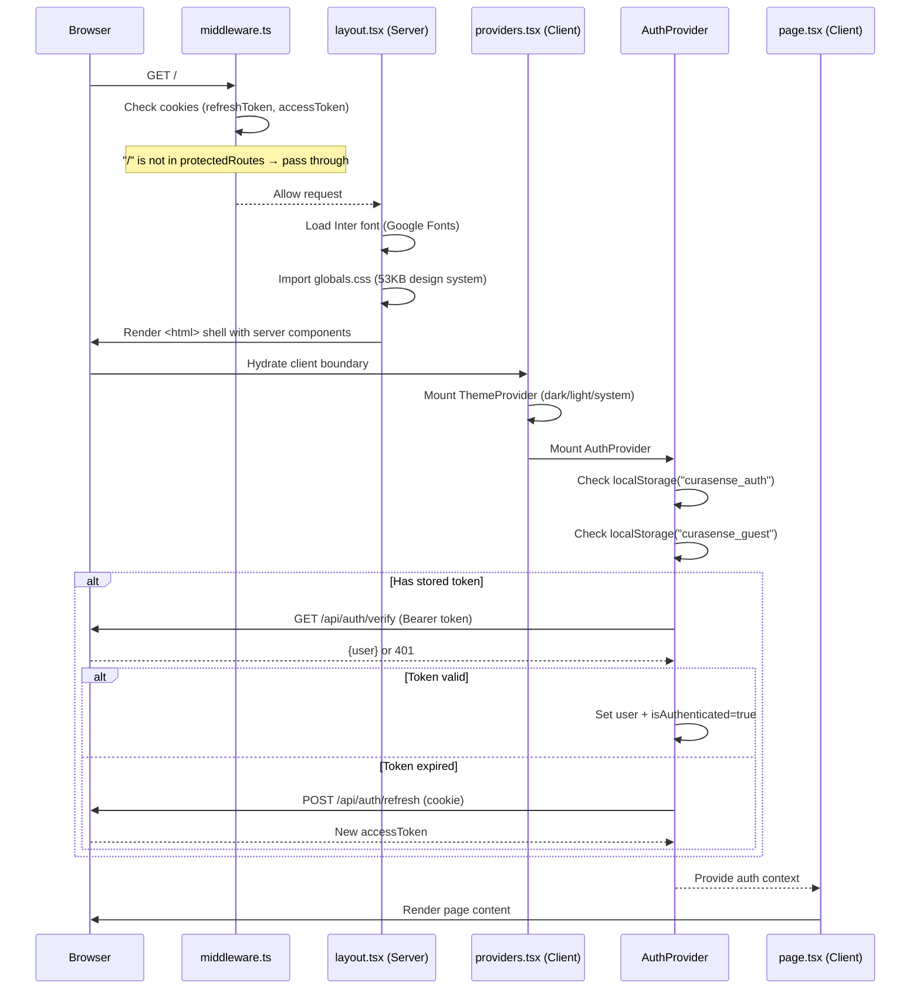
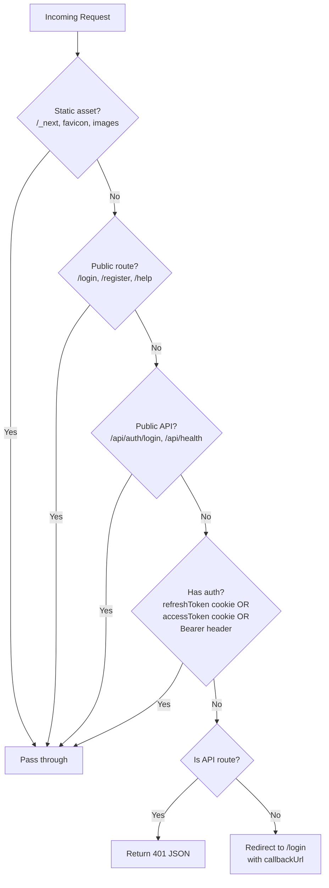
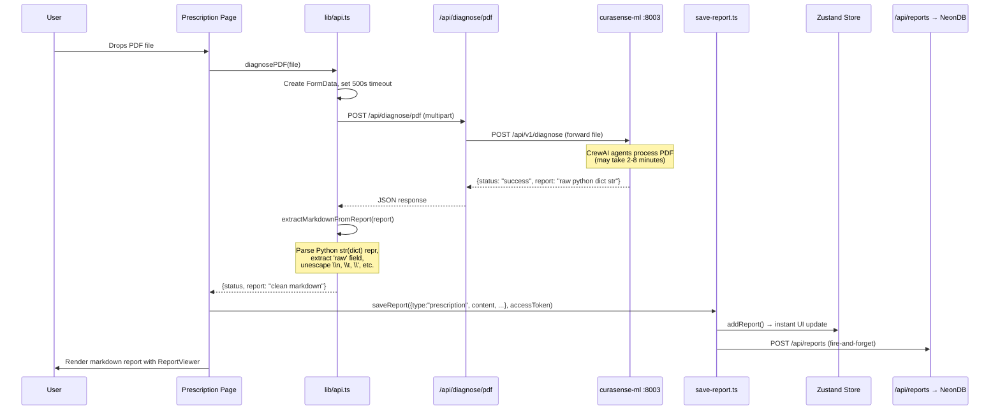
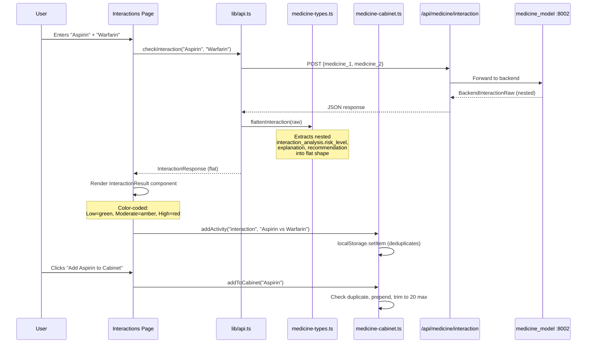
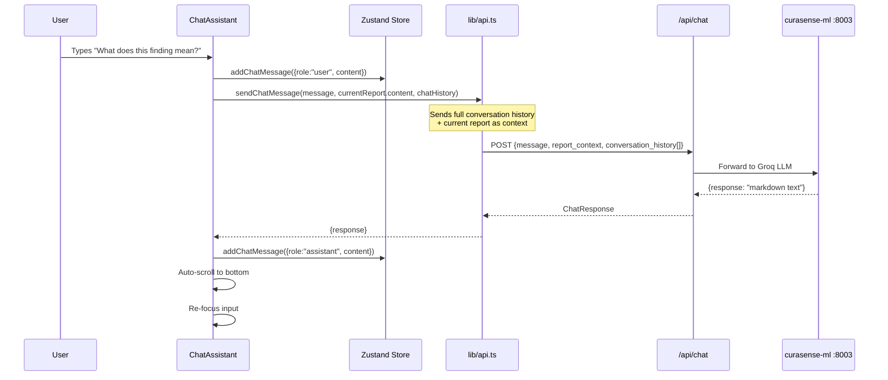
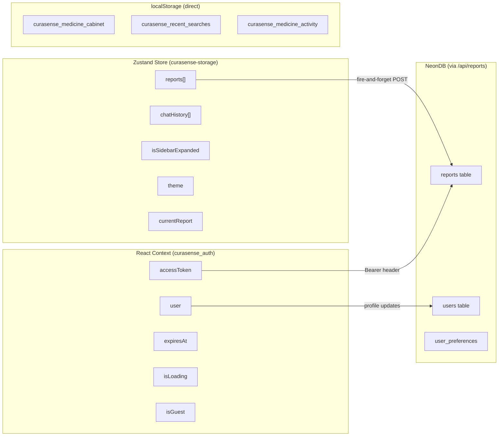
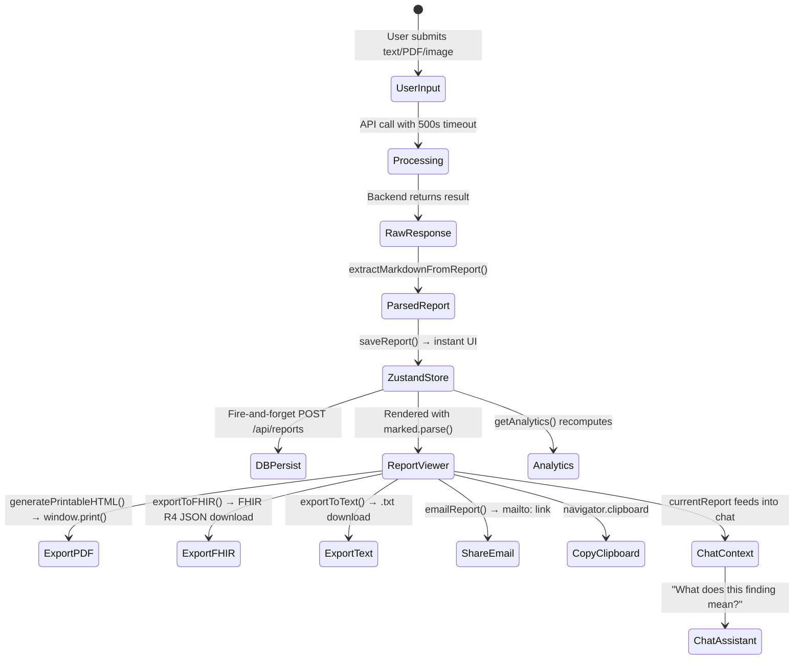
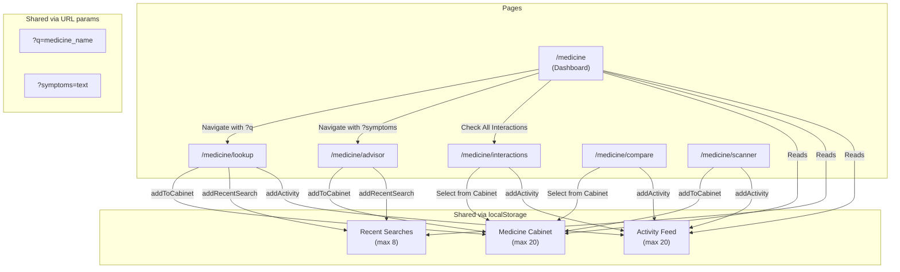

# CuraSense Frontend — How It Works

> A runtime walkthrough explaining **why** each layer exists, **how** components collaborate, and what happens from the moment a user opens the app to the moment they see an AI-generated report.

---

## 1. The Boot Sequence — What Happens on First Load

When a user navigates to `http://localhost:3000`, Next.js executes a precise startup chain. Every component mentioned below has a specific job, and removing any one of them would break a downstream feature.



### Why this order matters

1. **Middleware runs first** (Edge Runtime) — it decides whether the request even reaches the page. Without it, unauthenticated users would see a flash of protected content before being redirected.

2. **Layout is a Server Component** — it renders the `<html>` skeleton, loads fonts, and injects `globals.css` without sending JavaScript. This is why the page loads fast: the shell is pure HTML.

3. **Providers is a Client Component** (`"use client"`) — it creates the boundary where React hydration begins. Everything inside it can use hooks, state, and browser APIs.

4. **AuthProvider restores session before rendering children** — it sets `isLoading=true` until it verifies the stored token. This prevents the sidebar from flickering between "logged out" and "logged in" states.

---

## 2. The Provider Tree — Why Each Wrapper Exists

```
<html>
  <body>
    <Providers>                          ← Client boundary
      <ThemeProvider>                    ← Dark/light mode via class on <html>
        <AuthProvider>                   ← JWT state + auto-refresh timer
          <ScreenReaderAnnouncer>        ← Live region for accessibility
            <SmoothScroll>               ← Lenis smooth scroll engine
              {children}                 ← Page content
            </SmoothScroll>
            <Toaster />                  ← Sonner toast notifications
          </ScreenReaderAnnouncer>
        </AuthProvider>
      </ThemeProvider>
    </Providers>
  </body>
</html>
```

| Provider | Why it wraps everything | What breaks without it |
|---|---|---|
| `ThemeProvider` | Adds `class="dark"` to `<html>` so every Tailwind `dark:` variant works | All dark mode styles fail; users see only light theme |
| `AuthProvider` | Every page/component needs `useAuth()` for user data and tokens | Login, logout, protected API calls, sidebar visibility — all break |
| `ScreenReaderAnnouncer` | Provides a shared ARIA live region for dynamic announcements | Screen reader users miss navigation and state changes |
| `SmoothScroll` | Wraps content with Lenis for inertial scroll behavior | Scrolling feels abrupt; scroll-linked animations stutter |
| `Toaster` | Mounts the toast container at DOM root level | `toast.success()` / `toast.error()` calls silently fail |

---

## 3. The Layout Shell — How Navigation and Content Coexist

The root `layout.tsx` assembles the persistent UI that wraps every page:

```
┌──────────────────────────────────────────────────────────────┐
│  SkipNavigation (hidden, visible on Tab)                      │
│  OfflineIndicator (conditionally displayed)                   │
│  GlobalBackground (fixed, z-0 — ambient gradients/orbs)       │
│  ScrollProgress (fixed top bar — reading progress)            │
├──────────┬───────────────────────────────────────────────────┤
│ Sidebar  │  Header                                            │
│ (desktop │  ┌────────────────────────────────────────────┐    │
│  only,   │  │  SkipNavTarget (main content area)         │    │
│  hidden  │  │  ┌────────────────────────────────────┐    │    │
│  on      │  │  │  {children} ← Page component       │    │    │
│  mobile) │  │  └────────────────────────────────────┘    │    │
│          │  └────────────────────────────────────────────┘    │
├──────────┴───────────────────────────────────────────────────┤
│  MobileNav (mobile only — bottom tab bar)                     │
│  ChatAssistant (floating — bottom-right)                      │
│  ScrollToTop (floating — appears on scroll)                   │
└──────────────────────────────────────────────────────────────┘
```

### How the sidebar decides to show or hide

The `Sidebar` component doesn't rely on the layout to toggle it. Instead, it **self-gates** based on auth state:

```tsx
// Inside Sidebar component
const { isAuthenticated } = useAuth();
if (!isAuthenticated) return null;  // ← Simply removes itself from the tree
```

This means the landing page (`/`) renders with **no sidebar** for logged-out users and **with sidebar** for logged-in users — without any conditional logic in the layout.

### How mobile vs desktop navigation works

Both `Sidebar` and `MobileNav` are always mounted in the layout, but CSS controls visibility:

- `Sidebar`: `hidden lg:flex` — invisible below 1024px
- `MobileNav`: `lg:hidden` — invisible at 1024px and above

This avoids JavaScript-driven show/hide, which would cause layout shifts.

---

## 4. The Middleware Guard — Request Filtering Before React

`middleware.ts` runs in the **Edge Runtime** (not Node.js) before any page or API route executes. It is the security gate for the entire application.



**Why separate API vs page handling?** API routes serve JSON to JavaScript code — redirecting them would confuse `fetch()` calls. Page routes serve HTML to the browser — redirecting them is the proper UX pattern.

---

## 5. The Proxy Pattern — Why Frontend Has Its Own API Routes

The frontend contains 28 API route files, but **none of them contain business logic**. They are pure proxy endpoints that forward requests to the three Python backends.

### Why not call backends directly from the browser?

```
❌ Direct: Browser → http://localhost:8002/medicine/aspirin
   Problems: CORS blocked, backend URL exposed, no auth injection

✅ Proxy:   Browser → /api/medicine/aspirin → http://localhost:8002/medicine/aspirin
   Benefits: Same-origin (no CORS), URL hidden, server can add headers
```

### How a proxy route works (example: medicine lookup)

```tsx
// app/api/medicine/[name]/route.ts
export async function GET(req, { params }) {
  const { name } = params;
  
  // 1. Forward to backend (URL from server-only env var)
  const backendResponse = await fetch(
    `${process.env.MEDICINE_API_URL}/medicine/${name}`
  );
  
  // 2. Pass through response to browser
  const data = await backendResponse.json();
  return NextResponse.json(data);
}
```

The client-side code in `lib/api.ts` never knows the real backend URL. It only knows `/api/medicine/...`.

### The three backend services and what they power

| Backend | Next.js Proxy Routes | Frontend Features |
|---|---|---|
| **curasense-ml** (:8003) | `/api/diagnose/*`, `/api/chat`, `/api/compare` | PDF diagnosis, text diagnosis, AI chat assistant |
| **ml-fastapi** (:8001) | `/api/vision/*` | X-ray upload, query, and streamed answer |
| **medicine_model** (:8002) | `/api/medicine/*` | Lookup, recommendations, interactions, compare, image scanner |

---

## 6. Data Flow — A Complete Request Journey

### Journey 1: User uploads a prescription PDF



**Key insight — `extractMarkdownFromReport()`**: The ML backend returns `str(result)` where `result` is a Python dict. This produces Python `repr()` format with escaped quotes and newlines. The function tries JSON parse first (futureproofing), then manually walks the string character by character to extract the `raw` field, handling `\'`, `\"`, `\\n`, `\\t` escapes.

### Journey 2: User checks drug interactions



### Journey 3: The chat assistant resolves a follow-up question



**Why `currentReport` matters**: The chat assistant passes `currentReport.content` from the Zustand store as `report_context`. This means if a user just analyzed a prescription, they can ask follow-up questions like "Is this dosage safe?" and the AI has the full report context.

---

## 7. State Architecture — Two Systems Working Together

The frontend uses **two parallel state systems** that serve different purposes:



### Why Zustand for reports, not just a database?

Speed. When a user finishes a diagnosis, the report appears in the UI **instantly** because it's added to the Zustand store (which triggers a re-render). The database write happens asynchronously in the background. If it fails, the user still sees their report — it just won't persist across devices.

### Why localStorage for medicine cabinet, not Zustand?

The medicine cabinet is **feature-scoped** state that only the medicine hub pages use. Putting it in Zustand would:
1. Increase the persisted store size for all pages
2. Add unnecessary complexity to the global store
3. Require all medicine pages to import the Zustand store

Instead, `medicine-cabinet.ts` provides simple `get`/`set` functions that any component can call independently.

### Why React Context for auth, not Zustand?

Authentication has a **different lifecycle** from app state:
- It needs to run async initialization on mount (verify token with server)
- It needs `useEffect` for auto-refresh timers
- Provider pattern lets `useAuth()` throw if used outside the provider (catches bugs early)

Zustand doesn't support initialization effects or provider boundaries — it's a global singleton.

---

## 8. Component Composition — How the UI Assembles

### The composition pattern

Every page follows a consistent assembly pattern using shared building blocks:

```
Page Component
├── Premium Background (decorative blurred orbs)
├── motion.div (page entrance animation)
│   ├── Header Section
│   │   ├── Gradient Icon Box (feature-colored)
│   │   ├── GradientText (brand-colored heading)
│   │   └── Muted description text
│   │
│   ├── Content Section
│   │   ├── StaggerContainer (sequential child animation)
│   │   │   ├── StaggerItem → TiltCard or GlassCard
│   │   │   ├── StaggerItem → TiltCard or GlassCard
│   │   │   └── ...
│   │   └── Data-driven list rendering
│   │
│   └── Footer/Disclaimer Section
│       └── Card with warning styling
│
└── Floating elements (ChatAssistant, ScrollToTop — from layout)
```

### How a TiltCard creates its 3D effect

The `TiltCard` component tracks mouse position relative to the card's center and applies CSS `rotateX`/`rotateY` transforms:

```
Mouse enters card → onMouseMove fires
  → Calculate (x, y) offset from card center
  → Convert to rotation degrees (max ~10°)
  → Apply via framer-motion spring animation
  → Card visually tilts toward the cursor

Mouse leaves → Reset rotation to (0, 0) with spring ease-out
```

### How SpotlightCardV2 creates its spotlight glow

The card renders an invisible `radial-gradient` overlay. On `mousemove`, it updates the gradient's center position to follow the cursor, creating a flashlight-like effect:

```
<div style={{
  background: `radial-gradient(
    600px circle at ${mouseX}px ${mouseY}px,
    hsl(var(--brand-primary) / 0.08),
    transparent 40%
  )`
}} />
```

---

## 9. The Design System — How Colors and Animations Stay Consistent

### CSS Custom Properties as the single source of truth

Every color in the app comes from `globals.css` variables. Components never use raw hex/RGB values. This is what makes theme switching work:

```css
/* Light mode (default) */
:root {
  --background: 0 0% 100%;
  --foreground: 0 0% 3.9%;
  --brand-primary: 168 80% 45%;
}

/* Dark mode — just swap the values */
.dark {
  --background: 0 0% 3.9%;
  --foreground: 0 0% 98%;
  --brand-primary: 168 80% 45%;    /* Brand stays the same */
}
```

When `ThemeProvider` adds `class="dark"` to `<html>`, every `hsl(var(--background))` reference in the entire app instantly resolves to the dark value. No JavaScript re-renders needed.

### Animation tokens prevent inconsistency

Instead of every component defining its own spring physics, they import from `styles/tokens/animations.ts`:

```tsx
// Component A
import { springPresets } from "@/styles/tokens/animations";
<motion.div transition={springPresets.smooth}>  // stiffness: 200, damping: 25

// Component B — same physics, guaranteed
<motion.div transition={springPresets.smooth}>
```

This means every "smooth" animation across the entire app has identical timing, creating visual coherence.

---

## 10. The Report Lifecycle — From Analysis to Export



**Why dual persistence?**
- Zustand = instant feedback (user sees report immediately)
- Database = durability (report survives browser clear, accessible from other devices)
- If the DB write fails, `console.warn` logs it but the user experience is unaffected

---

## 11. How the Medicine Hub Pages Coordinate

The medicine hub is 6 pages that share data through three mechanisms:



### Cross-page navigation with pre-filled data

The hub dashboard's search bar **doesn't search on the hub page**. Instead, it navigates to the lookup page with the query as a URL parameter:

```tsx
// Hub search bar onSubmit:
router.push(`/medicine/lookup?q=${encodeURIComponent(query)}`);

// Lookup page on mount:
useEffect(() => {
  const params = new URLSearchParams(window.location.search);
  const q = params.get("q");
  if (q) searchMedicine(q);   // Auto-triggers search
}, []);
```

Similarly, clicking a medicine category on the hub navigates to `/medicine/advisor?symptoms=headache`.

### The batch interaction matrix

When a user clicks "Check All Interactions" on the hub (requires 3+ cabinet items), the hub:
1. Reads all cabinet items
2. Generates every unique pair (n × (n-1) / 2 combinations)
3. Calls `checkInteraction()` for each pair in parallel
4. Renders a color-coded grid showing safety levels

---

## 12. Error Boundaries and Recovery — What Happens When Things Fail

The app has **three layers** of error handling, each catching different failure types:

```
Layer 1: useErrorRecovery hook
  └── Catches: API timeouts, network errors, 4xx/5xx responses
  └── Action: Shows retry button with countdown timer
  └── Retries: Up to 3× with exponential backoff (1s → 2s → 4s)

Layer 2: ErrorBoundary component
  └── Catches: React rendering errors (null references, invalid state)
  └── Action: Shows fallback UI with "Try Again" button
  └── Recovery: Resets React tree and re-renders

Layer 3: OfflineIndicator + useOfflineQueue
  └── Catches: Complete network loss
  └── Action: Shows persistent banner, queues failed requests
  └── Recovery: Auto-processes queue when connection restores
```

### Why three layers?

- **Hook-level** catches expected failures (slow backends, bad input) — user can retry immediately
- **Component-level** catches unexpected crashes — prevents white screen of death
- **App-level** catches infrastructure failures — degrades gracefully

---

## 13. Why Everything Exists — The Decision Map

| Decision | Why | What it enables |
|---|---|---|
| **Next.js App Router** | Server Components for fast initial load; API routes for backend proxy | Zero-CORS architecture, SEO, streaming |
| **`"use client"` boundary at providers.tsx** | Keeps layout as Server Component (fast shell), hydrates only interactive parts | Faster TTFB, smaller JS bundle for initial load |
| **Zustand over Redux** | Less boilerplate, built-in persistence middleware, computed values (getAnalytics) | Reports, chat, theme in ~200 lines vs ~500+ with Redux |
| **React Context for auth only** | Auth needs initialization lifecycle (`useEffect`), provider boundary, and `useCallback` memoization | Auto-refresh timers, SSR-safe restoration, error boundaries |
| **localStorage for medicine cabinet** | Feature-scoped, doesn't need cross-tab sync, SSR-safe via typeof guards | Independent of global store; pages work in isolation |
| **Framer Motion over CSS animations** | Spring physics, layout animations, AnimatePresence exit animations, gesture handlers | TiltCard, SpotlightCard, stagger animations, page transitions |
| **Radix UI primitives** | Accessible by default (ARIA, keyboard, focus management) without styling opinions | WCAG compliance with custom design system |
| **Prisma with pg adapter** | Type-safe ORM that works with NeonDB's serverless PostgreSQL | Generated types, migration support, Prisma Studio |
| **Lazy Proxy for PrismaClient** | `next build` runs at module-load time; eager init would require DATABASE_URL at build | Docker builds without runtime env vars at build stage |
| **Standalone Docker output** | `output: "standalone"` produces a minimal self-contained server | ~100MB Docker image vs ~500MB with full node_modules |

---

*CuraSense Frontend — Runtime Walkthrough v1.0 · March 2026*
