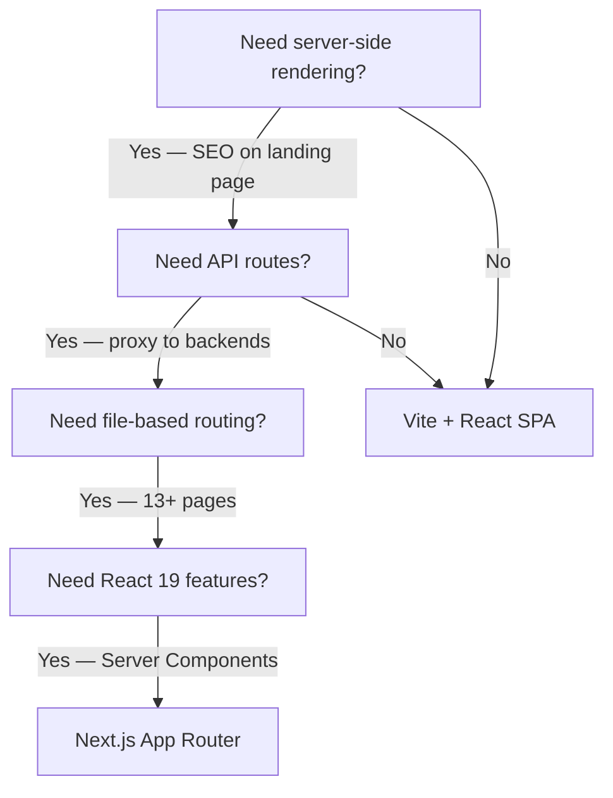
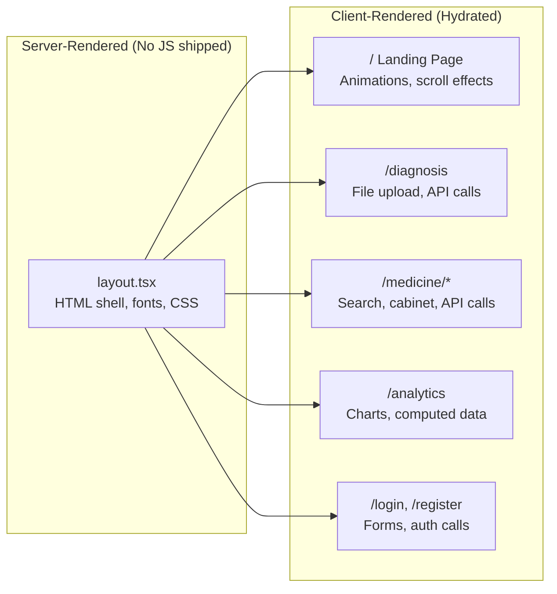
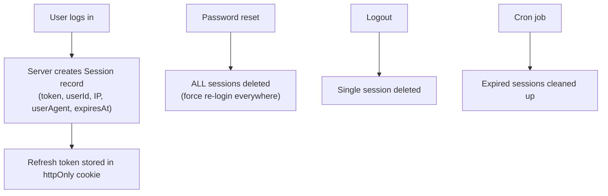

# CuraSense Frontend — System Design

> The **why** behind every architectural layer — what alternatives were considered, what trade-offs were made, and what would change at scale.

---

## 1. The Core Design Question

CuraSense is a healthcare AI platform with three Python ML backends and a PostgreSQL database. The fundamental system design question is:

> **How should the frontend connect a browser to three independent ML services, a database, and an auth system — while remaining fast, secure, and deployable?**

The answer is a **Backend-for-Frontend (BFF)** architecture where Next.js serves as both the UI renderer and the server-side orchestration layer.

```
┌─────────────────────────────────────────────────────────────────────┐
│                         THE DESIGN                                   │
│                                                                      │
│   Browser ──→ Next.js (UI + BFF) ──→ 3 Python APIs + PostgreSQL     │
│                                                                      │
│   NOT:  Browser ──→ 3 Python APIs directly                          │
│   NOT:  Browser ──→ Separate BFF Server ──→ 3 Python APIs           │
│   NOT:  Browser ──→ API Gateway ──→ 3 Python APIs                   │
└─────────────────────────────────────────────────────────────────────┘
```

### Why this design over the alternatives?

| Alternative | Why it was rejected |
|---|---|
| **Browser → Python APIs directly** | CORS on 3 different origins. Backend URLs exposed to client. No unified auth layer. Each backend would need its own JWT verification |
| **Separate Express/Fastify BFF** | Extra server to deploy, monitor, and maintain. Next.js API routes give the same capability for free — zero additional infrastructure |
| **API Gateway (Kong, AWS API Gateway)** | Overkill for 3 backends. Adds latency, cost, and operational complexity. Appropriate at 10+ microservices, not 3 |
| **GraphQL aggregation layer** | The backends return different data shapes for different features — not a good fit for a unified graph. REST proxy is simpler and the frontend knows exactly which backend each feature needs |

---

## 2. Why Next.js App Router

### The decision framework



### Why App Router over Pages Router?

| Feature | Pages Router | App Router (chosen) |
|---|---|---|
| **Server Components** | ❌ Everything is client-rendered | ✅ `layout.tsx` is a Server Component — sends HTML without JS |
| **Nested layouts** | Manual with `_app.tsx` | ✅ Built-in — sidebar/header persist across navigations without re-mount |
| **Streaming** | Limited | ✅ X-ray answer endpoint streams response chunks |
| **Route groups** | ❌ | ✅ `(auth)`, `(dashboard)` grouping possible |
| **Parallel routes** | ❌ | ✅ Sidebar + main content render independently |

### Why not a pure SPA (Vite/CRA)?

A Single Page Application would mean:
1. **No server-side proxy** — browser calls Python backends directly (CORS issues)
2. **No server-side auth** — JWT verification must happen client-side (insecure)
3. **No SEO** — landing page needs indexing for discoverability
4. **No server-side database access** — would need a separate API server for Prisma/PostgreSQL
5. **No httpOnly cookies** — refresh token can't be secured without a server

Next.js gives us a server **and** a SPA in one deployment unit.

---

## 3. The Rendering Strategy

Not all pages are rendered the same way. The system uses a **hybrid rendering strategy**:



### Why is `layout.tsx` a Server Component but every page is `"use client"`?

**The layout contains no interactivity**. It simply renders:
- The HTML `<html>` and `<body>` tags
- The font `<link>` tag (Inter from Google Fonts)
- The `globals.css` import
- The `<Providers>` wrapper (which is client-side)

By keeping the layout as a Server Component, the browser receives a complete HTML skeleton **before** any JavaScript loads. This improves:
- **First Contentful Paint (FCP)** — user sees the page structure immediately
- **Bundle size** — layout code isn't included in the client JS bundle
- **Time to Interactive (TTI)** — only interactive components need hydration

**Every page is `"use client"` because** they all use: `useState`, `useEffect`, Framer Motion, API calls, or Zustand. These require browser APIs that don't exist on the server.

### Why not use Server Components for pages too?

Server Components can't:
- Call `useState` or `useEffect`
- Use Framer Motion animations
- Access `localStorage`
- Handle user interactions (click, hover, drag)

Since every page in CuraSense is highly interactive (file uploads, search bars, animated cards, API calls), Server Components at the page level would provide no benefit — the entire page would need to be wrapped in a `"use client"` boundary anyway.

---

## 4. The Three-Tier State Architecture

The system design's most critical decision is how state is managed. CuraSense uses **three tiers**, each serving a distinct purpose:

```
┌─────────────────────────────────────────────────────────────────┐
│  Tier 1: REACT CONTEXT (Auth)                                    │
│  Scope: Entire app                                               │
│  Lifecycle: Mount → verify → auto-refresh → unmount              │
│  Persistence: localStorage (curasense_auth)                      │
│  Why separate: Needs initialization effects + provider boundary  │
├─────────────────────────────────────────────────────────────────┤
│  Tier 2: ZUSTAND (App State)                                     │
│  Scope: Entire app                                               │
│  Lifecycle: Singleton, survives navigation                       │
│  Persistence: localStorage (curasense-storage) via middleware    │
│  Why separate: Global state without provider ceremony            │
├─────────────────────────────────────────────────────────────────┤
│  Tier 3: LOCALSTORAGE (Feature State)                            │
│  Scope: Medicine Hub only                                        │
│  Lifecycle: Independent of React tree                            │
│  Persistence: Direct read/write                                  │
│  Why separate: Feature-scoped, no global coupling                │
└─────────────────────────────────────────────────────────────────┘
│
▼ (async, fire-and-forget)
┌─────────────────────────────────────────────────────────────────┐
│  Tier 0: DATABASE (PostgreSQL via Prisma)                        │
│  Scope: Cross-device, cross-session                              │
│  Lifecycle: Permanent                                            │
│  Why separate: Durability, not speed                             │
└─────────────────────────────────────────────────────────────────┘
```

### Why not just use the database for everything?

**Speed**. When a user finishes a 5-minute diagnosis, the report must appear **instantly**. If the UI waited for `POST /api/reports` → database write → response → update UI, there would be a visible delay. Instead:

1. `addReport()` writes to Zustand → React re-renders immediately (< 1ms)
2. `persistToDatabase()` fires in the background → if it fails, the user doesn't notice

This is the **optimistic update** pattern — assume success, handle failure silently.

### Why not just use Zustand for everything?

Zustand is a **client-side singleton**. It can't:
- Persist data across devices (only localStorage)
- Survive a browser storage clear
- Be queried with SQL (for analytics aggregation)
- Enforce data integrity constraints

The database provides **durability** that Zustand can't.

### Why not just use React Context for everything?

React Context re-renders **all consumers** on any state change. If reports, chat, sidebar, and theme were all in one Context:
- Adding a chat message would re-render the sidebar
- Toggling the sidebar would re-render the analytics page
- Every keystroke in chat would cascade through the entire app

Zustand's **selector pattern** (`useAppStore(state => state.reports)`) only re-renders the component when its specific slice changes.

### Why is auth in Context instead of Zustand?

Auth needs things Zustand doesn't provide:
1. **Initialization lifecycle** — `useEffect` on mount to verify stored tokens with the server
2. **Auto-refresh timer** — `useEffect` with `setTimeout` to refresh tokens before expiry
3. **Provider boundary** — `useAuth()` throws if used outside `<AuthProvider>`, catching bugs at development time
4. **`useCallback` dependencies** — auth functions depend on each other (`login` uses `persistAuth`, `refreshToken` uses `clearAuth`)

Zustand is a flat store; it doesn't have a concept of "run this code when the store first loads from persistence."

---

## 5. The Security Architecture

### The Token Flow — Why Two Tokens?

```
┌──────────────────────────────────────────────────────────────────┐
│                    WHY TWO TOKENS?                                │
│                                                                   │
│  ACCESS TOKEN (7d, in memory/localStorage)                        │
│  ├── Purpose: Prove identity on every API request                 │
│  ├── Where: Authorization: Bearer header                          │
│  ├── Risk: Stealable via XSS                                     │
│  └── Mitigation: Short-lived* (can be reduced to 15min)           │
│                                                                   │
│  REFRESH TOKEN (30d, in httpOnly cookie)                          │
│  ├── Purpose: Get new access tokens without re-login              │
│  ├── Where: Automatically sent by browser on same-origin requests │
│  ├── Risk: NOT stealable via XSS (httpOnly flag)                  │
│  └── Mitigation: Only accepted by /api/auth/refresh               │
│                                                                   │
│  ATTACK SCENARIO:                                                 │
│  XSS steals access token → attacker has 7d of access             │
│  BUT cannot steal refresh token → cannot renew access             │
│  When access token expires → attacker is locked out               │
│                                                                   │
│  VS SINGLE TOKEN:                                                 │
│  XSS steals the only token → attacker has 30d of access          │
│  No separation of privilege                                       │
└──────────────────────────────────────────────────────────────────┘
```

### The Middleware — Why Edge Runtime?

```
Request → [Edge Middleware] → [API Route / Page]
              │
              ├── Runs in V8 isolate (not Node.js)
              ├── Sub-millisecond cold start
              ├── Can run on CDN edge nodes
              └── Doesn't load Prisma, React, or any heavy dependency
```

The middleware only checks for the **existence** of auth cookies/headers — it doesn't verify them. Verification happens in the API route itself (which has access to Prisma and JWT libraries). This separation means:
- Middleware is **fast** (no database call, no JWT decode)
- API routes are **thorough** (full token verification)
- Unauthenticated requests are rejected **before** reaching Node.js

### Session Management — Why Database Sessions?



**Why not just JWT-only (stateless)?**

With pure JWT, you can't:
- Force logout a user (JWT is valid until expiry)
- Invalidate all sessions on password reset
- See how many active sessions a user has
- Track IP/user agent per session for security auditing

Database sessions make tokens **revocable** — essential for a healthcare app.

---

## 6. The Data Persistence Philosophy

### Why Dual Write (Zustand + Database)?

```
User completes analysis
    │
    ├──→ Zustand store (sync, < 1ms)
    │       └── UI re-renders immediately
    │       └── localStorage backup via persist middleware
    │
    └──→ POST /api/reports (async, fire-and-forget)
            └── Prisma → PostgreSQL
            └── If fails: console.warn, user unaffected
```

This is the **CQRS-lite** pattern:
- **Command** (write): Zustand is the primary write target
- **Query** (read): Analytics computed from Zustand, not from DB
- **Sync**: Database is a secondary persistence target, not the source of truth for the UI

### Why not sync from database on every page load?

If every page loaded reports from the database:
1. Every navigation would need a loading spinner (network latency)
2. Offline mode would be impossible
3. The analytics dashboard would need a separate API call

With Zustand persistence, the app works **offline** and loads **instantly**. The database is for cross-device durability, not for real-time reading.

---

## 7. The API Proxy Architecture — Deep Design

### Request Flow Through the System

```
Browser fetch("/api/medicine/aspirin")
    │
    ▼
[Next.js Middleware — Edge Runtime]
    │ Check: has refreshToken cookie? → Yes, pass through
    ▼
[API Route — Node.js Runtime]
    │ app/api/medicine/[name]/route.ts
    │
    │ 1. Read `name` from URL params
    │ 2. Read MEDICINE_API_URL from process.env (server-only)
    │ 3. fetch(`${MEDICINE_API_URL}/medicine/${name}`)
    │ 4. Await response from Python backend
    │ 5. Return response.json() to browser
    ▼
[Python FastAPI — medicine_model :8002]
    │
    │ 1. Query ChromaDB vector store
    │ 2. Call Google Gemini API for analysis
    │ 3. Call Tavily API for web search
    │ 4. Aggregate results
    │ 5. Return MedicineDetail JSON
    ▼
[Response flows back through same path]
```

### Why 28 separate route files instead of a generic proxy?

A single catch-all proxy (`/api/[...path]/route.ts`) would be fewer files but creates problems:

| Concern | Dedicated routes (chosen) | Generic proxy |
|---|---|---|
| **Type safety** | Each route knows its request/response shape | Generic handler has no type checking |
| **Validation** | Report creation validates enums before DB insert | Passes everything through blindly |
| **Auth handling** | Different routes have different auth requirements | One-size-fits-all auth |
| **Error mapping** | Auth errors → 401, validation → 400, duplicates → 409 | All errors → 500 |
| **Backend routing** | Each route knows which backend to call | Needs a routing table |
| **Timeout tuning** | Diagnosis gets 500s, medicine gets default | Same timeout for everything |

---

## 8. The Deployment Architecture

### Docker Multi-Stage Build — Why This Design?

```dockerfile
# Stage 1: Build (heavy — contains node_modules, source, compiler)
FROM node:20-alpine AS builder
  → npm ci (install all deps)
  → npx prisma generate (create typed client)
  → npm run build (compile Next.js → standalone output)

# Stage 2: Production (lightweight — only compiled output)
FROM node:20-alpine AS runner
  → Copy .next/standalone (self-contained server)
  → Copy .next/static (CSS, JS, fonts)
  → Copy public/ (static assets)
  → Run as non-root user (uid 1001)
  → Healthcheck: GET /api/health every 30s
```

**Result**: ~100MB production image vs ~500MB+ with full node_modules.

### Why `output: "standalone"` in next.config.ts?

Standard Next.js deployment copies the entire `node_modules/` directory (400MB+). Standalone mode:
1. Traces which files are actually used at runtime
2. Copies only those files into `.next/standalone/`
3. Generates a `server.js` entry point that doesn't need `npm start`

This makes the Docker image small, fast to pull, and easy to horizontally scale.

### Why non-root user in Docker?

```dockerfile
RUN addgroup --system --gid 1001 nodejs && \
    adduser --system --uid 1001 nextjs
USER nextjs
```

If the container is compromised, the attacker runs as `nextjs` (uid 1001) — not root. They can't:
- Install packages
- Modify system files
- Escalate privileges
- Access other containers' filesystems

### The Healthcheck — Why `/api/health`?

```dockerfile
HEALTHCHECK --interval=30s --timeout=5s --start-period=30s --retries=3 \
    CMD wget --spider http://127.0.0.1:3000/api/health || exit 1
```

Docker/orchestrators use this to:
- Detect if the Next.js server has crashed
- Automatically restart unhealthy containers
- Remove unhealthy instances from load balancer rotation

The 30-second start period handles slow cold starts without false positives.

---

## 9. The Maintenance Layer — Automated Cleanup

### Why a Cron Endpoint?

```
/api/cron/cleanup (Vercel Cron / external scheduler)
    │
    ├── Delete expired sessions (expiresAt < now)
    ├── Delete audit logs > 30 days old
    ├── Archive reports inactive > 30 days
    └── Delete unverified users > 7 days old
```

Without cleanup:
- **Sessions table grows indefinitely** — every login creates a row, but expired sessions are never removed
- **Audit logs accumulate** — 30 days of logs are sufficient for compliance; older logs waste storage
- **Unverified users bloat the user table** — bots or abandoned signups linger forever

The cron endpoint is **authenticated** with `CRON_SECRET` in production — preventing external abuse.

---

## 10. What Changes at Production Scale

| Current Design | Production Design | Why |
|---|---|---|
| **Access token: 7 days** | **Access token: 15 minutes** | Minimize attack window if token is stolen |
| **No caching** | **Redis/Upstash cache** for medicine data | Same medicine queried repeatedly; cache saves backend calls |
| **Zustand as primary read source** | **Server-side data fetching + React Query** | For multi-device sync, DB becomes source of truth |
| **Fire-and-forget DB writes** | **Guaranteed write with retry queue** | Healthcare data can't be lost; use persistent queue |
| **Single Next.js instance** | **Horizontal scaling behind load balancer** | Standalone output enables easy container replication |
| **Dynamic import for Prisma in cron** | **Separate worker service** | Long-running cleanup shouldn't compete with request-serving threads |
| **`console.error` for monitoring** | **Sentry/Datadog** | Structured error tracking, alerting, and performance profiling |
| **No rate limiting** | **Token bucket per user** | Prevent abuse of ML backends (which are expensive to run) |
| **No CDN** | **Vercel Edge / CloudFront for static assets** | CSS, JS, fonts served from edge nodes closest to user |
| **Single region (NeonDB)** | **Multi-region read replicas** | Reduce latency for geographically distributed users |

---

## 11. The Complete System — Layered View

```
┌─────────────────────────────────────────────────────────────────────┐
│  LAYER 7: USER INTERFACE                                             │
│  React 19 components, Framer Motion, Tailwind CSS, Radix UI         │
│  WHY: Interactive, accessible, animated healthcare UI                │
├─────────────────────────────────────────────────────────────────────┤
│  LAYER 6: STATE MANAGEMENT                                           │
│  Zustand (reports, chat, UI) + React Context (auth) + localStorage  │
│  WHY: Instant UI updates, offline support, separated concerns       │
├─────────────────────────────────────────────────────────────────────┤
│  LAYER 5: API CLIENT                                                 │
│  lib/api.ts — typed fetch functions with timeout + error handling    │
│  WHY: Single point of contact for all backend communication         │
├─────────────────────────────────────────────────────────────────────┤
│  LAYER 4: BFF PROXY                                                  │
│  28 Next.js API routes — forward to backends, handle auth           │
│  WHY: CORS elimination, URL hiding, unified error handling          │
├─────────────────────────────────────────────────────────────────────┤
│  LAYER 3: MIDDLEWARE                                                 │
│  Edge Runtime auth guard — cookie/header existence check            │
│  WHY: Fast rejection of unauthenticated requests before Node.js    │
├─────────────────────────────────────────────────────────────────────┤
│  LAYER 2: DATA LAYER                                                 │
│  Prisma ORM + pg adapter → NeonDB PostgreSQL                        │
│  WHY: Type-safe database access, connection pooling, migrations     │
├─────────────────────────────────────────────────────────────────────┤
│  LAYER 1: EXTERNAL SERVICES                                         │
│  curasense-ml (Groq/CrewAI) + ml-fastapi (Gemini Vision)           │
│  + medicine_model (Gemini/Tavily/ChromaDB)                          │
│  WHY: AI capabilities — NLP diagnosis, image analysis, drug intel  │
├─────────────────────────────────────────────────────────────────────┤
│  LAYER 0: INFRASTRUCTURE                                            │
│  Docker (standalone) + Vercel/AWS + NeonDB (serverless PostgreSQL)  │
│  WHY: Minimal deployment footprint, auto-scaling database           │
└─────────────────────────────────────────────────────────────────────┘
```

**Each layer depends only on the layer below it.** The UI doesn't know about Prisma. The API client doesn't know about NeonDB. The middleware doesn't know about Zustand. This **separation of concerns** is what makes the system maintainable, testable, and scalable.

---

*CuraSense Frontend — System Design v1.0 · March 2026*
