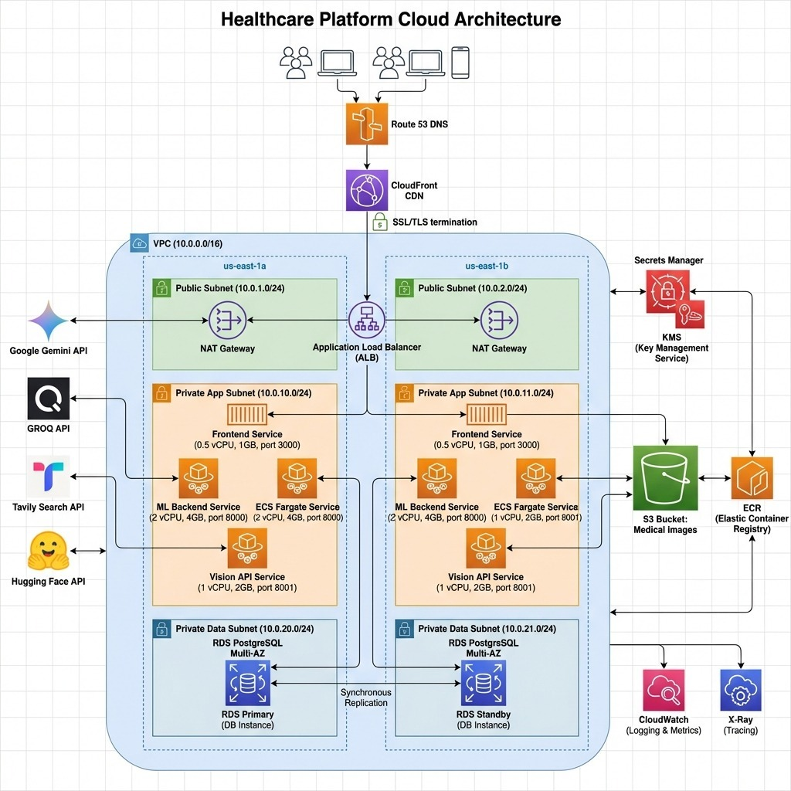
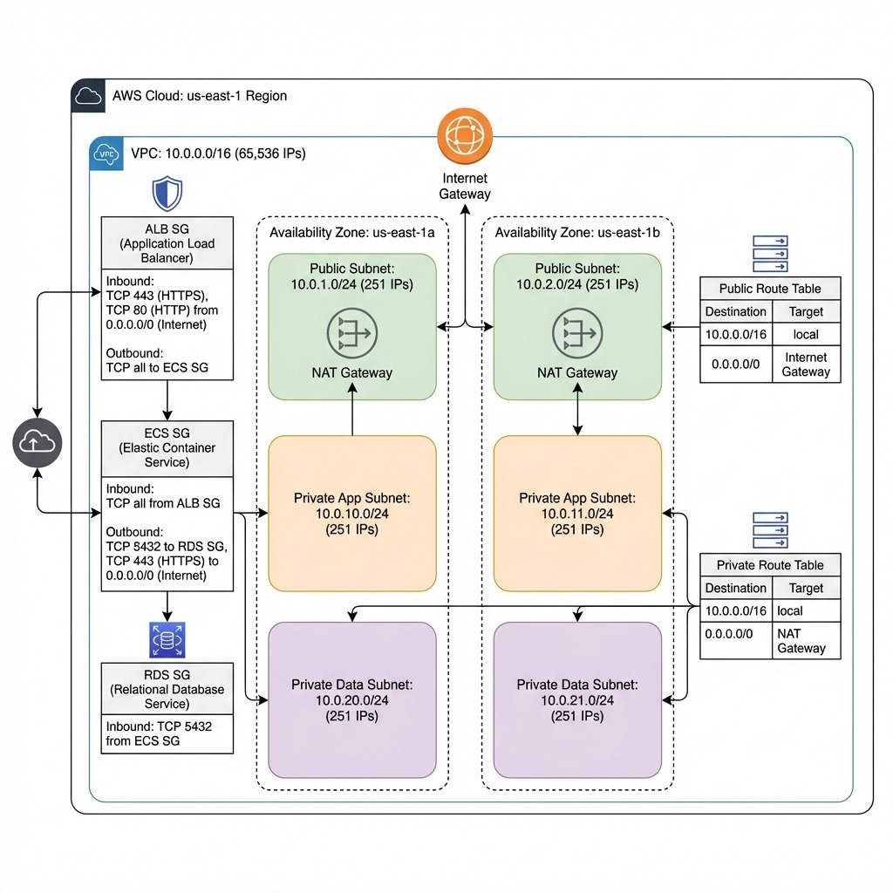
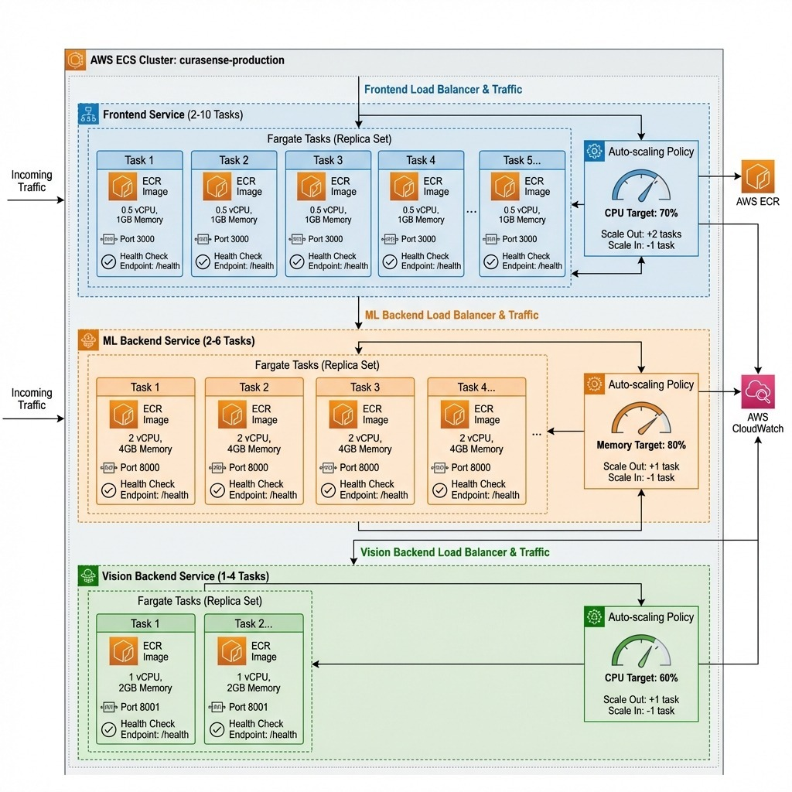

# CuraSense Project Roadmap and Future Development Plan

<div align="center">

**Strategic Technical Document**

[](https://github.com/VaibhavK289/curasense-architecture)
[](https://github.com/VaibhavK289/curasense-architecture/issues)
[](LICENSE)

_Document Version: 1.0 | Last Updated: February 2026_

</div>

---

## Executive Summary

CuraSense has evolved from a concept to a fully functional AI-powered healthcare platform. This document outlines the strategic roadmap for scaling the platform, migrating to enterprise-grade AWS infrastructure, and resolving outstanding technical challenges.

**Vision Statement**: Make AI-assisted healthcare accessible, reliable, and secure for everyone.

---

## 1. Current State Overview

### 1.1 Production Features

| Feature             | Technology Stack             | Status     |
| ------------------- | ---------------------------- | ---------- |
| AI Diagnosis        | CrewAI + Groq + Gemini       | Production |
| X-Ray Analysis      | LangGraph + Gemini 2.5 Flash | Production |
| Medicine Comparison | Tavily Search + LLM          | Production |
| Chat Assistant      | Groq LLM                     | Production |
| User Authentication | JWT + bcrypt                 | Production |
| Report Management   | Prisma + NeonDB              | Production |

### 1.2 Current Deployment Architecture

```
┌─────────────────┐     ┌─────────────────┐     ┌─────────────────┐
│   Vercel        │────▶│ Azure Container │────▶│    NeonDB       │
│   (Frontend)    │     │ Apps (Backend)  │     │  (PostgreSQL)   │
└─────────────────┘     └─────────────────┘     └─────────────────┘
```

### 1.3 Rationale for AWS Migration

| Factor       | Current State        | AWS Target                       |
| ------------ | -------------------- | -------------------------------- |
| Scalability  | Limited auto-scaling | ECS Fargate with target tracking |
| Availability | Single region        | Multi-AZ deployment              |
| Security     | Basic encryption     | KMS + Secrets Manager + WAF      |
| Cost Control | Fixed pricing        | Auto-scaling + Savings Plans     |
| Compliance   | Partial              | HIPAA-ready infrastructure       |

---

## 2. AWS Cloud Architecture

### 2.1 Platform Overview

The following diagram represents the target AWS infrastructure, designed for scalability, security, and high availability:



**Key Components:**

| Service         | Purpose                 | Configuration          |
| --------------- | ----------------------- | ---------------------- |
| Route 53        | DNS management          | Domain routing         |
| CloudFront      | CDN + SSL termination   | Global edge caching    |
| ALB             | Load balancing          | Cross-AZ distribution  |
| ECS Fargate     | Container orchestration | Serverless compute     |
| RDS PostgreSQL  | Database                | Multi-AZ replication   |
| S3              | Medical image storage   | Encrypted at rest      |
| ECR             | Container registry      | Private images         |
| Secrets Manager | Credentials             | API keys, DB passwords |
| CloudWatch      | Monitoring              | Logs, metrics, alarms  |
| X-Ray           | Distributed tracing     | Request tracing        |

---

### 2.2 VPC Network Architecture

Network design follows AWS best practices with proper isolation between public and private resources:



**Network Design:**

| Subnet Type  | CIDR Block                 | Purpose           |
| ------------ | -------------------------- | ----------------- |
| Public       | 10.0.1.0/24, 10.0.2.0/24   | NAT Gateways, ALB |
| Private App  | 10.0.10.0/24, 10.0.11.0/24 | ECS Services      |
| Private Data | 10.0.20.0/24, 10.0.21.0/24 | RDS Database      |

**Security Groups:**

| Security Group | Inbound Rules              | Outbound Rules                         |
| -------------- | -------------------------- | -------------------------------------- |
| ALB SG         | TCP 443, 80 from 0.0.0.0/0 | All traffic to ECS SG                  |
| ECS SG         | All traffic from ALB SG    | TCP 5432 to RDS SG, HTTPS to 0.0.0.0/0 |
| RDS SG         | TCP 5432 from ECS SG       | None                                   |

---

### 2.3 ECS Cluster and Auto-Scaling

Containerized services are designed to scale automatically based on demand:



**Service Configuration:**

| Service    | Task Range | vCPU | Memory | Port | Scaling Trigger    |
| ---------- | ---------- | ---- | ------ | ---- | ------------------ |
| Frontend   | 2-10       | 0.5  | 1GB    | 3000 | CPU Target: 70%    |
| ML Backend | 2-6        | 2    | 4GB    | 8000 | Memory Target: 80% |
| Vision API | 1-4        | 1    | 2GB    | 8001 | CPU Target: 60%    |

**Configuration Rationale:**

- **Frontend**: Lightweight Next.js application, CPU-bound during SSR operations
- **ML Backend**: Memory-intensive for CrewAI pipelines and NER model inference
- **Vision API**: Balanced configuration for image processing with Gemini/Llama models

---

## 3. Open Issues and Resolution Plan

This section outlines all outstanding issues and their resolution strategies.

### 3.1 Critical Priority

| Issue                                                                  | Title                     | Description                             | Resolution Strategy                                                      | Timeline |
| ---------------------------------------------------------------------- | ------------------------- | --------------------------------------- | ------------------------------------------------------------------------ | -------- |
| [#11](https://github.com/VaibhavK289/curasense-architecture/issues/11) | NeonDB Connection Failure | Database connection drops in production | Implement connection pooling with PgBouncer, add exponential retry logic | Week 1   |
| [#1](https://github.com/VaibhavK289/curasense-architecture/issues/1)   | Authentication Frontend   | Auth flow incomplete or unreliable      | Review token refresh logic, fix session persistence in localStorage      | Week 1   |

### 3.2 High Priority

| Issue                                                                  | Title                        | Description                           | Resolution Strategy                                          | Timeline |
| ---------------------------------------------------------------------- | ---------------------------- | ------------------------------------- | ------------------------------------------------------------ | -------- |
| [#10](https://github.com/VaibhavK289/curasense-architecture/issues/10) | Dashboard Problem            | Dashboard not displaying correctly    | Debug data fetching hooks, fix component rendering lifecycle | Week 2   |
| [#9](https://github.com/VaibhavK289/curasense-architecture/issues/9)   | History Section Not Working  | Recently analyzed reports not showing | Fix Zustand store persistence, validate data flow from API   | Week 2   |
| [#7](https://github.com/VaibhavK289/curasense-architecture/issues/7)   | Report History: Slow Loading | Performance issues with report list   | Implement server-side pagination, add skeleton loaders       | Week 2   |

### 3.3 Medium Priority

| Issue                                                                | Title                  | Description                             | Resolution Strategy                                          | Timeline |
| -------------------------------------------------------------------- | ---------------------- | --------------------------------------- | ------------------------------------------------------------ | -------- |
| [#8](https://github.com/VaibhavK289/curasense-architecture/issues/8) | Scrolling Issue        | Report and X-ray pages have scroll bugs | Fix CSS overflow properties, test on mobile viewports        | Week 3   |
| [#6](https://github.com/VaibhavK289/curasense-architecture/issues/6) | Report Type Formatting | Formatting errors in report display     | Standardize markdown rendering with unified parser           | Week 3   |
| [#5](https://github.com/VaibhavK289/curasense-architecture/issues/5) | Consistency Issue      | UI inconsistencies across pages         | Create design system tokens, enforce usage across components | Week 3   |

### 3.4 Documentation and Quality

| Issue                                                                  | Title        | Description                         | Resolution Strategy                                                      | Timeline |
| ---------------------------------------------------------------------- | ------------ | ----------------------------------- | ------------------------------------------------------------------------ | -------- |
| [#13](https://github.com/VaibhavK289/curasense-architecture/issues/13) | Code Quality | Code needs cleanup and optimization | ESLint fixes, remove dead code, add JSDoc comments                       | Week 4   |
| [#12](https://github.com/VaibhavK289/curasense-architecture/issues/12) | README.md    | Documentation incomplete            | Update README with setup instructions, architecture diagrams, demo links | Week 4   |

---

## 4. Phased Roadmap

### Phase 1: Stabilization (Weeks 1-2)

_Focus: Critical bug resolution and system reliability_

**Objectives:**

- [ ] Resolve database connection issues (#11)
- [ ] Fix authentication flow (#1)
- [ ] Repair dashboard functionality (#10)
- [ ] Restore history section (#9)
- [ ] Optimize report loading performance (#7)

**Deliverables:**

- Stable production deployment
- Zero critical bugs
- 99% uptime target

---

### Phase 2: Polish (Weeks 3-4)

_Focus: UI/UX refinement and code quality_

**Objectives:**

- [ ] Fix scrolling issues (#8)
- [ ] Standardize report formatting (#6)
- [ ] Ensure UI consistency (#5)
- [ ] Improve code quality (#13)
- [ ] Complete documentation (#12)

**Deliverables:**

- Cohesive user experience
- Clean, maintainable codebase
- Comprehensive technical documentation

---

### Phase 3: AWS Migration (Weeks 5-8)

_Focus: Enterprise-grade infrastructure deployment_

**Week 5-6: Infrastructure Setup**

- [ ] Create VPC with public/private subnets
- [ ] Configure security groups and NACLs
- [ ] Set up RDS PostgreSQL with Multi-AZ
- [ ] Create ECR repositories
- [ ] Configure Secrets Manager

**Week 7: Application Deployment**

- [ ] Build and push Docker images to ECR
- [ ] Create ECS cluster and task definitions
- [ ] Deploy services with ALB
- [ ] Configure auto-scaling policies
- [ ] Set up CloudWatch alarms

**Week 8: DNS and Monitoring**

- [ ] Configure Route 53 and CloudFront
- [ ] Implement X-Ray tracing
- [ ] Create CloudWatch dashboards
- [ ] Document runbooks and SOPs
- [ ] Perform load testing

---

### Phase 4: Advanced Features (Months 3-6)

_Focus: Platform expansion and AI improvements_

| Feature                | Description                         | Priority |
| ---------------------- | ----------------------------------- | -------- |
| Multi-language Support | Hindi, Spanish, French localization | High     |
| Voice Input            | Speech-to-text for symptom input    | Medium   |
| Mobile Application     | React Native companion app          | High     |
| RAG Enhancement        | Medical literature integration      | Medium   |
| Doctor Dashboard       | Professional tools for clinicians   | High     |
| Telemedicine           | Video consultation integration      | Low      |
| Wearable Integration   | Apple Watch, Fitbit data sync       | Medium   |

---

## 5. Cost Analysis

### 5.1 Current Costs (Azure + Vercel)

| Service              | Monthly Cost     |
| -------------------- | ---------------- |
| Vercel (Pro)         | $20              |
| Azure Container Apps | $30-50           |
| NeonDB (Free tier)   | $0               |
| **Total**            | **$50-70/month** |

### 5.2 Projected AWS Costs

| Service         | Configuration           | Monthly Cost       |
| --------------- | ----------------------- | ------------------ |
| ECS Fargate     | 3 services, avg 2 tasks | $80-120            |
| RDS PostgreSQL  | db.t3.small, Multi-AZ   | $50-70             |
| ALB             | 1 load balancer         | $20                |
| NAT Gateway     | 2 gateways              | $60                |
| S3 + CloudFront | 100GB transfer          | $10-20             |
| Route 53        | 1 hosted zone           | $0.50              |
| CloudWatch      | Standard metrics        | $5-10              |
| Secrets Manager | 10 secrets              | $4                 |
| **Total**       |                         | **$230-310/month** |

### 5.3 Cost Optimization Strategies

1. **Savings Plans**: Reserve baseline capacity for 40% cost reduction
2. **Scale-to-Zero**: Reduce capacity during low-traffic hours
3. **Spot Instances**: Utilize for non-critical batch workloads
4. **S3 Intelligent Tiering**: Automatic storage class optimization

---

## 6. Security Roadmap

### 6.1 Current Security Measures

| Security Control          | Implementation Status |
| ------------------------- | --------------------- |
| Password hashing (bcrypt) | Implemented           |
| JWT authentication        | Implemented           |
| HTTPS enforcement         | Implemented           |
| Input validation          | Implemented           |

### 6.2 Planned Security Enhancements

| Feature          | Description                | Target Phase |
| ---------------- | -------------------------- | ------------ |
| AWS KMS          | Encrypt all data at rest   | Phase 3      |
| WAF              | Web application firewall   | Phase 3      |
| VPC Flow Logs    | Network traffic monitoring | Phase 3      |
| GuardDuty        | Threat detection           | Phase 4      |
| Security Hub     | Compliance dashboard       | Phase 4      |
| SOC 2 Compliance | Audit preparation          | Phase 4      |

### 6.3 HIPAA Compliance Checklist

- [ ] Enable encryption at rest (RDS, S3)
- [ ] Enable encryption in transit (TLS 1.3)
- [ ] Implement comprehensive audit logging
- [ ] Configure access controls (IAM policies)
- [ ] Sign Business Associate Agreement (BAA) with AWS
- [ ] Document security policies and procedures
- [ ] Conduct penetration testing

---

## 7. Success Metrics

### 7.1 Technical KPIs

| Metric                | Current Baseline | Target       |
| --------------------- | ---------------- | ------------ |
| Uptime                | 95%              | 99.9%        |
| API Latency (p95)     | 2s               | 500ms        |
| Error Rate            | 5%               | < 1%         |
| Deployment Frequency  | Weekly           | Daily        |
| Mean Time to Recovery | Hours            | < 15 minutes |

### 7.2 Business KPIs

| Metric                           | Current Baseline | 6-Month Target |
| -------------------------------- | ---------------- | -------------- |
| Monthly Active Users             | 100              | 5,000          |
| Reports Generated                | 500              | 25,000         |
| User Satisfaction Score          | N/A              | 4.5/5          |
| Healthcare Provider Partnerships | 0                | 10             |

---

## 8. Team Structure and Contribution Guidelines

### 8.1 Core Team Roles

| Role                 | Responsibility                           |
| -------------------- | ---------------------------------------- |
| Full-Stack Developer | Frontend, Backend, DevOps                |
| AI/ML Engineer       | Model integration, pipeline optimization |
| Cloud Architect      | AWS infrastructure design                |

### 8.2 Contribution Process

1. Fork the repository
2. Clone the fork: `git clone https://github.com/YOUR_USERNAME/curasense-architecture.git`
3. Create a feature branch: `git checkout -b feature/feature-name`
4. Commit changes: `git commit -m 'Add feature description'`
5. Push to branch: `git push origin feature/feature-name`
6. Open a Pull Request

---

## 9. Related Documentation

| Document                                               | Description                       |
| ------------------------------------------------------ | --------------------------------- |
| [FRONTEND_DOCUMENTATION.md](FRONTEND_DOCUMENTATION.md) | Next.js frontend architecture     |
| [BACKEND_DOCUMENTATION.md](BACKEND_DOCUMENTATION.md)   | FastAPI + AI backend services     |
| [DATABASE_DOCUMENTATION.md](DATABASE_DOCUMENTATION.md) | Prisma schema and database design |

---

## 10. References

- **GitHub Repository**: [VaibhavK289/curasense-architecture](https://github.com/VaibhavK289/curasense-architecture)
- **Issue Tracker**: [GitHub Issues](https://github.com/VaibhavK289/curasense-architecture/issues)

---

_Document prepared for technical review and strategic planning meetings._
